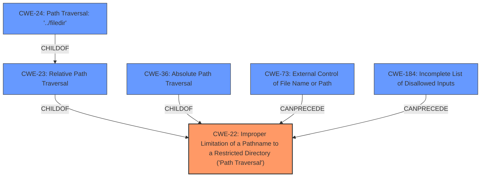

# Analysis Report for CVE-2021-31542

# Vulnerability Analysis Report: CVE-2021-31542

## Description


## Analysis (with Relationship Data)

# Summary
| CWE ID | CWE Name | Confidence | CWE Abstraction Level | CWE Vulnerability Mapping Label | CWE-Vulnerability Mapping Notes |
|---|---|---|---|---|---|
| CWE-22 | Improper Limitation of a Pathname to a Restricted Directory ('Path Traversal') | 1.0 | Base | Allowed | Primary CWE |
| CWE-184 | Incomplete List of Disallowed Inputs | 0.6 | Base | Allowed | Secondary Candidate |

## Evidence and Confidence

*   **Confidence Score:** 0.8
*   **Evidence Strength:** HIGH

## Relationship Analysis
The primary CWE, CWE-22, is a base-level CWE that describes the **improper limitation of a pathname to a restricted directory**, also known as 'Path Traversal'. Several child CWEs exist, such as CWE-23 (Relative Path Traversal), CWE-36 (Absolute Path Traversal), and CWE-24 (Path Traversal: '../filedir'). These variants represent specific ways path traversal can occur. CWE-73 (External Control of File Name or Path) is a parent that CanPrecede CWE-22. CWE-184 (Incomplete List of Disallowed Inputs) is also related, as the **failure** to properly filter disallowed inputs can lead to path traversal.



## Vulnerability Chain
The vulnerability chain starts with the **lack of proper input validation** in Django's `MultiPartParser`, `UploadedFile`, and `FieldFile` components. This **failure** to sanitize file names allows attackers to inject path traversal sequences, leading to unauthorized file access.
  - **Root Cause:** **Insufficient sanitization of filenames during file uploads**
  - **Weakness:** CWE-22 Improper Limitation of a Pathname to a Restricted Directory
  - **Impact:** Directory traversal, potential disclosure of sensitive information

## Summary of Analysis
The primary weakness is CWE-22, as the vulnerability description explicitly states that the issue is a **directory traversal** vulnerability caused by the **improper limitation of a pathname to a restricted directory**. The CVE Reference Links Content Summary confirms this by highlighting the **insufficient sanitization of filenames** and the presence of "path traversal vulnerability: Improper handling of '..' path sequences in filenames." This aligns perfectly with the description of CWE-22.

CWE-23 (Relative Path Traversal) and CWE-24 (Path Traversal: '../filedir') are more specific variants of CWE-22, but the provided information doesn't explicitly state whether the vulnerability is limited to relative path traversal or the '../filedir' sequence. Therefore, mapping to the base CWE-22 is more appropriate.

CWE-184 is included as a secondary candidate because the root cause involves **insufficient filename validation**, which can be seen as an **incomplete list of disallowed inputs**. The system **fails to reject empty filenames or filenames with '..' path segments**. While the primary issue is the path traversal itself, the underlying cause is the lack of proper input validation, making CWE-184 a relevant contributing factor.

CWE-434 (Unrestricted Upload of File with Dangerous Type) was considered but deemed less relevant because the vulnerability isn't primarily about dangerous file *types* but about dangerous file *names* that allow path traversal, though related.

The decision to map to CWE-22 and CWE-184 is based on direct evidence from the vulnerability description and supporting information, as well as the relationships between these CWEs. CWE-22 is the most specific CWE that accurately describes the vulnerability, while CWE-184 highlights the underlying **input validation issue**.

Relevant CWE Information:

# Enhanced Context (25 CWEs)
The following CWEs were identified as potentially relevant to this vulnerability:

## CWE-24: Path Traversal: '../filedir'
**Abstraction Level**: Variant
**Similarity Score**: 0.81
**Source**: dense

**Description**:
The product uses external input to construct a pathname that should be within a restricted directory, but it does not properly neutralize "../" sequences that can resolve to a location that is outside of that directory.

**Mapping Guidance**:
- Usage: Allowed
- Rationale: This CWE entry is at the Variant level of abstraction, which is a preferred level of abstraction for mapping to the root causes of vulnerabilities.

## CWE-23: Relative Path Traversal
**Abstraction Level**: Base
**Similarity Score**: 0.80
**Source**: dense

**Description**:
The product uses external input to construct a pathname that should be within a restricted directory, but it does not properly neutralize sequences such as ".." that can resolve to a location that is outside of that directory.

**Mapping Guidance**:
- Usage: Allowed
- Rationale: This CWE entry is at the Base level of abstraction, which is a preferred level of abstraction for mapping to the root causes of vulnerabilities.

## CWE-73: External Control of File Name or Path
**Abstraction Level**: Base
**Similarity Score**: 0.80
**Source**: dense

**Description**:
The product allows user input to control or influence paths or file names that are used in filesystem operations.

**Mapping Guidance**:
- Usage: Allowed
- Rationale: This CWE entry is at the Base level of abstraction, which is a preferred level of abstraction for mapping to the root causes of vulnerabilities.

## CWE-59: Improper Link Resolution Before File Access ('Link Following')
**Abstraction Level**: Base
**Similarity Score**: 0.80
**Source**: dense

**Description**:
The product attempts to access a file based on the filename, but it does not properly prevent that filename from identifying a link or shortcut that resolves to an unintended resource.

**Mapping Guidance**:
- Usage: Allowed
- Rationale: This CWE entry is at the Base level of abstraction, which is a preferred level of abstraction for mapping to the root causes of vulnerabilities.

## CWE-36: Absolute Path Traversal
**Abstraction Level**: Base
**Similarity Score**: 0.80
**Source**: dense

**Description**:
The product uses external input to construct a pathname that should be within a restricted directory, but it does not properly neutralize absolute path sequences such as "/abs/path" that can resolve to a location that is outside of that directory.

**Mapping Guidance**:
- Usage: Allowed
- Rationale: This CWE entry is at the Base level of abstraction, which is a preferred level of abstraction for mapping to the root causes of vulnerabilities.

## CWE-427: Uncontrolled Search Path Element
**Abstraction Level**: Base
**Similarity Score**: 0.79
**Source**: dense

**Description**:
The product uses a fixed or controlled search path to find resources, but one or more locations in that path can be under the control of unintended actors.

**Mapping Guidance**:
- Usage: Allowed
- Rationale: This CWE entry is at the Base level of abstraction, which is a preferred level of abstraction for mapping to the root causes of vulnerabilities.

## CWE-41: Improper Resolution of Path Equivalence
**Abstraction Level**: Base
**Similarity Score**: 0.79
**Source**: dense

**Description**:
The product is vulnerable to file system contents disclosure through path equivalence. Path equivalence involves the use of special characters in file and directory names. The associated manipulations are intended to generate multiple names for the same object.

**Mapping Guidance**:
- Usage: Allowed
- Rationale: This CWE entry is at the Base level of abstraction, which is a preferred level of abstraction for mapping to the root causes of vulnerabilities.

## CWE-25: Path Traversal: '/../filedir'
**Abstraction Level**: Variant
**Similarity Score**: 0.78
**Source**: dense

**Description**:
The product uses external input to construct a pathname that should be within a restricted directory, but it does not properly neutralize "/../" sequences that can resolve to a location that is outside of that directory.

**Mapping Guidance**:
- Usage: Allowed
- Rationale: This CWE entry is at the Variant level of abstraction, which is a preferred level of abstraction for mapping


## CWE Relationship Analysis

Current CWEs represent these abstraction levels: .


### Vulnerability Chain Analysis

**Chain starting from CWE-36:**
- 36 (Absolute Path Traversal) - ROOT


**Chain starting from CWE-73:**
- 73 (External Control of File Name or Path) - ROOT


### CWE Relationship Diagram

```mermaid
graph TD
    classDef primary fill:#f96,stroke:#333,stroke-width:2px
    classDef secondary fill:#69f,stroke:#333
    classDef tertiary fill:#9e9,stroke:#333
```


*Report generated on 2025-04-02 01:28:30*
