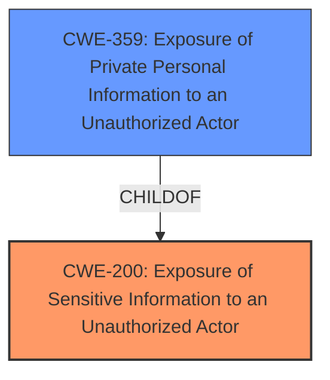

# Raw Analyzer Response for CVE-2021-31545

# Summary
| CWE ID | CWE Name | Confidence | CWE Abstraction Level | CWE Vulnerability Mapping Label | CWE-Vulnerability Mapping Notes |
|---|---|---|---|---|---|
| CWE-200 | Exposure of Sensitive Information to an Unauthorized Actor | 0.75 | Class | Primary | Discouraged due to being high-level, but appropriate given the information leak |
| CWE-359 | Exposure of Private Personal Information to an Unauthorized Actor | 0.6 | Base | Secondary | Allowed. A more specific instance of CWE-200 |

## Evidence and Confidence

*   **Confidence Score:** 0.7
*   **Evidence Strength:** MEDIUM

## Relationship Analysis
The primary CWE is CWE-200, which represents the general case of exposing sensitive information. CWE-359 is a child of CWE-200, representing the specific case of exposing private personal information. The vulnerability description indicates the leakage of usernames, which falls under the category of personal information, making CWE-359 a relevant, more specific, secondary CWE. The choice of CWE-200 is influenced by its high-level nature, capturing the essence of information exposure, while CWE-359 provides a more granular classification related to personal data.

## Vulnerability Chain
The vulnerability chain begins with a **lack of** proper access control within the `page_recent_contributors` function. This **improper** handling leads to the exposure of deleted MediaWiki usernames. The final impact is the leakage of sensitive information (usernames) to unauthorized actors.

## Summary of Analysis
The initial assessment was focused on identifying the root cause of the information leak. The "CVE Reference Links Content Summary" section provided key evidence, stating that the `page_recent_contributors` function did not properly check revision visibility. This **lack of** checking led to the exposure of usernames, which should have been hidden.

The selection of CWE-200 is based on the high-level description of exposing sensitive information to unauthorized actors. Although CWE-200 is discouraged due to its broad nature, it is appropriate here because the vulnerability's core impact is indeed an information exposure. Further, the exposed information consists of usernames, which qualifies as private, personal information. Therefore, CWE-359, a child of CWE-200, is also included as a more specific classification.

The graph relationships influenced the selection by providing a clear hierarchical structure. CWE-359 is a child of CWE-200, which allows for a layered classification approach. The retriever results also supported the selection of CWE-200 and CWE-359, with relatively high scores, further solidifying the confidence in the mapping. The selected CWEs are at an optimal level of specificity by capturing the general information exposure (CWE-200) and the specific type of information exposed (CWE-359).

Relevant CWE Information:
# Enhanced Context (25 CWEs)
The following CWEs were identified as potentially relevant to this vulnerability:

## CWE-538: Insertion of Sensitive Information into Externally-Accessible File or Directory
**Abstraction Level**: Base
**Similarity Score**: 0.81
**Source**: dense

**Description**:
The product places sensitive information into files or directories that are accessible to actors who are allowed to have access to the files, but not to the sensitive information.

**Mapping Guidance**:
- Usage: Allowed
- Rationale: This CWE entry is at the Base level of abstraction, which is a preferred level of abstraction for mapping to the root causes of vulnerabilities.

## CWE-212: Improper Removal of Sensitive Information Before Storage or Transfer
**Abstraction Level**: Base
**Similarity Score**: 0.77
**Source**: dense

**Description**:
The product stores, transfers, or shares a resource that contains sensitive information, but it does not properly remove that information before the product makes the resource available to unauthorized actors.

**Mapping Guidance**:
- Usage: Allowed
- Rationale: This CWE entry is at the Base level of abstraction, which is a preferred level of abstraction for mapping to the root causes of vulnerabilities.

## CWE-202: Exposure of Sensitive Information Through Data Queries
**Abstraction Level**: Base
**Similarity Score**: 0.77
**Source**: dense

**Description**:
When trying to keep information confidential, an attacker can often infer some of the information by using statistics.

**Mapping Guidance**:
- Usage: Allowed
- Rationale: This CWE entry is at the Base level of abstraction, which is a preferred level of abstraction for mapping to the root causes of vulnerabilities.

## CWE-497: Exposure of Sensitive System Information to an Unauthorized Control Sphere
**Abstraction Level**: Base
**Similarity Score**: 0.77
**Source**: dense

**Description**:
The product does not properly prevent sensitive system-level information from being accessed by unauthorized actors who do not have the same level of access to the underlying system as the product does.

**Mapping Guidance**:
- Usage: Allowed
- Rationale: This CWE entry is at the Base level of abstraction, which is a preferred level of abstraction for mapping to the root causes of vulnerabilities.

## CWE-540: Inclusion of Sensitive Information in Source Code
**Abstraction Level**: Base
**Similarity Score**: 0.77
**Source**: dense

**Description**:
Source code on a web server or repository often contains sensitive information and should generally not be accessible to users.

**Mapping Guidance**:
- Usage: Allowed
- Rationale: This CWE entry is at the Base level of abstraction, which is a preferred level of abstraction for mapping to the root causes of vulnerabilities.

## CWE-226: Sensitive Information in Resource Not Removed Before Reuse
**Abstraction Level**: Base
**Similarity Score**: 0.77
**Source**: dense

**Description**:
The product releases a resource such as memory or a file so that it can be made available for reuse, but it does not clear or "zeroize" the information contained in the resource before the product performs a critical state transition or makes the resource available for reuse by other entities.

**Mapping Guidance**:
- Usage: Allowed
- Rationale: This CWE entry is at the Base level of abstraction, which is a preferred level of abstraction for mapping to the root causes of vulnerabilities.

## CWE-359: Exposure of Private Personal Information to an Unauthorized Actor
**Abstraction Level**: Base
**Similarity Score**: 0.76
**Source**: dense

**Description**:
The product does not properly prevent a person's private, personal information from being accessed by actors who either (1) are not explicitly authorized to access the information or (2) do not have the implicit consent of the person about whom the information is collected.

**Mapping Guidance**:
- Usage: Allowed
- Rationale: This CWE entry is at the Base level of abstraction, which is a preferred level of abstraction for mapping to the root causes of vulnerabilities.

## CWE-668: Exposure of Resource to Wrong Sphere
**Abstraction Level**: Class
**Similarity Score**: 0.76
**Source**: dense

**Description**:
The product exposes a resource to the wrong control sphere, providing unintended actors with inappropriate access to the resource.

**Mapping Guidance**:
- Usage: Discouraged
- Rationale: CWE-668 is high-level and is often misused as a catch-all when lower-level CWE IDs might be applicable. It is sometimes used for low-information vulnerability reports [REF-1287]. It is a level-1 Class (i.e., a child of a Pillar). It is not useful for trend analysis.

## CWE-213: Exposure of Sensitive Information Due to Incompatible Policies
**Abstraction Level**: Base
**Similarity Score**: 0.76
**Source**: dense

**Description**:
The product's intended functionality exposes information to certain actors in accordance with the developer's security policy, but this information is regarded as sensitive according to the intended security policies of other stakeholders such as the product's administrator, users, or others whose information is being processed.

**Mapping Guidance**:
- Usage: Allowed
- Rationale: This CWE entry is at the Base level of abstraction, which is a preferred level of abstraction for mapping to the root causes of vulnerabilities.

## CWE-552: Files or Directories Accessible to External Parties
**Abstraction Level**: Base
**Similarity Score**: 0.76
**Source**: dense

**Description**:
The product makes files or directories accessible to unauthorized actors, even though they should not be.

**Mapping Guidance**:
- Usage: Allowed
- Rationale: This CWE entry is at the Base level of abstraction, which is a preferred level of abstraction for mapping to the root causes of vulnerabilities.

## CWE-200: Exposure of Sensitive Information to an Unauthorized Actor
**Abstraction Level