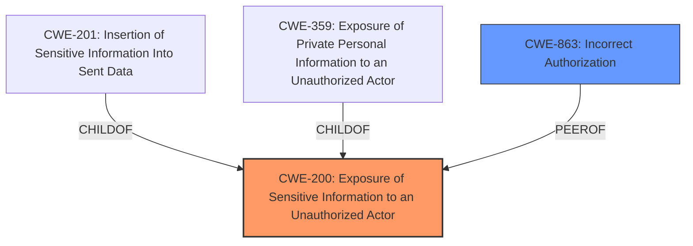

# Analysis Report for CVE-2021-31547

# Vulnerability Analysis Report: CVE-2021-31547

## Description


## Analysis (with Relationship Data)

# Summary

| CWE ID  | CWE Name                                                     | Confidence | CWE Abstraction Level | CWE Vulnerability Mapping Label | CWE-Vulnerability Mapping Notes |
| :-------- | :----------------------------------------------------------- | :--------- | :-------------------- | :---------------------------- | :------------------------------ |
| CWE-200 | Exposure of Sensitive Information to an Unauthorized Actor | 0.8        | Class                 | Primary CWE                   | Allowed-with-Review            |
| CWE-863 | Incorrect Authorization                                        | 0.7        | Class                 | Secondary Candidate             | Allowed-with-Review            |

## Evidence and Confidence

*   **Confidence Score:** 0.75
*   **Evidence Strength:** MEDIUM

## Relationship Analysis

The primary relationship considered here is that CWE-200 is a parent of CWE-201 (Insertion of Sensitive Information Into Sent Data) and CWE-359 (Exposure of Private Personal Information to an Unauthorized Actor). While CWE-201 and CWE-359 are more specific, the available evidence doesn't fully support specifying the exact mechanism of information exposure. CWE-863 (Incorrect Authorization) is a class-level CWE that could be a contributing factor, especially given the context of unauthorized access.



## Vulnerability Chain

The chain of events can be described as follows:

1.  **Improper Access Control:** The `ApiAbuseFilterCheckMatch` API lacked proper checks for visibility (suppression) of revisions and log entries.
2.  **Incorrect Authorization (CWE-863):** Because of the missing checks, users with limited privileges (`abusefilter-view-private` or `abusefilter-modify`) were able to access suppressed content.
3.  **Exposure of Sensitive Information (CWE-200):** Suppressed edits and usernames were revealed to unauthorized users.

## Summary of Analysis

My analysis is based on the vulnerability description, CVE reference, and the enhanced context provided.

The core of the vulnerability lies in the fact that suppressed information was revealed to users who should not have had access to it. The CVE reference states: "The `ApiAbuseFilterCheckMatch` API in the MediaWiki AbuseFilter extension did not properly check the visibility of suppressed revisions and abuse log entries. This allowed users with `abusefilter-view-private` or `abusefilter-modify` rights to potentially recover information from suppressed content."

The primary CWE is **CWE-200 (Exposure of Sensitive Information to an Unauthorized Actor)**, which aligns with the **impact** of the vulnerability, as unprivileged users were able to access suppressed edits and usernames. While CWE-200 is discouraged for being too general, in this instance, the evidence supports that the API was explicitly exposing data that should have been protected. The retriever identifies **CWE-201 (Insertion of Sensitive Information Into Sent Data)** and **CWE-359 (Exposure of Private Personal Information to an Unauthorized Actor)**. These are more specific, but without more information on *how* the information was exposed (e.g. in a log file vs. directly sent), sticking with CWE-200 is reasonable.

A secondary contributing factor is **CWE-863 (Incorrect Authorization)**. The API **failed to properly authorize** access to the suppressed information, which led to the exposure. While the primary issue is the exposure itself, the underlying authorization failure contributed to the vulnerability.

I considered other CWEs from the retriever results, such as **CWE-203 (Observable Discrepancy)** and **CWE-208 (Observable Timing Discrepancy)**, but these are not relevant as the vulnerability does not involve timing or observable differences in responses.

Relevant CWE Information:

# Enhanced Context (25 CWEs)
The following CWEs were identified as potentially relevant to this vulnerability:

## CWE-807: Reliance on Untrusted Inputs in a Security Decision
**Abstraction Level**: Base
**Similarity Score**: 0.76
**Source**: dense

**Description**:
The product uses a protection mechanism that relies on the existence or values of an input, but the input can be modified by an untrusted actor in a way that bypasses the protection mechanism.

**Mapping Guidance**:
- Usage: Allowed
- Rationale: This CWE entry is at the Base level of abstraction, which is a preferred level of abstraction for mapping to the root causes of vulnerabilities.

*Not Applicable:* This CWE is not applicable because the vulnerability is not about relying on untrusted inputs in a security decision. It's more about improper authorization leading to information exposure.

## CWE-204: Observable Response Discrepancy
**Abstraction Level**: Base
**Similarity Score**: 0.76
**Source**: dense

**Description**:
The product provides different responses to incoming requests in a way that reveals internal state information to an unauthorized actor outside of the intended control sphere.

**Mapping Guidance**:
- Usage: Allowed
- Rationale: This CWE entry is at the Base level of abstraction, which is a preferred level of abstraction for mapping to the root causes of vulnerabilities.

*Not Applicable:* This CWE is not applicable because the vulnerability does not involve observing discrepancies in responses to infer information.

## CWE-639: Authorization Bypass Through User-Controlled Key
**Abstraction Level**: Base
**Similarity Score**: 0.75
**Source**: dense

**Description**:
The system's authorization functionality does not prevent one user from gaining access to another user's data or record by modifying the key value identifying the data.

**Mapping Guidance**:
- Usage: Allowed
- Rationale: This CWE entry is at the Base level of abstraction, which is a preferred level of abstraction for mapping to the root causes of vulnerabilities.

*Not Applicable:* While there is an authorization issue, it's not directly related to user-controlled keys.

## CWE-1390: Weak Authentication
**Abstraction Level**: Class
**Similarity Score**: 0.75
**Source**: dense

**Description**:
The product uses an authentication mechanism to restrict access to specific users or identities, but the mechanism does not sufficiently prove that the claimed identity is correct.

**Mapping Guidance**:
- Usage: Allowed-with-Review
- Rationale: This CWE entry is a Class and might have Base-level children that would be more appropriate

*Not Applicable:* The issue is not with the strength of the authentication mechanism itself, but with the authorization process after authentication.

## CWE-208: Observable Timing Discrepancy
**Abstraction Level**: Base
**Similarity Score**: 0.75
**Source**: dense

**Description**:
Two separate operations in a product require different amounts of time to complete, in a way that is observable to an actor and reveals security-relevant information about the state of the product, such as whether a particular operation was successful or not.

**Mapping Guidance**:
- Usage: Allowed
- Rationale: This CWE entry is at the Base level of abstraction, which is a preferred level of abstraction for mapping to the root causes of vulnerabilities.

*Not Applicable:* This CWE is not applicable because the vulnerability does not involve timing discrepancies.

## CWE-303: Incorrect Implementation of Authentication Algorithm
**Abstraction Level**: Base
**Similarity Score**: 0.75
**Source**: dense

**Description**:
The requirements for the product dictate the use of an established authentication algorithm, but the implementation of the algorithm is incorrect.

**Mapping Guidance**:
- Usage: Allowed
- Rationale: This CWE entry is at the Base level of abstraction, which is a preferred level of abstraction for mapping to the root causes of vulnerabilities.

*Not Applicable:* The issue is not with the authentication algorithm, but with the authorization process.

## CWE-668: Exposure of Resource to Wrong Sphere
**Abstraction Level**: Class
**Similarity Score**: 0.74
**Source**: dense

**Description**:
The product exposes a resource to the wrong control sphere, providing unintended actors with inappropriate access to the resource.

**Mapping Guidance**:
- Usage: Discouraged
- Rationale: CWE-668 is high-level and is often misused as a catch-all when lower-level CWE IDs might be applicable. It is sometimes used for low-information vulnerability reports [REF-1287]. It is a level-1 Class (i.e., a child of a Pillar). It is not useful for trend analysis.

*Not Applicable:* While the vulnerability does involve exposing a resource (suppressed information) to the wrong sphere, CWE-200 is a more direct and specific fit.

##


## CWE Relationship Analysis

Current CWEs represent these abstraction levels: .


### Vulnerability Chain Analysis

**Chain starting from CWE-639:**
- 639 (Authorization Bypass Through User-Controlled Key) - ROOT


**Chain starting from CWE-303:**
- 303 (Incorrect Implementation of Authentication Algorithm) - ROOT


### CWE Relationship Diagram

```mermaid
graph TD
    classDef primary fill:#f96,stroke:#333,stroke-width:2px
    classDef secondary fill:#69f,stroke:#333
    classDef tertiary fill:#9e9,stroke:#333
```


*Report generated on 2025-04-02 07:58:04*
