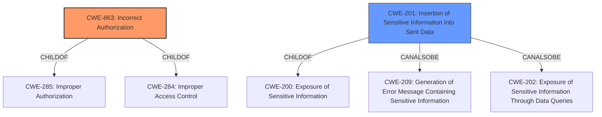

# Analysis Report for CVE-2021-31552

# Vulnerability Analysis Report: CVE-2021-31552

## Description


## Analysis (with Relationship Data)

# Summary
| CWE ID  | CWE Name                                                                 | Confidence | CWE Abstraction Level | CWE Vulnerability Mapping Label | CWE-Vulnerability Mapping Notes |
| :-------- | :----------------------------------------------------------------------- | :--------- | :---------------------- | :------------------------------ | :------------------------------ |
| CWE-863   | Incorrect Authorization                                                | 0.9        | Class                   | Primary CWE                      | Allowed-with-Review            |
| CWE-201   | Insertion of Sensitive Information Into Sent Data                      | 0.7        | Base                    | Secondary Candidate             | Allowed                       |

## Evidence and Confidence

*   **Confidence Score:** 0.8
*   **Evidence Strength:** HIGH

## Relationship Analysis
The primary CWE identified is CWE-863, "Incorrect Authorization," which is a class-level CWE. It has parent relationships with CWE-285 and CWE-284, both related to improper authorization. CWE-201, "Insertion of Sensitive Information Into Sent Data," is a base-level CWE and is related to CWE-200, "Exposure of Sensitive Information". CWE-201 can also be related to CWE-209, "Generation of Error Message Containing Sensitive Information" and CWE-202, "Exposure of Sensitive Information Through Data Queries". The abstraction levels influenced the decision to prioritize CWE-863 as a primary classification, given the initial **incorrect execution of rules** and then complement with CWE-201 because the impact was leaking sensitive IP addresses.



## Vulnerability Chain
The vulnerability chain starts with the **incorrect execution of rules** related to blocking accounts. This leads to the ability to create accounts while blocking only the IP address. Finally, this results in the exposure of IP addresses in the abuse log.

## Summary of Analysis
The initial analysis focused on the **incorrect execution of certain rules** which leads to the bypass of the intended account blocking, which is a violation of the intended authorization mechanism. The evidence for this lies in the vulnerability description: "It **incorrectly executed certain rules related to blocking accounts after account creation**."

The selection of CWE-863 is based on the fact that the AbuseFilter was intended to authorize or prevent certain actions, but it did so incorrectly. The summary of CVE-2021-31552 also supports this: "The vulnerability stems from the AbuseFilter's behavior of blocking account creation by blocking the underlying IP address, which inadvertently exposes the IP address of the account creator in the abuse log."

CWE-201 is also considered as a secondary issue, because blocking the IP address instead of the account led to the **exposure of sensitive information** (IP addresses). This is also confirmed by the CVE summary: "The primary impact of this vulnerability is the exposure of the IP addresses of users attempting to create accounts that trigger AbuseFilter rules".

The selected CWEs are at the optimal level of specificity, representing both the root cause (**incorrect authorization**) and a significant impact (**exposure of sensitive information**).

Relevant CWE Information:

# Enhanced Context (25 CWEs)

## CWE-367: Time-of-check Time-of-use (TOCTOU) Race Condition
I considered CWE-367, but this vulnerability doesn't involve a race condition where the state of a resource changes between a check and its use. Instead, it's a matter of incorrect implementation of blocking rules.

## CWE-41: Improper Resolution of Path Equivalence
CWE-41 is not relevant because the vulnerability doesn't involve file system path manipulation or equivalence issues.

## CWE-668: Exposure of Resource to Wrong Sphere
CWE-668 is too high-level. The vulnerability involves a specific type of authorization issue and information exposure, making lower-level CWEs more appropriate.

## CWE-667: Improper Locking
CWE-667 is not relevant as it deals with locking mechanisms, which are not involved in this vulnerability.

## CWE-404: Improper Resource Shutdown or Release
CWE-404 does not apply because the issue is not related to resource release or shutdown.

## CWE-184: Incomplete List of Disallowed Inputs
CWE-184 is not applicable because the vulnerability isn't related to an incomplete list of disallowed inputs.

## CWE-59: Improper Link Resolution Before File Access ('Link Following')
CWE-59 is not relevant as the vulnerability doesn't involve file access via links or shortcuts.

## CWE-754: Improper Check for Unusual or Exceptional Conditions
CWE-754 is too generic. The vulnerability is a specific authorization flaw rather than a general failure to check for unusual conditions.

## CWE-639: Authorization Bypass Through User-Controlled Key
CWE-639 doesn't fit because the vulnerability isn't about modifying keys to bypass authorization.

## CWE-267: Privilege Defined With Unsafe Actions
CWE-267 is related, but the core issue is not about privileges being defined with unsafe actions. It's about the incorrect execution of rules.

## CWE-79: Improper Neutralization of Input During Web Page Generation ('Cross-site Scripting')
CWE-79 is not relevant because the vulnerability doesn't involve cross-site scripting.

## CWE-863: Incorrect Authorization
CWE-863 is the primary CWE because it directly addresses the **incorrect** authorization check performed by the AbuseFilter.

## CWE-285: Improper Authorization
CWE-285 is a parent of CWE-863 and is considered, but CWE-863 provides a more specific classification.

## CWE-367: Time-of-check Time-of-use (TOCTOU) Race Condition
CWE-367 is not relevant because there is no race condition involved.

## CWE-116: Improper Encoding or Escaping of Output
CWE-116 is not relevant because the vulnerability doesn't involve encoding or escaping of output.

## CWE-79: Improper Neutralization of Input During Web Page Generation ('Cross-site Scripting')
CWE-79 is not relevant because the vulnerability doesn't involve cross-site scripting.

## CWE-613: Insufficient Session Expiration
CWE-613 is not relevant because the vulnerability doesn't involve session expiration issues.

## CWE-494: Download of Code Without Integrity Check
CWE-494 is not relevant because the vulnerability doesn't involve downloading code without integrity checks.

## CWE-202: Exposure of Sensitive Information Through Data Queries
CWE-202 is considered but CWE-201 is more specific since the exposure is through sent data.

## CWE-201: Insertion of Sensitive Information Into Sent Data
CWE-201 is a secondary CWE because it addresses the **exposure of sensitive information** (IP addresses) as a result of the incorrect authorization.

## CWE-178: Improper Handling of Case Sensitivity
CWE-178 is not relevant because the vulnerability doesn't involve case sensitivity issues.

## CWE-209: Generation of Error Message Containing Sensitive Information
CWE-209 is related to information exposure, but the information is not being exposed through error messages.

## CWE-352: Cross-Site Request Forgery (CSRF)
CWE-352 is not relevant because the vulnerability doesn't involve cross-site request forgery.

## CWE-252: Unchecked Return Value
CWE-252 is not relevant because the vulnerability doesn't involve unchecked return values.

## CWE-41: Improper Resolution of Path Equivalence
CWE-41 is not relevant because the vulnerability doesn't involve path equivalence issues.


## CWE Relationship Analysis

Current CWEs represent these abstraction levels: .


### Vulnerability Chain Analysis

**Chain starting from CWE-754:**
- 754 (Improper Check for Unusual or Exceptional Conditions) - ROOT


**Chain starting from CWE-404:**
- 404 (Improper Resource Shutdown or Release) - ROOT


### CWE Relationship Diagram

```mermaid
graph TD
    classDef primary fill:#f96,stroke:#333,stroke-width:2px
    classDef secondary fill:#69f,stroke:#333
    classDef tertiary fill:#9e9,stroke:#333
```


*Report generated on 2025-04-01 22:38:22*
