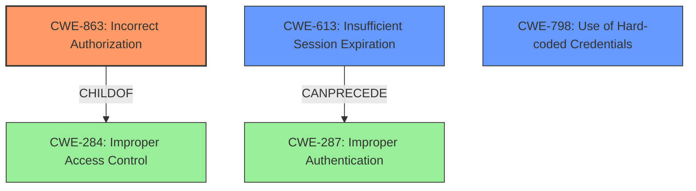

# Analysis for CVE-2021-31590

# Summary
| CWE ID | CWE Name | Confidence | CWE Abstraction Level | CWE Vulnerability Mapping Label | CWE-Vulnerability Mapping Notes |
|---|---|---|---|---|---|
| CWE-863 | Incorrect Authorization | 0.9 | Class | Primary | Allowed-with-Review |
| CWE-613 | Insufficient Session Expiration | 0.7 | Base | Secondary | Allowed |
| CWE-798 | Use of Hard-coded Credentials | 0.6 | Base | Secondary | Allowed |

## Evidence and Confidence

*   **Confidence Score:** 0.8
*   **Evidence Strength:** HIGH

## Relationship Analysis
The primary relationship that impacted my decision was the hierarchical relationship between CWE-863 (Incorrect Authorization) and its parent CWE-284 (Improper Access Control). While CWE-284 is a broader category, CWE-863 provides a more specific classification for the authorization issue in this vulnerability.

CWE-613 (Insufficient Session Expiration) is also related, as the JWTs are not expiring when they should, allowing the attacker to maintain elevated permissions. CWE-613 can precede CWE-287 (Improper Authentication).

CWE-798 (Use of Hard-coded Credentials) is a secondary candidate as well, because the CVE description mentions use of hardcoded JWT secrets.

## Vulnerability Chain
The vulnerability chain starts with **incorrect JSON Webtoken handling** which leads to **incorrect access control**. The root cause is the backend's failure to verify JWT claims against the database after token generation, combined with potential hardcoded JWT secrets and insufficient session expiration. This allows an attacker with a valid JWT to maintain admin privileges even after being downgraded, leading to complete system compromise.

## Summary of Analysis
My analysis concludes that CWE-863 (Incorrect Authorization) is the most appropriate primary CWE for this vulnerability, with CWE-613 (Insufficient Session Expiration) and CWE-798 (Use of Hard-coded Credentials) as secondary contributing factors.

The evidence from the "CVE Reference Links Content Summary" clearly indicates that the backend does not verify JWT claims against the database after token generation, resulting in **incorrect access control**. This aligns perfectly with the description of CWE-863, where the authorization check is performed incorrectly.

The retriever results also support this conclusion, with CWE-863 being ranked as the top candidate. Although CWE-284 (Improper Access Control) is a parent of CWE-863, it is a more general classification and therefore less appropriate. The usage guidance for CWE-284 discourages its use in favor of more specific descendants like CWE-863.

CWE-613 (Insufficient Session Expiration) is a secondary weakness because the vulnerability allows a user to retain admin privileges even after being downgraded or deleted. The session is not expiring when it should be.

CWE-798 (Use of Hard-coded Credentials) is also a secondary weakness because the CVE description mentions the use of hardcoded JWT secrets.

The selected CWEs are at the optimal level of specificity because they directly address the root cause and contributing factors of the vulnerability, as supported by the evidence.