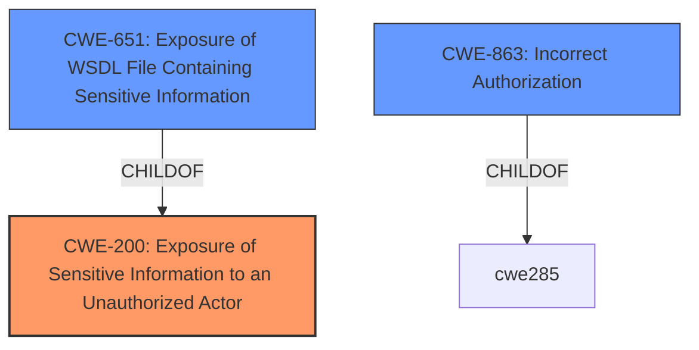

# Analysis for CVE-2021-31601

# Summary
| CWE ID | CWE Name | Confidence | CWE Abstraction Level | CWE Vulnerability Mapping Label | CWE-Vulnerability Mapping Notes |
|---|---|---|---|---|---|
| CWE-200 | Exposure of Sensitive Information to an Unauthorized Actor | 0.9 | Class | Primary | Discouraged due to being high-level, but applicable |
| CWE-651 | Exposure of WSDL File Containing Sensitive Information | 0.7 | Variant | Secondary | Allowed, matches the technology stack |
| CWE-863 | Incorrect Authorization | 0.6 | Class | Secondary | Allowed-with-Review, consider more specific children |

## Evidence and Confidence

*   **Confidence Score:** 0.8
*   **Evidence Strength:** MEDIUM

## Relationship Analysis
The primary relationship considered was the parent-child relationship between CWE-200 and CWE-651, where CWE-651 is a more specific variant of CWE-200 related to WSDL files. While CWE-200 is discouraged due to being high-level, it accurately captures the exposure of sensitive information. CWE-863 was considered due to the possibility of an authorization issue leading to the information exposure, but evidence for this is weak.

## Vulnerability Chain
The vulnerability chain starts with the implementation of web services using SOAP, followed by an **impact:** where an authenticated user is able to list all databases connection details and credentials. This leads to the **exposure of sensitive information**. The weakness appears to be a **missing or incorrect authorization** check that would prevent authenticated users from accessing sensitive database connection details.

## Summary of Analysis
The initial analysis identified the **impact:** as the exposure of sensitive information, which strongly suggests CWE-200. The retriever results also highlighted CWE-200, CWE-651 and CWE-863 as potential candidates. The final selection prioritizes CWE-200 due to its direct relevance to the vulnerability description, further refined by CWE-651 due to the vulnerability existing in the WSDL file. While CWE-863 (Incorrect Authorization) is plausible, the provided information does not provide enough evidence to confirm this as a root cause. The assessment heavily relies on the provided vulnerability description, particularly the phrase "**impact:** list all databases connection details and credentials."

Relevant CWE Information:

# Enhanced Context (25 CWEs)

## CWE-807: Reliance on Untrusted Inputs in a Security Decision
**Abstraction Level**: Base
**Similarity Score**: 0.78
**Source**: dense

**Description**:
The product uses a protection mechanism that relies on the existence or values of an input, but the input can be modified by an untrusted actor in a way that bypasses the protection mechanism.
- This CWE is not relevant because the vulnerability stems from the fact that an authenticated user can list the database connection, not from reliance on an untrusted input.

## CWE-1289: Improper Validation of Unsafe Equivalence in Input
**Abstraction Level**: Base
**Similarity Score**: 0.76
**Source**: dense

**Description**:
The product receives an input value that is used as a resource identifier or other type of reference, but it does not validate or incorrectly validates that the input is equivalent to a potentially-unsafe value.
- This CWE is not relevant because the vulnerability does not involve validating input values as resource identifiers. The core problem is **unauthorized access** to information.

## CWE-183: Permissive List of Allowed Inputs
**Abstraction Level**: Base
**Similarity Score**: 0.75
**Source**: dense

**Description**:
The product implements a protection mechanism that relies on a list of inputs (or properties of inputs) that are explicitly allowed by policy because the inputs are assumed to be safe, but the list is too permissive - that is, it allows an input that is unsafe, leading to resultant weaknesses.
- This CWE is not directly relevant, as the vulnerability does not clearly hinge on a overly permissive input list.

## CWE-668: Exposure of Resource to Wrong Sphere
**Abstraction Level**: Class
**Similarity Score**: 0.75
**Source**: dense

**Description**:
The product exposes a resource to the wrong control sphere, providing unintended actors with inappropriate access to the resource.
- This CWE is too general. The more specific CWE-200 is more relevant.

## CWE-303: Incorrect Implementation of Authentication Algorithm
**Abstraction Level**: Base
**Similarity Score**: 0.75
**Source**: dense

**Description**:
The requirements for the product dictate the use of an established authentication algorithm, but the implementation of the algorithm is incorrect.
- This CWE is not relevant because the vulnerability doesn't mention anything about the authentication algorithm.

## CWE-274: Improper Handling of Insufficient Privileges
**Abstraction Level**: Base
**Similarity Score**: 0.75
**Source**: dense

**Description**:
The product does not handle or incorrectly handles when it has insufficient privileges to perform an operation, leading to resultant weaknesses.
- The description is a little too vague, doesn't quite fit

## CWE-639: Authorization Bypass Through User-Controlled Key
**Abstraction Level**: Base
**Similarity Score**: 0.74
**Source**: dense

**Description**:
The system's authorization functionality does not prevent one user from gaining access to another user's data or record by modifying the key value identifying the data.
- This is not relevant as there's no mention of key modification.

## CWE-74: Improper Neutralization of Special Elements in Output Used by a Downstream Component ('Injection')
**Abstraction Level**: Class
**Similarity Score**: 0.74
**Source**: dense

**Description**:
The product constructs all or part of a command, data structure, or record using externally-influenced input from an upstream component, but it does not neutralize or incorrectly neutralizes special elements that could modify how it is parsed or interpreted when it is sent to a downstream component.
- This is not relevant as there's no injection scenario described.

## CWE-184: Incomplete List of Disallowed Inputs
**Abstraction Level**: Base
**Similarity Score**: 0.74
**Source**: dense

**Description**:
The product implements a protection mechanism that relies on a list of inputs (or properties of inputs) that are not allowed by policy or otherwise require other action to neutralize before additional processing takes place, but the list is incomplete.
- Not relevant as there is no mention of an incomplete list of disallowed inputs.

## CWE-1390: Weak Authentication
**Abstraction Level**: Class
**Similarity Score**: 0.74
**Source**: dense

**Description**:
The product uses an authentication mechanism to restrict access to specific users or identities, but the mechanism does not sufficiently prove that the claimed identity is correct.
- The problem is not that the authentication is weak, but that authorization is wrong.

## CWE-200: Exposure of Sensitive Information to an Unauthorized Actor
**Abstraction Level**: Class
**Similarity Score**: 6929.50
**Source**: sparse

**Description**:
The product exposes sensitive information to an actor that is not explicitly authorized to have access to that information.
- This fits the description very well, and it is the Primary CWE.

## CWE-863: Incorrect Authorization
**Abstraction Level**: Class
**Similarity Score**: 6928.89
**Source**: sparse

**Description**:
The product performs an authorization check when an actor attempts to access a resource or perform an action, but it does not correctly perform the check.
- This may be related, but requires more evidence, which is not available. The vulnerability description only describes the impact, not how the authorization check is incorrect.

## CWE-639: Authorization Bypass Through User-Controlled Key
**Abstraction Level**: Base
**Similarity Score**: 6815.21
**Source**: sparse

**Description**:
The system's authorization functionality does not prevent one user from gaining access to another user's data or record by modifying the key value identifying the data.
- There's no user-controlled key.

## CWE-22: Improper Limitation of a Pathname to a Restricted Directory ('Path Traversal')
**Abstraction Level**: Base
**Similarity Score**: 6796.70
**Source**: sparse

**Description**:
The product uses external input to construct a pathname that is intended to identify a file or directory that is located underneath a restricted parent directory, but the product does not properly neutralize special elements within the pathname that can cause the pathname to resolve to a location that is