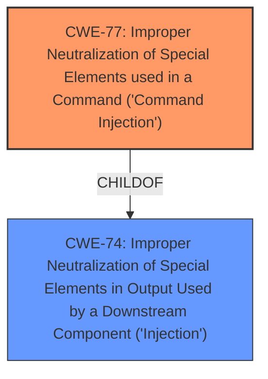

# Raw Analyzer Response for CVE-2021-31605

# Summary
| CWE ID | CWE Name | Confidence | CWE Abstraction Level | CWE Vulnerability Mapping Label | CWE-Vulnerability Mapping Notes |
|---|---|---|---|---|---|
| CWE-77 | Improper Neutralization of Special Elements used in a Command ('Command Injection') | 0.9 | Class | Allowed-with-Review | Primary CWE |

## Evidence and Confidence

*   **Confidence Score:** 0.9
*   **Evidence Strength:** MEDIUM

## Relationship Analysis
The primary relationship influencing the decision is the ChildOf relationship between CWE-77 and CWE-74 (Improper Neutralization of Special Elements in Output Used by a Downstream Component ('Injection')). CWE-77 is a more specific form of CWE-74, relating specifically to command injection. The other relationships are not directly relevant to this specific vulnerability. The abstraction level of CWE-77 as a Class, while generally suggesting a search for a Base or Variant, is appropriate here because the description of the vulnerability involves command injection generally, rather than a specific type of command (like OS command injection).

## Vulnerability Chain
The vulnerability chain starts with the **improper neutralization** of special elements used in commands, which leads to **command injection**, ultimately resulting in the server being shut down.

## Summary of Analysis
The initial assessment, based on the vulnerability description, points towards **command injection**. The key phrase "command injection" in the vulnerability description strongly suggests CWE-77. The description states that the vulnerability allows an attacker to "shut down the server via signal%20SIGTERM," which is a consequence of successful command injection.

The Retriever Results list CWE-77 as the top candidate, with a score of 1.000. CWE-78 (OS Command Injection) is also a possibility, but CWE-77 is more general and appropriate because the description does not specify that the injection occurs within the operating system.

The Complete CWE Specifications for CWE-77 states: "The product constructs all or part of a command using externally-influenced input from an upstream component, but it does not neutralize or incorrectly neutralizes special elements that could modify the intended command when it is sent to a downstream component." This definition aligns with the vulnerability description. The Complete CWE Specifications also has the following mapping guidance: "CWE-77 is often misused when OS command injection (CWE-78) was intended instead [REF-1287]." Since the description does not specify that the command is an OS command, it is best to stick with CWE-77.

Other CWEs considered but not used:

*   CWE-78: Improper Neutralization of Special Elements used in an OS Command ('OS Command Injection') - While related, this is more specific to OS commands, which is not explicitly mentioned in the description.
*   CWE-1336: Improper Neutralization of Special Elements Used in a Template Engine - This is not relevant as the vulnerability description does not mention template engines.
*   CWE-89: Improper Neutralization of Special Elements used in an SQL Command ('SQL Injection') - This is not relevant as the vulnerability description does not mention SQL commands.

The selected CWE is at the optimal level of specificity because it accurately describes the **command injection** vulnerability without being overly specific about the type of command. The confidence level is high (0.9) due to the explicit mention of "command injection" and the alignment with the CWE description.