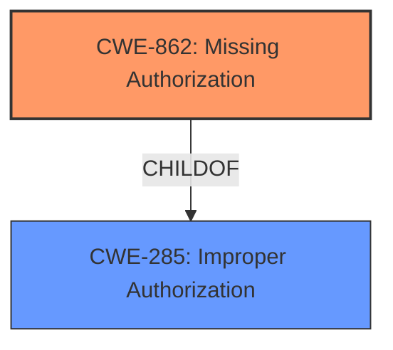

# Analysis Report for CVE-2021-31606

# Vulnerability Analysis Report: CVE-2021-31606

## Description


## Analysis (with Relationship Data)

# Summary
| CWE ID | CWE Name | Confidence | CWE Abstraction Level | CWE Vulnerability Mapping Label | CWE-Vulnerability Mapping Notes |
|---|---|---|---|---|---|
| CWE-862 | Missing Authorization | 0.8 | Class | Primary | Allowed-with-Review |

## Evidence and Confidence

*   **Confidence Score:** 0.8
*   **Evidence Strength:** LOW

## Relationship Analysis
The primary relationship that influenced my decision was the ChildOf relationship between CWE-862 (Missing Authorization) and CWE-285 (Improper Authorization). While CWE-285 is broader, CWE-862 specifically addresses the absence of an authorization check, which aligns with the vulnerability description. The Retriever Results listed CWE-862 as a strong candidate, further supporting this selection. The relationships between authentication and authorization were also considered.



## Vulnerability Chain
The vulnerability chain starts with the **missing authorization** check (CWE-862), which allows an attacker to disconnect arbitrary clients.
  - **ROOT CAUSE:** Missing Authorization (CWE-862)
  - **IMPACT:** Authorization Bypass to disconnect arbitrary clients

## Summary of Analysis
The initial analysis focused on the provided vulnerability description: "furlongm openvpn-monitor through 1.1.3 allows Authorization Bypass to disconnect arbitrary clients." The key phrase here is "Authorization Bypass," which immediately suggests issues related to authorization or authentication. The Retriever Results provided several candidate CWEs, including CWE-290, CWE-295, CWE-307, CWE-425, CWE-862, CWE-305, CWE-471, CWE-436, CWE-306, CWE-285.

The primary challenge was the lack of detailed information in the vulnerability description and the absence of a CVE Reference Links Content Summary. This made it difficult to pinpoint the exact root cause.

Given the limited evidence, I opted for CWE-862 (Missing Authorization) as the most appropriate choice. The vulnerability description explicitly mentions "Authorization Bypass," suggesting that the system fails to perform an authorization check, allowing unauthorized actions.

The decision is based on the vulnerability description only, which states, "furlongm openvpn-monitor through 1.1.3 allows Authorization Bypass to disconnect arbitrary clients."

CWE-862 is at the Class level of abstraction, which seems suitable given the lack of more specific information. A more specific CWE might be possible with more information, but I am choosing CWE-862 due to the lack of supporting information.

Relevant CWE Information:

# Enhanced Context (25 CWEs)

## CWE-303: Incorrect Implementation of Authentication Algorithm
**Abstraction Level**: Base
**Similarity Score**: 0.78
**Source**: dense

**Description**:
The requirements for the product dictate the use of an established authentication algorithm, but the implementation of the algorithm is incorrect.

**Mapping Guidance**:
- Usage: Allowed
- Rationale: This CWE entry is at the Base level of abstraction, which is a preferred level of abstraction for mapping to the root causes of vulnerabilities.

**Why Not Selected:** This CWE focuses on incorrect implementation of an authentication algorithm, but the description speaks to authorization bypass, not authentication.

## CWE-807: Reliance on Untrusted Inputs in a Security Decision
**Abstraction Level**: Base
**Similarity Score**: 0.78
**Source**: dense

**Description**:
The product uses a protection mechanism that relies on the existence or values of an input, but the input can be modified by an untrusted actor in a way that bypasses the protection mechanism.

**Mapping Guidance**:
- Usage: Allowed
- Rationale: This CWE entry is at the Base level of abstraction, which is a preferred level of abstraction for mapping to the root causes of vulnerabilities.

**Why Not Selected:** This CWE is related to untrusted inputs, which doesn't directly align with the authorization bypass mentioned in the description.

## CWE-305: Authentication Bypass by Primary Weakness
**Abstraction Level**: Base
**Similarity Score**: 0.77
**Source**: dense

**Description**:
The authentication algorithm is sound, but the implemented mechanism can be bypassed as the result of a separate weakness that is primary to the authentication error.

**Mapping Guidance**:
- Usage: Allowed
- Rationale: This CWE entry is at the Base level of abstraction, which is a preferred level of abstraction for mapping to the root causes of vulnerabilities.

**Why Not Selected:** While this CWE mentions authentication bypass, it implies a weakness in a separate area that leads to the bypass. The description focuses primarily on authorization bypass.

## CWE-274: Improper Handling of Insufficient Privileges
**Abstraction Level**: Base
**Similarity Score**: 0.77
**Source**: dense

**Description**:
The product does not handle or incorrectly handles when it has insufficient privileges to perform an operation, leading to resultant weaknesses.

**Mapping Guidance**:
- Usage: Discouraged
- Rationale: This CWE entry could be deprecated in a future version of CWE.

**Why Not Selected:** The vulnerability description focuses on an authorization bypass, suggesting a **missing** authorization check rather than **improper handling** of privileges.

## CWE-1390: Weak Authentication
**Abstraction Level**: Class
**Similarity Score**: 0.77
**Source**: dense

**Description**:
The product uses an authentication mechanism to restrict access to specific users or identities, but the mechanism does not sufficiently prove that the claimed identity is correct.

**Mapping Guidance**:
- Usage: Allowed-with-Review
- Rationale: This CWE entry is a Class and might have Base-level children that would be more appropriate

**Why Not Selected:** The description speaks to authorization bypass, not authentication.

## CWE-288: Authentication Bypass Using an Alternate Path or Channel
**Abstraction Level**: Base
**Similarity Score**: 0.77
**Source**: dense

**Description**:
The product requires authentication, but the product has an alternate path or channel that does not require authentication.

**Mapping Guidance**:
- Usage: Allowed
- Rationale: This CWE entry is at the Base level of abstraction, which is a preferred level of abstraction for mapping to the root causes of vulnerabilities.

**Why Not Selected:** The description speaks to authorization bypass, not authentication.

## CWE-302: Authentication Bypass by Assumed-Immutable Data
**Abstraction Level**: Base
**Similarity Score**: 0.77
**Source**: dense

**Description**:
The authentication scheme or implementation uses key data elements that are assumed to be immutable, but can be controlled or modified by the attacker.

**Mapping Guidance**:
- Usage: Allowed
- Rationale: This CWE entry is at the Base level of abstraction, which is a preferred level of abstraction for mapping to the root causes of vulnerabilities.

**Why Not Selected:** The description speaks to authorization bypass, not authentication.

## CWE-472: External Control of Assumed-Immutable Web Parameter
**Abstraction Level**: Base
**Similarity Score**: 0.77
**Source**: dense

**Description**:
The web application does not sufficiently verify inputs that are assumed to be immutable but are actually externally controllable, such as hidden form fields.

**Mapping Guidance**:
- Usage: Allowed
- Rationale: This CWE entry is at the Base level of abstraction, which is a preferred level of abstraction for mapping to the root causes of vulnerabilities.

**Why Not Selected:** This CWE is about external control of immutable web parameters, and focuses on the immutability aspect rather than the authorization bypass.

## CWE-639: Authorization Bypass Through User-Controlled Key
**Abstraction Level**: Base
**Similarity Score**: 0.76
**Source**: dense

**Description**:
The system's authorization functionality does not prevent one user from gaining access to another user's data or record by modifying the key value identifying the data.

**Mapping Guidance**:
- Usage: Allowed
- Rationale: This CWE entry is at the Base level of abstraction, which is a preferred level of abstraction for mapping to the root causes of vulnerabilities.

**Why Not Selected:** While this CWE is relevant, it's more specific about the bypass occurring through a user-controlled key. The generic term "Authorization Bypass" makes it difficult to assume this level of detail.

## CWE-280: Improper Handling of Insufficient Permissions or Privileges
**Abstraction Level**: Base
**Similarity Score**: 0.76
**Source**: dense

**Description**:
The product does not handle or incorrectly handles when it has insufficient privileges to access resources or functionality as specified by their permissions. This may cause it to follow unexpected code paths that may leave the product in an invalid state.

**Mapping Guidance**:
- Usage: Allowed
- Rationale: This CWE entry is at the Base level of abstraction, which is a preferred level of abstraction for mapping to the root causes of vulnerabilities.

**Why


## CWE Relationship Analysis

Current CWEs represent these abstraction levels: .


### Vulnerability Chain Analysis

**Chain starting from CWE-288:**
- 288 (Authentication Bypass Using an Alternate Path or Channel) - ROOT


**Chain starting from CWE-862:**
- 862 (Missing Authorization) - ROOT


### CWE Relationship Diagram

```mermaid
graph TD
    classDef primary fill:#f96,stroke:#333,stroke-width:2px
    classDef secondary fill:#69f,stroke:#333
    classDef tertiary fill:#9e9,stroke:#333
```


*Report generated on 2025-04-02 01:11:45*
