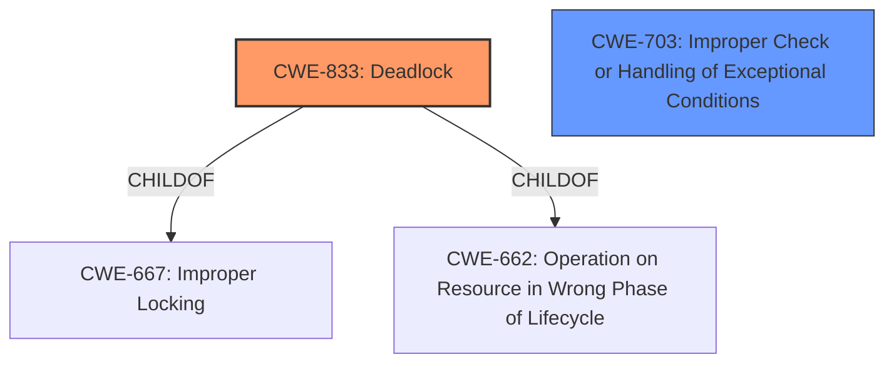

# Analysis for CVE-2021-31611

# Summary
| CWE ID  | CWE Name  | Confidence | CWE Abstraction Level | CWE Vulnerability Mapping Label | CWE-Vulnerability Mapping Notes |
|--------------|------------------------------------------------------|------------|--------------------------|------------------------------------|------------------------------------|
| CWE-833 | Deadlock | 0.9 | Base | Allowed | Primary CWE |
| CWE-703 | Improper Check or Handling of Exceptional Conditions | 0.4 | Pillar | Discouraged | Secondary Candidate |

## Evidence and Confidence

*   **Confidence Score:** 0.9
*   **Evidence Strength:** HIGH

## Relationship Analysis
The primary CWE is CWE-833 (Deadlock), which accurately reflects the vulnerability's impact. While CWE-703 (Improper Check or Handling of Exceptional Conditions) was considered, it is a high-level Pillar and less specific than CWE-833. CWE-833 is a child of CWE-667 (Improper Locking) and CWE-662 (Operation on Resource in Wrong Phase of Lifecycle). The vulnerability involves **improper handling of an out-of-order LMP Setup procedure**, leading to a deadlock. The chain starts with an **improper handling** issue, culminating in a deadlock.

## Vulnerability Chain
The vulnerability chain starts with the **improper handling of an out-of-order LMP Setup procedure**, specifically a duplicated `LMP_setup_complete` packet followed by a malformed `LMP_features_req_ext` packet. This leads to a deadlock, requiring a manual reboot.

## Summary of Analysis
The analysis is based on the vulnerability description and CVE reference links. The **root cause** is the **improper handling of the out-of-order LMP Setup procedure**. The resulting impact is a deadlock. The evidence explicitly mentions the deadlock, supporting the selection of CWE-833. The other CWEs considered, such as those related to buffer overflows or memory management, were not directly supported by the provided evidence. The relationship graph shows that the selected CWE is the most specific and accurate representation of the vulnerability.

Relevant CWE Information:

# Enhanced Context (25 CWEs)
The following CWEs were identified as potentially relevant to this vulnerability:

## CWE-703: Improper Check or Handling of Exceptional Conditions
**Abstraction Level**: Pillar
**Similarity Score**: 0.78
**Source**: dense

**Description**:
The product does not properly anticipate or handle exceptional conditions that rarely occur during normal operation of the product.

**Mapping Guidance**:
- Usage: Discouraged
- Rationale: This CWE entry is extremely high-level, a Pillar.

## CWE-833: Deadlock
**Abstraction:** Base
**Similarity Score**: 4757.79
**Source**: sparse

**Description**:
The product contains multiple threads or executable segments that are waiting for each other to release a necessary lock, resulting in deadlock.

**Mapping Guidance**:
- Usage: Allowed
- Rationale: This CWE entry is at the Base level of abstraction, which is a preferred level of abstraction for mapping to the root causes of vulnerabilities.

### Detailed Analysis:

**CWE-833: Deadlock**

*   **Matching:** The vulnerability description explicitly states that the device is deadlocked.
*   **Justification:** The **improper handling** of the LMP setup procedure results in a deadlock, aligning directly with the CWE description.
*   **Abstraction Level:** Base, which is the preferred level.
*   **Usage:** Allowed.
*   **Confidence:** 0.9

**CWE-703: Improper Check or Handling of Exceptional Conditions**

*   **Matching:** The description contains the phrase "**improper handling**" which is a characteristic of this CWE.
*   **Justification:** The **improper handling** of the out-of-order LMP setup procedure could be considered an exceptional condition.
*   **Abstraction Level:** Pillar, which is a high-level abstraction and not preferred.
*   **Usage:** Discouraged.
*   **Confidence:** 0.4
*   **Why Not Chosen:** It is too general and does not fully capture the specific nature of the deadlock vulnerability.

**Other CWEs Considered and Rejected:**

*   CWE-119 (Improper Restriction of Operations within the Bounds of a Memory Buffer), CWE-125 (Out-of-bounds Read), CWE-787 (Out-of-bounds Write), CWE-122 (Heap-based Buffer Overflow), CWE-129 (Improper Validation of Array Index): These CWEs are related to memory corruption issues. There's no evidence in the vulnerability description or CVE details that suggests memory corruption is involved. The issue is a deadlock caused by the **improper handling** of protocol messages, not a memory safety issue.
*   CWE-1284 (Improper Validation of Specified Quantity in Input): This CWE relates to improper validation of input quantities. While the vulnerability involves malformed packets, the core issue is not the validation of a specific quantity but the **improper handling** of the overall protocol sequence.
*   CWE-401 (Missing Release of Memory after Effective Lifetime): There is no evidence of memory leaks in the provided description.
*   CWE-306 (Missing Authentication for Critical Function): The vulnerability is not related to missing authentication.

The selection of CWE-833 is based on its direct relevance to the described deadlock condition. The other CWEs were considered but rejected due to a lack of supporting evidence in the vulnerability description and CVE reference.