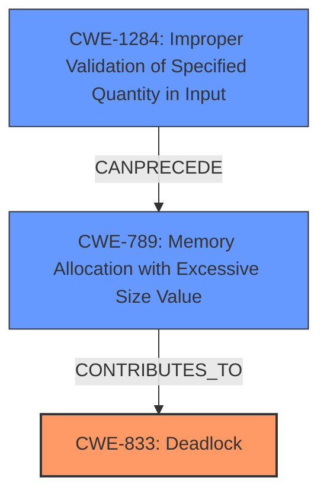

# Enhanced Analysis for CVE-2021-31612

# Summary
| CWE ID  | CWE Name                                                      | Confidence | CWE Abstraction Level | CWE Vulnerability Mapping Label | CWE-Vulnerability Mapping Notes |
| :------- | :------------------------------------------------------------ | :--------- | :---------------------- | :------------------------------ | :------------------------------ |
| CWE-833  | Deadlock                                                      | 0.9        | Base                    | Primary CWE                     | Allowed                       |
| CWE-1284 | Improper Validation of Specified Quantity in Input          | 0.7        | Base                    | Secondary CWE                   | Allowed                       |

## Evidence and Confidence

*   **Confidence Score:** 0.8
*   **Evidence Strength:** HIGH

## Relationship Analysis
The primary CWE is CWE-833 (Deadlock), representing the vulnerability's impact. A secondary CWE, CWE-1284 (Improper Validation of Specified Quantity in Input), highlights the root cause, specifically the **lack of validation** on the size of the LMP packet. These CWEs are not directly related in a parent-child or peer relationship, but CWE-1284 can precede CWE-789 (Memory Allocation with Excessive Size Value), suggesting a potential chain where **improper input validation** leads to excessive memory allocation, ultimately contributing to the deadlock.



## Vulnerability Chain
The vulnerability chain involves the following sequence:
1.  **Improper input validation (CWE-1284):** The system **fails to validate the size of the incoming LMP packet**.
2.  **Excessive memory allocation (Potential CWE-789):** An oversized packet might lead to an attempt to allocate more memory than available or expected, although this is speculative based on the description.
3.  **Deadlock (CWE-833):** The **improper handling of the oversized packet** leads to a **deadlock**, causing a denial-of-service.

## Summary of Analysis
The primary weakness is a **deadlock triggered by an oversized LMP packet** which the Bluetooth Classic implementation **does not properly handle**. The vulnerability description states "The Bluetooth Classic implementation on Zhuhai Jieli AC690X devices **does not properly handle the reception of an oversized LMP packet** greater than 17 bytes during the LMP auto rate procedure, allowing attackers in radio range to trigger a deadlock via a crafted LMP packet."

The analysis is primarily based on the provided evidence. The "Vulnerability Description Key Phrases" indicates the **weakness** as "**does not properly handle the reception of an oversized LMP packet**" and the **impact** as "**trigger a deadlock**." The "CVE Reference Links Content Summary" further supports this by stating the "**root_cause**" as "The Bluetooth Classic implementation in Silicon Labs iWRAP 6.3.0 and earlier **does not properly handle the reception of an oversized LMP packet** greater than 17 bytes." It also lists "**Improper handling of oversized Link Manager Protocol (LMP) packets**" and "**Lack of input validation on LMP packet lengths**" as weaknesses.

CWE-833 (Deadlock) is chosen as the primary CWE because it accurately represents the **impact** of the vulnerability. The "Retriever Results" lists CWE-833 as the top result.

CWE-1284 (Improper Validation of Specified Quantity in Input) is a secondary CWE that highlights the **root cause**, namely, the **lack of validation of the LMP packet size**. The "CVE Reference Links Content Summary" confirms the "**lack of input validation on LMP packet lengths**" as a weakness. The "Retriever Results" lists CWE-1284 with good retriever score.

The chosen CWEs are at the appropriate level of specificity because CWE-833 directly represents the impact (deadlock), and CWE-1284 identifies the root cause (improper input validation).

CWE-119 (Improper Restriction of Operations within the Bounds of a Memory Buffer) was considered but not selected as a primary CWE because, while a buffer overflow could potentially be a contributing factor, the primary issue is the **lack of proper handling and validation of the oversized packet**, leading to the deadlock. Furthermore, CWE-119 is discouraged when more specific CWEs are available. CWE-789 (Memory Allocation with Excessive Size Value) was considered, but the description does not directly state that excessive memory allocation occurs. It's a possible consequence, but not explicitly stated.


## CWE Relationship Analysis

Current CWEs represent these abstraction levels: .


### Vulnerability Chain Analysis

**Chain starting from CWE-119:**
- 119 (Improper Restriction of Operations within the Bounds of a Memory Buffer) - ROOT


**Chain starting from CWE-833:**
- 833 (Deadlock) - ROOT


### CWE Relationship Diagram

```mermaid
graph TD
    classDef primary fill:#f96,stroke:#333,stroke-width:2px
    classDef secondary fill:#69f,stroke:#333
    classDef tertiary fill:#9e9,stroke:#333
```