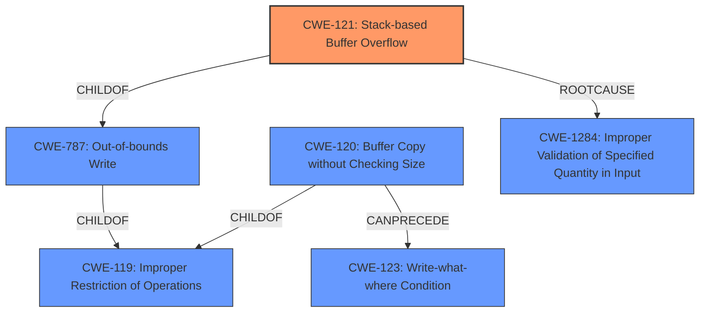

# Analysis for CVE-2021-31616

# Summary
| CWE ID | CWE Name | Confidence | CWE Abstraction Level | CWE Vulnerability Mapping Label | CWE-Vulnerability Mapping Notes |
|---|---|---|---|---|---|
| CWE-121 | Stack-based Buffer Overflow | 1.0 | Variant | Allowed | Primary CWE |
| CWE-120 | Buffer Copy without Checking Size of Input ('Classic Buffer Overflow') | 0.7 | Base | Allowed-with-Review | Secondary Candidate |
| CWE-1284 | Improper Validation of Specified Quantity in Input | 0.7 | Base | Allowed | Secondary Candidate |
| CWE-787 | Out-of-bounds Write | 0.6 | Base | Allowed | Secondary Candidate |
| CWE-119 | Improper Restriction of Operations within the Bounds of a Memory Buffer | 0.5 | Class | Discouraged | Secondary Candidate |

## Evidence and Confidence

*   **Confidence Score:** 0.9
*   **Evidence Strength:** HIGH

## Relationship Analysis
The primary CWE, CWE-121, is a `Variant` of CWE-787 (`Out-of-bounds Write`) which in turn is a `ChildOf` CWE-119 (`Improper Restriction of Operations within the Bounds of a Memory Buffer`). CWE-120 (`Buffer Copy without Checking Size of Input`) is also a `ChildOf` CWE-119. The `CANPRECEDE` relationship between CWE-120 and CWE-123 (`Write-what-where Condition`) suggests that a buffer overflow can lead to arbitrary memory writes. The insufficient length check which is the root cause can be expressed as CWE-1284 (`Improper Validation of Specified Quantity in Input`). The abstraction levels influenced the selection, favoring the more specific `Variant` CWE-121 where the buffer is allocated on the stack.

## Vulnerability Chain
The vulnerability chain starts with **insufficient length checks** (CWE-1284), leading to a **stack buffer overflow** (CWE-121), which allows for arbitrary code execution.

## Summary of Analysis
The initial analysis focused on identifying the root cause and the type of buffer overflow. The provided evidence strongly supports a stack-based buffer overflow due to **insufficient length checks**. The final selection prioritizes CWE-121 as the most specific representation of the vulnerability.

The vulnerability description explicitly mentions a "**stack buffer overflow**" and "**insufficient length checks**". The "CVE Reference Links Content Summary" confirms that the `memcpy` function uses an attacker-controlled length without proper validation, leading to an out-of-bounds write on the stack. This aligns perfectly with the characteristics of CWE-121.

The graph relationships show how CWE-121 is a specialized type of out-of-bounds write (CWE-787), which is a general case of improper memory buffer restriction (CWE-119). The root cause is the **improper validation of the specified quantity in the input** (CWE-1284).

CWE-121 is at the optimal level of specificity because it accurately describes the location of the buffer (stack) and the type of vulnerability (buffer overflow). While CWE-787 is also relevant, CWE-121 provides more detail.

Relevant CWE Information:

# Enhanced Context (25 CWEs)

## CWE-805: Buffer Access with Incorrect Length Value
**Abstraction Level**: Base
**Similarity Score**: 0.80
**Source**: dense

**Description**:
The product uses a sequential operation to read or write a buffer, but it uses an incorrect length value that causes it to access memory that is outside of the bounds of the buffer.

**Mapping Guidance**:
- Usage: Allowed
- Rationale: This CWE entry is at the Base level of abstraction, which is a preferred level of abstraction for mapping to the root causes of vulnerabilities.

*Rationale:* This CWE is related, as the **insufficient length checks** cause the usage of incorrect length value. It is not chosen as primary because it is a more generic case of buffer access with an incorrect length value, without specifically calling out the stack-based nature of the overflow.

## CWE-191: Integer Underflow (Wrap or Wraparound)
**Abstraction Level**: Base
**Similarity Score**: 0.78
**Source**: dense

**Description**:
The product subtracts one value from another, such that the result is less than the minimum allowable integer value, which produces a value that is not equal to the correct result.

**Mapping Guidance**:
- Usage: Allowed
- Rationale: This CWE entry is at the Base level of abstraction, which is a preferred level of abstraction for mapping to the root causes of vulnerabilities.

*Rationale:* Not applicable to this vulnerability.

## CWE-130: Improper Handling of Length Parameter Inconsistency
**Abstraction Level**: Base
**Similarity Score**: 0.78
**Source**: dense

**Description**:
The product parses a formatted message or structure, but it does not handle or incorrectly handles a length field that is inconsistent with the actual length of the associated data.

**Mapping Guidance**:
- Usage: Allowed
- Rationale: This CWE entry is at the Base level of abstraction, which is a preferred level of abstraction for mapping to the root causes of vulnerabilities.

*Rationale:* This CWE is related, as the vulnerability involves **improper handling of length**. It is not chosen as primary because it is more generic and doesn't specify the **stack buffer overflow** nature of the bug.

## CWE-131: Incorrect Calculation of Buffer Size
**Abstraction Level**: Base
**Similarity Score**: 0.77
**Source**: dense

**Description**:
The product does not correctly calculate the size to be used when allocating a buffer, which could lead to a buffer overflow.

**Mapping Guidance**:
- Usage: Allowed
- Rationale: This CWE entry is at the Base level of abstraction, which is a preferred level of abstraction for mapping to the root causes of vulnerabilities.

*Rationale:* Not applicable. There's no indication of an incorrect buffer calculation, but instead a failure to validate the input length against the buffer size.

## CWE-124: Buffer Underwrite ('Buffer Underflow')
**Abstraction Level**: Base
**Similarity Score**: 0.77
**Source**: dense

**Description**:
The product writes to a buffer using an index or pointer that references a memory location prior to the beginning of the buffer.

**Mapping Guidance**:
- Usage: Allowed
- Rationale: This CWE entry is at the Base level of abstraction, which is a preferred level of abstraction for mapping to the root causes of vulnerabilities.

*Rationale:* Not applicable. The vulnerability involves a buffer overflow (overwriting beyond the end of the buffer), not an underflow.

## CWE-126: Buffer Over-read
**Abstraction Level**: Variant
**Similarity Score**: 0.77
**Source**: dense

**Description**:
The product reads from a buffer using buffer access mechanisms such as indexes or pointers that reference memory locations after the targeted buffer.

**Mapping Guidance**:
- Usage: Allowed
- Rationale: This CWE entry is at the Variant level of abstraction, which is a preferred level of abstraction for mapping to the root causes of vulnerabilities.

*Rationale:* Not applicable. The vulnerability involves a buffer overflow, not an over-read.

## CWE-125: Out-of-bounds Read
**Abstraction Level**: Base
**Similarity Score**: 0.76
**Source**: dense

**Description**:
The product reads data past the end, or before the beginning, of the intended buffer.

**Mapping Guidance**:
- Usage: Allowed
- Rationale: This CWE entry is at the Base level of abstraction, which is a preferred level of abstraction for mapping to the root causes of vulnerabilities.

*Rationale:* Not applicable. The vulnerability involves a buffer overflow, not an out-of-bounds read.

## CWE