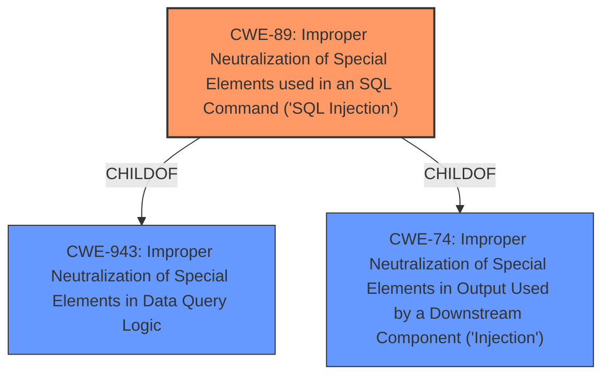

# Analysis Report for CVE-2021-31632

# Vulnerability Analysis Report: CVE-2021-31632

## Description


## Analysis (with Relationship Data)

# Summary
| CWE ID | CWE Name | Confidence | CWE Abstraction Level | CWE Vulnerability Mapping Label | CWE-Vulnerability Mapping Notes |
|---|---|---|---|---|---|
| CWE-89 | Improper Neutralization of Special Elements used in an SQL Command ('SQL Injection') | 1.0 | Base | Allowed | Primary CWE |

## Evidence and Confidence

*   **Confidence Score:** 1.0
*   **Evidence Strength:** HIGH

## Relationship Analysis
The primary relationship that influenced the decision was that CWE-89 is a base level CWE that accurately describes the **SQL Injection** vulnerability. The child relationships of CWE-89 to CWE-943 (Improper Neutralization of Special Elements in Data Query Logic) and CWE-74 (Improper Neutralization of Special Elements in Output Used by a Downstream Component ('Injection')) provide further context but are not as specific as CWE-89.



## Vulnerability Chain
The vulnerability chain starts with **SQL injection** due to **unsanitized input**, leading to potential remote code execution.

## Summary of Analysis
The initial analysis strongly points to CWE-89 as the primary weakness, based on the description of the **SQL injection** vulnerability. The CVE Reference Links Content Summary explicitly mentions that the root cause is due to **unsanitized input** in the ORDER BY clause of a SQL query. The `url.orderby` parameter is directly used in the ORDER BY clause without proper validation or sanitization.

The supporting evidence is:

*   Vulnerability Description: "...a **SQL injection** vulnerability via the parameter cfqueryparam in the User login section."
*   CVE Reference Links Content Summary: "The code is vulnerable to **SQL injection** due to **unsanitized input** in the ORDER BY clause of a SQL query. Specifically, the `url.orderby` parameter is directly used in the ORDER BY clause without proper validation or sanitization."

The graph relationships reinforce this selection, as CWE-89 is a base level CWE that accurately describes the identified vulnerability.

Other CWEs Considered but Not Used:

*   CWE-78: Improper Neutralization of Special Elements used in an OS Command ('OS Command Injection') - While the impact is "arbitrary code execution," the root cause is **SQL injection**, not OS command injection.
*   CWE-94: Improper Control of Generation of Code ('Code Injection') - Similar to CWE-78, this is too general, and the root cause is **SQL injection**.
*   CWE-1336: Improper Neutralization of Special Elements Used in a Template Engine - While template engines can be involved in injection vulnerabilities, the description does not indicate that a template engine is the source of the vulnerability.
*   CWE-184: Incomplete List of Disallowed Inputs - This could be a contributing factor if a list of disallowed characters was incomplete, but the primary issue is the lack of sanitization.


## CWE Relationship Analysis

Current CWEs represent these abstraction levels: .


### Vulnerability Chain Analysis

**Chain starting from CWE-1336:**
- 1336 (Improper Neutralization of Special Elements Used in a Template Engine) - ROOT


**Chain starting from CWE-943:**
- 943 (Improper Neutralization of Special Elements in Data Query Logic) - ROOT


### CWE Relationship Diagram

```mermaid
graph TD
    classDef primary fill:#f96,stroke:#333,stroke-width:2px
    classDef secondary fill:#69f,stroke:#333
    classDef tertiary fill:#9e9,stroke:#333
```


*Report generated on 2025-04-01 23:30:39*
