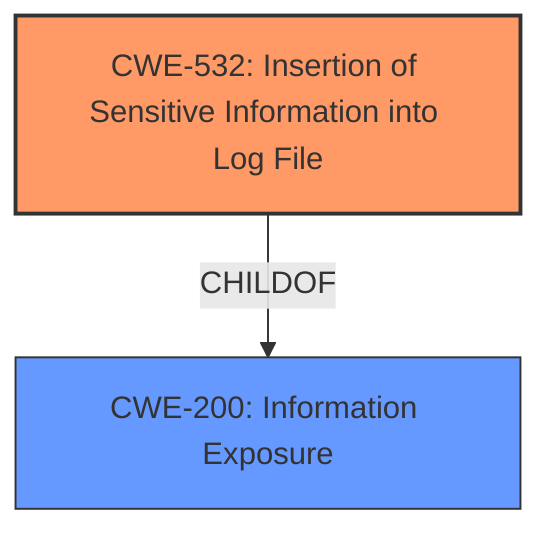

# Raw Analyzer Response for CVE-2021-3167

# Summary
| CWE ID  | CWE Name                                          | Confidence | CWE Abstraction Level | CWE Vulnerability Mapping Label | CWE-Vulnerability Mapping Notes |
| :------- | :------------------------------------------------ | :--------- | :---------------------- | :------------------------------ | :-------------------------------- |
| CWE-532 | Insertion of Sensitive Information into Log File | 1.0        | Base                    | Allowed                         | Primary CWE                       |

## Evidence and Confidence

*   **Confidence Score:** 1.0
*   **Evidence Strength:** HIGH

## Relationship Analysis
The primary identified CWE, CWE-532, is a base-level CWE. It's related to CWE-200, which is the broader category of information exposure. There are no child CWEs for CWE-532 that would provide a more specific classification. The graph focuses on direct parent-child relationships, emphasizing the hierarchical structure and abstraction levels involved in the CWE selection.

## Vulnerability Chain
The vulnerability chain starts with the **insertion of JWT authentication tokens** into the virtual cluster server logs and ends with the exposure of these tokens to administrators.

## Summary of Analysis
The analysis is based on the provided vulnerability description, which states that "JWT authentication tokens are exposed to administrators in virtual cluster server logs." The **weakness** is the **JWT authentication tokens being exposed**.

The primary CWE identified is CWE-532 (Insertion of Sensitive Information into Log File). This CWE accurately reflects the vulnerability because the JWT tokens (sensitive information) are being written to the log files, where they should not be. The evidence is the vulnerability description that explicitly mentions the exposure of JWT tokens in the logs.

The retriever results also support this finding, listing CWE-532 as the top combined result.

The selection of CWE-532 is at the optimal level of specificity as it directly addresses the root cause of the vulnerability: the **insertion of sensitive information into the log file**.

# Relevant CWE Information:

## CWE-532: Insertion of Sensitive Information into Log File
**Abstraction:** Base
**Status:** Incomplete

### Description
The product writes sensitive information to a log file.

### Extended Description
Not provided

### Alternative Terms
None

### Relationships
ChildOf -> CWE-538
ChildOf -> CWE-200

### Mapping Guidance
**Usage:** Allowed
**Rationale:** This CWE entry is at the Base level of abstraction, which is a preferred level of abstraction for mapping to the root causes of vulnerabilities.
**Comments:** Carefully read both the name and description to ensure that this mapping is an appropriate fit. Do not try to 'force' a mapping to a lower-level Base/Variant simply to comply with this preferred level of abstraction.
**Reasons:**
- Acceptable-Use