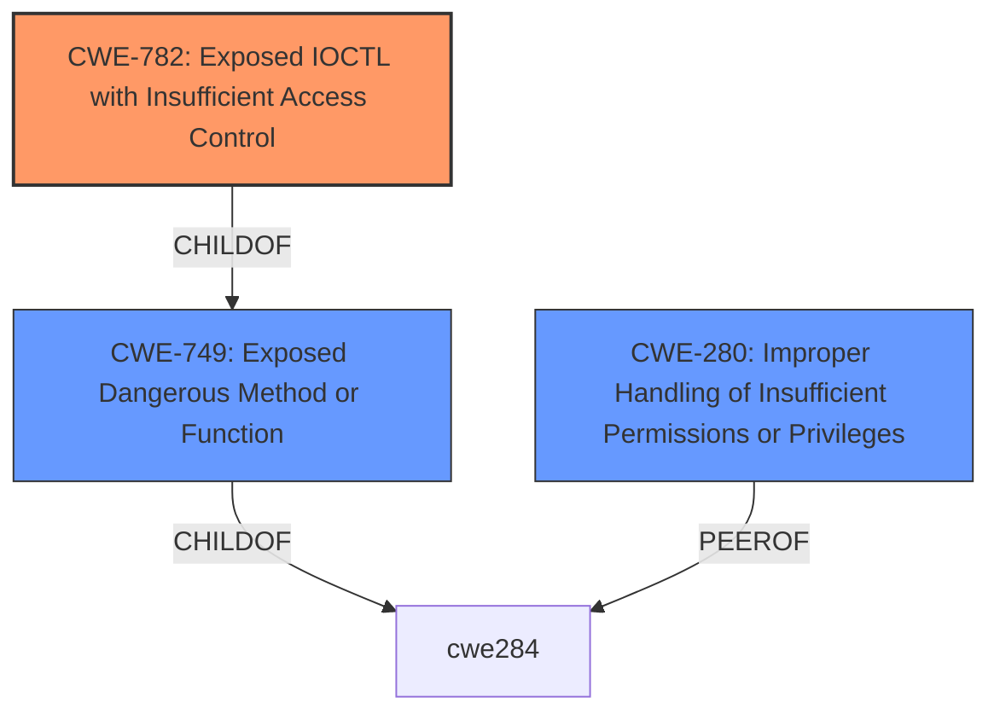

# Analysis for CVE-2021-31727

# Summary
| CWE ID | CWE Name | Confidence | CWE Abstraction Level | CWE Vulnerability Mapping Label | CWE-Vulnerability Mapping Notes |
|---|---|---|---|---|---|
| CWE-782 | Exposed IOCTL with Insufficient Access Control | 1.0 | Variant | Allowed | Primary CWE |
| CWE-749 | Exposed Dangerous Method or Function | 0.7 | Base | Allowed | Secondary CWE |
| CWE-280 | Improper Handling of Insufficient Permissions or Privileges | 0.6 | Base | Allowed | Secondary CWE |

## Evidence and Confidence

*   **Confidence Score:** 0.9
*   **Evidence Strength:** HIGH

## Relationship Analysis
The primary CWE is CWE-782, which is a Variant of CWE-749. This hierarchical relationship indicates that CWE-782 is a more specific instance of exposing a dangerous method or function. CWE-782 focuses specifically on IOCTLs, which aligns with the vulnerability description. CWE-749 is a more general case.

## Vulnerability Chain
The vulnerability chain starts with **incorrect access control** in the driver. This leads to exposure of unrestricted disk read/write capabilities via IOCTLs, allowing a non-privileged process to escalate privileges by overwriting critical system files.

## Summary of Analysis
The initial assessment focused on the **incorrect access control** leading to privilege escalation. The retriever results and the vulnerability description both pointed towards CWE-782 as a strong candidate.

The vulnerability description states: "**Incorrect access control** in zam64.sys, zam32.sys in MalwareFox AntiMalware 2.74.0.150 where IOCTLs 0x80002014, 0x80002018 expose unrestricted disk read/write capabilities respectively. A non-privileged process can open a handle to .\\ZemanaAntiMalware, register with the driver using IOCTL 0x80002010 and send these IOCTLs to escalate privileges by overwriting the boot sector or overwriting critical code in the pagefile."

The "CVE Reference Links Content Summary" reinforces this by stating: "The drivers expose unrestricted disk read/write capabilities through IOCTLs `0x80002014` (read) and `0x80002018` (write)."

CWE-782's description, "The product implements an IOCTL with functionality that should be restricted, but it does not properly enforce access control for the IOCTL," aligns perfectly with this. The **lack of proper access control** on the IOCTLs is the **root cause** of the vulnerability.

CWE-749 was considered as a parent class but CWE-782 provides a more specific classification.

CWE-280 was considered because the vulnerability involves insufficient privileges, however, CWE-782 pinpoints the weakness to the IOCTL level, making it a more precise fit.

CWE-782 is at the optimal level of specificity because it directly addresses the **root cause** – the **lack of access control** on exposed IOCTLs. This aligns with the guidance to prefer more specific variants when evidence supports it.

Relevant CWE Information:

# Enhanced Context (25 CWEs)
The following CWEs were identified as potentially relevant to this vulnerability:

## CWE-59: Improper Link Resolution Before File Access ('Link Following')
**Abstraction Level**: Base
**Similarity Score**: 0.78
**Source**: dense

**Description**:
The product attempts to access a file based on the filename, but it does not properly prevent that filename from identifying a link or shortcut that resolves to an unintended resource.

**Mapping Guidance**:
- Usage: Allowed
- Rationale: This CWE entry is at the Base level of abstraction, which is a preferred level of abstraction for mapping to the root causes of vulnerabilities.

## CWE-274: Improper Handling of Insufficient Privileges
**Abstraction Level**: Base
**Similarity Score**: 0.77
**Source**: dense

**Description**:
The product does not handle or incorrectly handles when it has insufficient privileges to perform an operation, leading to resultant weaknesses.

**Mapping Guidance**:
- Usage: Discouraged
- Rationale: This CWE entry could be deprecated in a future version of CWE.

## CWE-280: Improper Handling of Insufficient Permissions or Privileges 
**Abstraction Level**: Base
**Similarity Score**: 0.77
**Source**: dense

**Description**:
The product does not handle or incorrectly handles when it has insufficient privileges to access resources or functionality as specified by their permissions. This may cause it to follow unexpected code paths that may leave the product in an invalid state.

**Mapping Guidance**:
- Usage: Allowed
- Rationale: This CWE entry is at the Base level of abstraction, which is a preferred level of abstraction for mapping to the root causes of vulnerabilities.

## CWE-266: Incorrect Privilege Assignment
**Abstraction Level**: Base
**Similarity Score**: 0.77
**Source**: dense

**Description**:
A product incorrectly assigns a privilege to a particular actor, creating an unintended sphere of control for that actor.

**Mapping Guidance**:
- Usage: Allowed
- Rationale: This CWE entry is at the Base level of abstraction, which is a preferred level of abstraction for mapping to the root causes of vulnerabilities.

## CWE-749: Exposed Dangerous Method or Function
**Abstraction Level**: Base
**Similarity Score**: 0.76
**Source**: dense

**Description**:
The product provides an Applications Programming Interface (API) or similar interface for interaction with external actors, but the interface includes a dangerous method or function that is not properly restricted.

**Mapping Guidance**:
- Usage: Allowed
- Rationale: This CWE entry is at the Base level of abstraction, which is a preferred level of abstraction for mapping to the root causes of vulnerabilities.

## CWE-668: Exposure of Resource to Wrong Sphere
**Abstraction Level**: Class
**Similarity Score**: 0.76
**Source**: dense

**Description**:
The product exposes a resource to the wrong control sphere, providing unintended actors with inappropriate access to the resource.

**Mapping Guidance**:
- Usage: Discouraged
- Rationale: CWE-668 is high-level and is often misused as a catch-all when lower-level CWE IDs might be applicable. It is sometimes used for low-information vulnerability reports [REF-1287]. It is a level-1 Class (i.e., a child of a Pillar). It is not useful for trend analysis.

## CWE-1220: Insufficient Granularity of Access Control
**Abstraction Level**: Base
**Similarity Score**: 0.76
**Source**: dense

**Description**:
The product implements access controls via a policy or other feature with the intention to disable or restrict accesses (reads and/or writes) to assets in a system from untrusted agents. However, implemented access controls lack required granularity, which renders the control policy too broad because it allows accesses from unauthorized agents to the security-sensitive assets.

**Mapping Guidance**:
- Usage: Allowed
- Rationale: This CWE entry is at the Base level of abstraction, which is a preferred level of abstraction for mapping to the root causes of vulnerabilities.

## CWE-267: Privilege Defined With Unsafe Actions
**Abstraction Level**: Base
**Similarity Score**: 0.76
**Source**: dense

**Description**:
A particular privilege, role, capability, or right can be used to perform unsafe actions that were not intended, even when it is assigned to the correct entity.

**Mapping Guidance**:
- Usage: Allowed
- Rationale: This CWE entry is at the Base level of abstraction, which is a preferred level of abstraction for mapping to the root causes of vulnerabilities.

## CWE-782: Exposed IOCTL with Insufficient Access Control
**Abstraction Level**: Variant
**Similarity Score**: 0.76
**Source**: dense

**Description**:
The product implements an IOCTL with functionality that should be restricted, but it does not properly enforce access control for the IOCTL.

**Mapping Guidance**:
- Usage: Allowed
- Rationale: This CWE entry is at the Variant level of abstraction, which is a preferred level of abstraction for mapping to the root causes of vulnerabilities.

## CWE-653: Improper Isolation or Compartmentalization
**Abstraction Level**: Class
**Similarity Score**: 0.