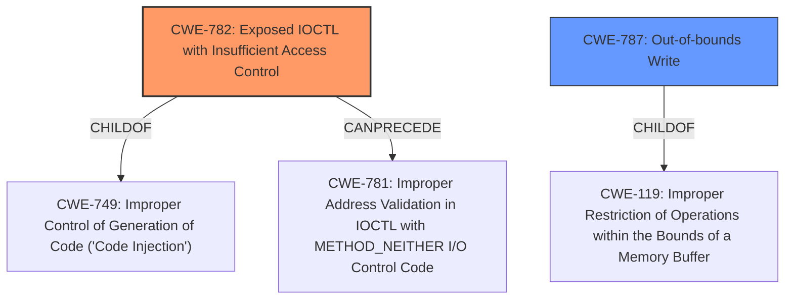

# Raw Analyzer Response for CVE-2021-31728

# Summary
| CWE ID | CWE Name | Confidence | CWE Abstraction Level | CWE Vulnerability Mapping Label | CWE-Vulnerability Mapping Notes |
|---|---|---|---|---|---|
| CWE-782 | Exposed IOCTL with Insufficient Access Control | 1.0 | Variant | Allowed | Primary CWE |
| CWE-280 | Improper Handling of Insufficient Permissions or Privileges | 0.7 | Base | Allowed | Secondary Candidate |
| CWE-787 | Out-of-bounds Write | 0.6 | Base | Allowed | Secondary Candidate |

## Evidence and Confidence

*   **Confidence Score:** 0.8
*   **Evidence Strength:** HIGH

## Relationship Analysis
The primary CWE, CWE-782, is a Variant of CWE-749 (ChildOf) and can precede CWE-781 (CanPrecede). CWE-787 is a base CWE that is a child of CWE-119. The hierarchical relationships guided the selection of the most specific CWE, favoring the Variant CWE-782 over its parent.

## Vulnerability Chain
The vulnerability chain starts with **incorrect access control** (CWE-782), leading to the ability to allocate executable memory, install a hook, and execute the memory, ultimately resulting in privilege escalation.

## Summary of Analysis
The initial assessment identified **incorrect access control** as the primary issue, supported by the "Vulnerability Description Key Phrases" and "CVE Reference Links Content Summary". The final decision is based on the evidence and the retriever results. CWE-782 is the most specific and relevant CWE, accurately capturing the **root cause** of the vulnerability.

The selection of CWE-782 is based on the following evidence:

*   Vulnerability Description Key Phrases: **Incorrect access control**
*   CVE Reference Links Content Summary: "The vulnerability stems from **incorrect access control** within the `zam64.sys` and `zam32.sys` drivers"

The "Retriever Results" listed CWE-782 as the top combined result.

Relevant CWE Information:

# Enhanced Context (25 CWEs)
The following CWEs were identified as potentially relevant to this vulnerability:

## CWE-782: Exposed IOCTL with Insufficient Access Control
**Abstraction Level**: Variant
**Similarity Score**: 0.83
**Source**: dense

**Description**:
The product implements an IOCTL with functionality that should be restricted, but it does not properly enforce access control for the IOCTL.

**Mapping Guidance**:
- Usage: Allowed
- Rationale: This CWE entry is at the Variant level of abstraction, which is a preferred level of abstraction for mapping to the root causes of vulnerabilities.

### CWE Details

*   **CWE-782: Exposed IOCTL with Insufficient Access Control**
    *   **Technical Explanation:** The vulnerability description clearly states that the **incorrect access control** allows non-privileged processes to interact with the driver. This aligns perfectly with the CWE-782 description, which focuses on IOCTLs with privileged functionality that lack proper access control.
    *   **Security Implications:** This allows attackers to bypass intended security restrictions and directly access privileged kernel functionality.
    *   **Relationship Impact:** CWE-782 is a Variant, providing a more specific classification than its parent.
    *   **Mapping Guidance:** The "Usage: Allowed" mapping guidance supports the selection of CWE-782.

*   **CWE-280: Improper Handling of Insufficient Permissions or Privileges**
    *   **Technical Explanation:** The vulnerability involves a non-privileged process gaining elevated privileges, indicating a failure to properly handle insufficient permissions.
    *   **Security Implications:** An attacker can perform actions that should be restricted to privileged users or processes.
    *   **Relationship Impact:** CWE-280 is a Base level CWE.
    *   **Mapping Guidance:** The "Usage: Allowed" mapping guidance supports the selection of CWE-280.
    *   **Reason for not selecting as Primary:** While relevant, CWE-280 is less specific than CWE-782, which directly addresses the IOCTL exposure.

*   **CWE-787: Out-of-bounds Write**
    *   **Technical Explanation:** The vulnerability description mentions a flaw in IOCTL 0x80002040 that allows allocating executable memory, hinting at potential memory corruption issues, including out-of-bounds writes.
    *   **Security Implications:** This can lead to arbitrary code execution and privilege escalation.
    *   **Relationship Impact:** CWE-787 is a Base level CWE and a child of CWE-119.
    *   **Mapping Guidance:** The "Usage: Allowed" mapping guidance supports the selection of CWE-787.
    *   **Reason for not selecting as Primary:** While memory corruption is a consequence of the vulnerability, the root cause is the **incorrect access control**.

*   **CWE-367: Time-of-check Time-of-use (TOCTOU) Race Condition**
    *   **Technical Explanation:** While not explicitly stated, the **incorrect access control** and flawed hook mechanism could potentially lead to race conditions if multiple processes attempt to interact with the driver simultaneously.
    *   **Security Implications:** This can lead to unpredictable behavior and potential security vulnerabilities.
    *   **Relationship Impact:** CWE-367 is a Base level CWE and a child of CWE-362.
    *   **Mapping Guidance:** The "Usage: Allowed" mapping guidance supports the selection of CWE-367.
    *   **Reason for not selecting:** This is a speculative assessment. No specific evidence is provided.

*   **CWE-362: Concurrent Execution using Shared Resource with Improper Synchronization ('Race Condition')**
    *   **Technical Explanation:** Similar to CWE-367, the concurrent access due to **incorrect access control** could introduce race conditions.
    *   **Security Implications:** Race conditions can lead to unpredictable behavior and exploitable vulnerabilities.
    *   **Relationship Impact:** CWE-362 is a Class level CWE.
    *   **Mapping Guidance:** The "Usage: Allowed-with-Review" mapping guidance suggests reviewing for more specific children.
    *   **Reason for not selecting:** This is a speculative assessment. No specific evidence is provided.

*   **CWE-781: Improper Address Validation in IOCTL with METHOD_NEITHER I/O Control Code**
    *   **Technical Explanation:** Although not explicitly specified, the vulnerability mentions a flaw related to allocating executable memory using an IOCTL, which is a weakness described in CWE-781.
    *   **Security Implications:** Attackers may supply arbitrary memory addresses, leading to code execution or a denial of service.
    *   **Relationship Impact:** CWE-781 is a Variant level CWE and a child of CWE-1285
    *   **Mapping Guidance:** The "Usage: Allowed" mapping guidance supports the selection of CWE-781.
    *   **Reason for not selecting:** While this CWE maps to the vulnerability, the root cause is **incorrect access control**.