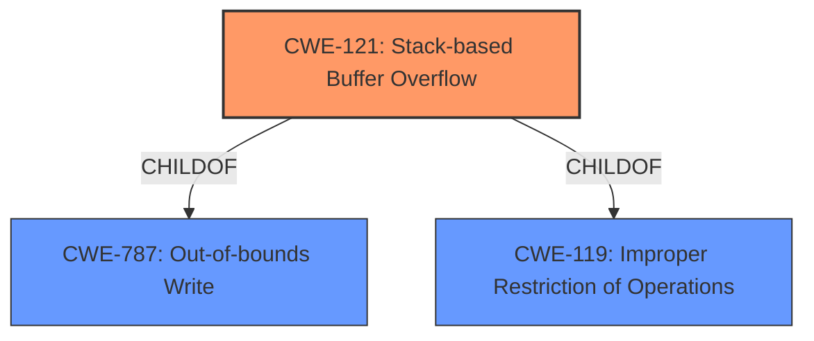

# Analysis for CVE-2021-31756

# Summary

| CWE ID | CWE Name | Confidence | CWE Abstraction Level | CWE Vulnerability Mapping Label | CWE-Vulnerability Mapping Notes |
|---|---|---|---|---|---|
| CWE-121 | Stack-based Buffer Overflow | 1.0 | Variant | Allowed | Primary CWE |
| CWE-119 | Improper Restriction of Operations within the Bounds of a Memory Buffer | 0.7 | Class | Discouraged | Secondary Candidate |

## Evidence and Confidence

*   **Confidence Score:** 0.9
*   **Evidence Strength:** HIGH

## Relationship Analysis
The primary CWE is CWE-121, which is a **Variant** of CWE-787 and CWE-119. The description explicitly states "stack buffer overflow," making CWE-121 the most specific and appropriate choice. The generic CWE-119 is a broader classification that is discouraged when more specific options are available.

## Vulnerability Chain
The vulnerability chain starts with a crafted POST request leading to a **stack buffer overflow**, which allows attackers to execute arbitrary code.
  - Crafted POST request -> **Stack Buffer Overflow (CWE-121)** -> Arbitrary Code Execution

## Summary of Analysis
The initial assessment strongly points to CWE-121 due to the explicit mention of "stack buffer overflow" in the vulnerability description.

"An issue was discovered on Tenda AC11 devices with firmware through 02.03.01.104_CN. A **stack buffer overflow** vulnerability in /gofrom/setwanType allows attackers to execute arbitrary code on the system via a crafted post request. This occurs when input vector controlled by malicious attack get copied to the stack variable."

CWE-121 is a **Variant** level CWE, which is preferred over the **Class** level CWE-119. While CWE-119 could apply, it's a more general case. The retriever results also list CWE-121 as a strong candidate. The description directly states the overflow occurs on the stack, making CWE-121 the most specific and fitting choice.

Relevant CWE Information:

# Enhanced Context (25 CWEs)

## CWE-124: Buffer Underwrite ('Buffer Underflow')
**Abstraction Level**: Base
**Similarity Score**: 0.78

Not applicable as it describes an underwrite, not an overflow.

## CWE-191: Integer Underflow (Wrap or Wraparound)
**Abstraction Level**: Base
**Similarity Score**: 0.76

Not applicable as the vulnerability is a buffer overflow, not an integer underflow.

## CWE-805: Buffer Access with Incorrect Length Value
**Abstraction Level**: Base
**Similarity Score**: 0.76

Potentially related but not the primary issue. The core problem is writing beyond buffer boundaries on the stack.

## CWE-131: Incorrect Calculation of Buffer Size
**Abstraction Level**: Base
**Similarity Score**: 0.76

Potentially related as an incorrect calculation could lead to the overflow, but the description doesn't provide enough information.

## CWE-680: Integer Overflow to Buffer Overflow
**Abstraction Level**: Compound
**Similarity Score**: 0.75

Not directly applicable. The provided information doesn't suggest an integer overflow leading to the buffer overflow.

## CWE-126: Buffer Over-read
**Abstraction Level**: Variant
**Similarity Score**: 0.75

Not applicable as the vulnerability is a buffer overflow (write), not an over-read.

## CWE-127: Buffer Under-read
**Abstraction Level**: Variant
**Similarity Score**: 0.74

Not applicable as the vulnerability is a buffer overflow, not an under-read.

## CWE-193: Off-by-one Error
**Abstraction Level**: Base
**Similarity Score**: 0.74

Potentially a contributing factor, but not the primary weakness. An off-by-one error could lead to the overflow, but without more specifics, it's not the best fit.

## CWE-125: Out-of-bounds Read
**Abstraction Level**: Base
**Similarity Score**: 0.73

Not applicable as the vulnerability is a buffer overflow (write), not an out-of-bounds read.

## CWE-190: Integer Overflow or Wraparound
**Abstraction Level**: Base
**Similarity Score**: 0.73

Not applicable as the vulnerability is a buffer overflow, not an integer overflow.

## CWE-1284: Improper Validation of Specified Quantity in Input
**Abstraction Level**: Base
**Similarity Score**: 6541.62

Could be a contributing factor if the size of the input is not properly validated, but the description only mentions a crafted POST request leading to an overflow.

## CWE-78: Improper Neutralization of Special Elements used in an OS Command ('OS Command Injection')
**Abstraction Level**: base
**Similarity Score**: 3.64

Not applicable, the vulnerability is a stack buffer overflow, not a command injection.