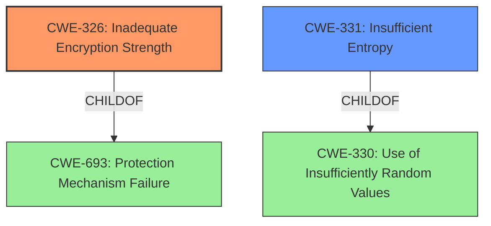

# Enhanced Analysis for CVE-2021-31796

# Summary
| CWE ID | CWE Name | Confidence | CWE Abstraction Level | CWE Vulnerability Mapping Label | CWE-Vulnerability Mapping Notes |
|---|---|---|---|---|---|
| CWE-326 | Inadequate Encryption Strength | 1.0 | Class | Primary | Allowed-with-Review |
| CWE-331 | Insufficient Entropy | 0.9 | Base | Secondary | Allowed |

## Evidence and Confidence

*   **Confidence Score:** 0.95
*   **Evidence Strength:** HIGH

## Relationship Analysis
The primary relationship influencing the choice of CWE-326 is its parent relationship to CWE-693: Protection Mechanism Failure, indicating a failure in a security mechanism. CWE-331 is related to CWE-330: Use of Insufficiently Random Values, further clarifying the nature of the entropy issue. Both CWE-326 and CWE-331 are at appropriate abstraction levels, Class and Base respectively.



## Vulnerability Chain
The chain of root cause and weaknesses starts with **insufficient entropy** (CWE-331) which leads to **inadequate encryption strength** (CWE-326) which further leads to Information Disclosure.
  - The root cause is the insufficient entropy.
  - The primary weakness is the inadequate encryption strength.
  - The impact is Information Disclosure.

## Summary of Analysis
The assessment is heavily based on the evidence provided, especially from the "CVE Reference Links Content Summary" section.
The **root cause** of the vulnerability is **inadequate encryption** due to an insufficient key space, making it vulnerable to brute-force attacks. The primary CWE is CWE-326 Inadequate Encryption Strength, with a confidence of 1.0, since the description clearly states the encryption is theoretically sound but not strong enough for the required level of protection. The secondary CWE is CWE-331 Insufficient Entropy, which contributes to the weakness of the encryption. This mapping aligns with the MITRE guidance for both CWEs. Both CWEs are at appropriate levels of abstraction.

Relevant CWE Information:

# Enhanced Context (25 CWEs)

## CWE-327: Use of a Broken or Risky Cryptographic Algorithm
**Abstraction Level**: Class
**Similarity Score**: 0.76
**Source**: dense

**Description**:
The product uses a broken or risky cryptographic algorithm or protocol.
*This CWE was considered but ultimately not selected because the vulnerability description indicates that the encryption algorithm itself is not broken, but rather that the implementation results in **inadequate encryption strength**. Therefore, CWE-326 is a more accurate fit.*

## CWE-331: Insufficient Entropy
**Abstraction Level**: Base
**Similarity Score**: 0.75
**Source**: dense

**Description**:
The product uses an algorithm or scheme that produces insufficient entropy, leaving patterns or clusters of values that are more likely to occur than others.
*This CWE was selected as a secondary weakness because the inadequate encryption strength is partly due to the use of fields that are not sufficiently randomized.*

## CWE-1391: Use of Weak Credentials
**Abstraction Level**: Class
**Similarity Score**: 0.76
**Source**: dense

**Description**:
The product uses weak credentials (such as a default key or hard-coded password) that can be calculated, derived, reused, or guessed by an attacker.
*This CWE was considered but not selected as the vulnerability is not due to weak credentials themselves, but rather the **inadequate encryption** of those credentials.*

## CWE-798: Use of Hard-coded Credentials
**Abstraction Level**: Base
**Similarity Score**: 0.74
**Source**: dense

**Description**:
The product contains hard-coded credentials, such as a password or cryptographic key.
*This CWE was considered but not selected as the summary says "Undocumented Hard-coded Values" are a potential weakness and not explicitly part of the main issue.*


## CWE Relationship Analysis

Current CWEs represent these abstraction levels: .


### Vulnerability Chain Analysis

**Chain starting from CWE-331:**
- 331 (Insufficient Entropy) - ROOT


**Chain starting from CWE-330:**
- 330 (Use of Insufficiently Random Values) - ROOT


### CWE Relationship Diagram

```mermaid
graph TD
    classDef primary fill:#f96,stroke:#333,stroke-width:2px
    classDef secondary fill:#69f,stroke:#333
    classDef tertiary fill:#9e9,stroke:#333
```