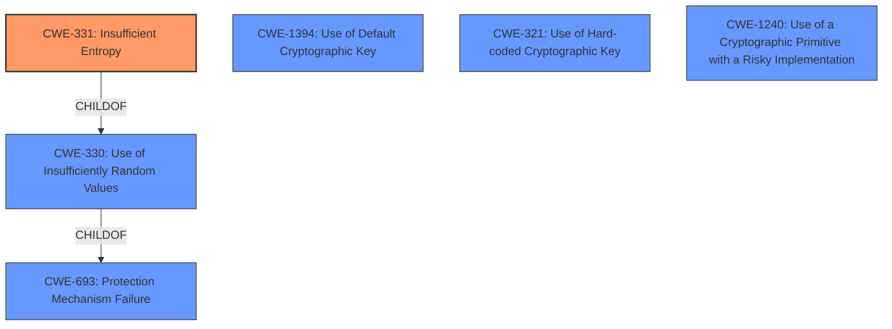

# Enhanced Analysis for CVE-2021-31798

# Summary
| CWE ID | CWE Name | Confidence | CWE Abstraction Level | CWE Vulnerability Mapping Label | CWE-Vulnerability Mapping Notes |
|---|---|---|---|---|---|
| CWE-331 | Insufficient Entropy | 0.9 | Base | Primary | Allowed |
| CWE-1394 | Use of Default Cryptographic Key | 0.6 | Base | Secondary | Allowed |
| CWE-321 | Use of Hard-coded Cryptographic Key | 0.5 | Variant | Secondary | Allowed |
| CWE-1240 | Use of a Cryptographic Primitive with a Risky Implementation | 0.5 | Base | Secondary | Allowed |

## Evidence and Confidence

*   **Confidence Score:** 0.8
*   **Evidence Strength:** HIGH

## Relationship Analysis
The primary weakness is **insufficient entropy**, which leads to a reduced key space. Several related weaknesses exist: the use of default cryptographic keys, the use of hard-coded cryptographic keys, and the use of risky cryptographic implementations.
CWE-331 (Insufficient Entropy) is a base-level CWE and a child of CWE-330 (Use of Insufficiently Random Values), which in turn is a child of CWE-693 (Protection Mechanism Failure). It's important to select the most specific CWE that accurately represents the vulnerability, hence choosing CWE-331 over its parents.



## Vulnerability Chain
The vulnerability chain starts with **insufficient entropy** used in the key derivation process. This leads to a **weak key space**, making brute-force attacks feasible. The attacker can then decrypt the local cache files, gaining access to sensitive information such as passwords and application properties.

CWE-331 (Insufficient Entropy) -> Weak Key Space -> Decryption of Cache Files -> Access to Sensitive Information

## Summary of Analysis
The primary assessment is based on the vulnerability description and the CVE reference links content summary. The vulnerability is due to **insufficient entropy** used in the key derivation process for encrypting the cache in CyberArk Credential Provider. The effective key space is reduced, making brute-force attacks feasible, which allows a local malicious user to obtain the plaintext of cache files.

The CVE reference links state: "The vulnerability stems from a **weakness** in the key derivation process for the local cache encryption... Due to a **lack of sufficient entropy** in the username and the limited number of application types, the effective key space is drastically reduced, making brute-force attacks feasible."

The retriever results also support this assessment, with CWE-331 (Insufficient Entropy) being the top match.
CWE-331 is at the Base level of abstraction, which is the preferred level.
Other CWEs considered but not selected as primary:
- CWE-327 (Use of a Broken or Risky Cryptographic Algorithm): While this is related, the root cause is specifically the insufficient entropy rather than a fundamentally broken algorithm.
- CWE-1394 (Use of Default Cryptographic Key): This may be a contributing factor if default values are used, but the primary issue is the entropy of the key derivation process itself.
- CWE-321 (Use of Hard-coded Cryptographic Key): Similar to default keys, this is not the primary issue but a potential contributing factor if hard-coded values are used in the key derivation.
- CWE-1240 (Use of a Cryptographic Primitive with a Risky Implementation): Could be applicable if the SHA1 hash is considered risky.

The selected CWEs are at the optimal level of specificity, providing a clear understanding of the root cause and contributing factors to the vulnerability.
Relevant CWE Information:

# Enhanced Context (25 CWEs)
The following CWEs were identified as potentially relevant to this vulnerability:

## CWE-1240: Use of a Cryptographic Primitive with a Risky Implementation
**Abstraction Level**: Base
**Similarity Score**: 0.80
**Source**: dense

**Description**:
To fulfill the need for a cryptographic primitive, the product implements a cryptographic algorithm using a non-standard, unproven, or disallowed/non-compliant cryptographic implementation.

**Mapping Guidance**:
- Usage: Allowed
- Rationale: This CWE entry is at the Base level of abstraction, which is a preferred level of abstraction for mapping to the root causes of vulnerabilities.

## CWE-1391: Use of Weak Credentials
**Abstraction Level**: Class
**Similarity Score**: 0.78
**Source**: dense

**Description**:
The product uses weak credentials (such as a default key or hard-coded password) that can be calculated, derived, reused, or guessed by an attacker.

**Mapping Guidance**:
- Usage: Allowed-with-Review
- Rationale: This CWE entry is a Class and might have Base-level children that would be more appropriate

## CWE-331: Insufficient Entropy
**Abstraction Level**: Base
**Similarity Score**: 0.77
**Source**: dense

**Description**:
The product uses an algorithm or scheme that produces insufficient entropy, leaving patterns or clusters of values that are more likely to occur than others.

**Mapping Guidance**:
- Usage: Allowed
- Rationale: This CWE entry is at the Base level of abstraction, which is a preferred level of abstraction for mapping to the root causes of vulnerabilities.

## CWE-330: Use of Insufficiently Random Values
**Abstraction Level**: Class
**Similarity Score**: 0.77
**Source**: dense

**Description**:
The product uses insufficiently random numbers or values in a security context that depends on unpredictable numbers.

**Mapping Guidance**:
- Usage: Discouraged
- Rationale: This CWE entry is a level-1 Class (i.e., a child of a Pillar). It might have lower-level children that would be more appropriate

## CWE-312: Cleartext Storage of Sensitive Information
**Abstraction Level**: Base
**Similarity Score**: 0.76
**Source**: dense

**Description**:
The product stores sensitive information in cleartext within a resource that might be accessible to another control sphere.

**Mapping Guidance**:
- Usage: Allowed
- Rationale: This CWE entry is at the Base level of abstraction, which is a preferred level of abstraction for mapping to the root causes of vulnerabilities.

## CWE-319: Cleartext Transmission of Sensitive Information
**Abstraction Level**: Base
**Similarity Score**: 0.76
**Source**: dense

**Description**:
The product transmits sensitive or security-critical data in cleartext in a communication channel that can be sniffed by unauthorized actors.

**Mapping Guidance**:
- Usage: Allowed
- Rationale: This CWE entry is at the Base level of abstraction, which is a preferred level of abstraction for mapping to the root causes of vulnerabilities.

## CWE-303: Incorrect Implementation of Authentication Algorithm
**Abstraction Level**: Base
**Similarity Score**: 0.76
**Source**: dense

**Description**:
The requirements for the product dictate the use of an established authentication algorithm, but the implementation of the algorithm is incorrect.

**Mapping Guidance**:
- Usage: Allowed
- Rationale: This CWE entry is at the Base level of abstraction, which is a preferred level of abstraction for mapping to the root causes of vulnerabilities.

## CWE-807: Reliance on Untrusted Inputs in a Security Decision
**Abstraction Level**: Base
**Similarity Score**: 0.75
**Source**: dense

**Description**:
The product uses a protection mechanism that relies on the existence or values of an input, but the input can be modified by an untrusted actor in a way that bypasses the protection mechanism.

**Mapping Guidance**:
- Usage: Allowed
- Rationale: This CWE entry is at the Base level of abstraction, which is a preferred level of abstraction for mapping to the root causes of vulnerabilities.

## CWE-656: Reliance on Security Through Obscurity
**Abstraction Level**: Class
**Similarity Score**: 0.75
**Source**: dense

**Description**:
The product uses a protection mechanism whose strength depends heavily on its obscurity, such that knowledge of its algorithms or key data is sufficient to defeat the mechanism.

**Mapping Guidance**:
- Usage: Allowed


## CWE Relationship Analysis

Current CWEs represent these abstraction levels: .


### Vulnerability Chain Analysis

**Chain starting from CWE-321:**
- 321 (Use of Hard-coded Cryptographic Key) - ROOT


**Chain starting from CWE-303:**
- 303 (Incorrect Implementation of Authentication Algorithm) - ROOT


### CWE Relationship Diagram

```mermaid
graph TD
    classDef primary fill:#f96,stroke:#333,stroke-width:2px
    classDef secondary fill:#69f,stroke:#333
    classDef tertiary fill:#9e9,stroke:#333
```