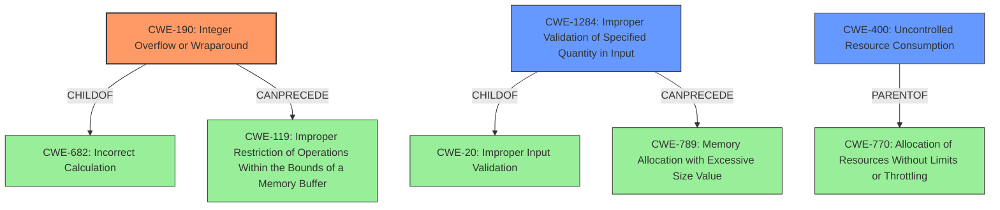

# Analysis for CVE-2021-31808

# Summary
| CWE ID | CWE Name | Confidence | CWE Abstraction Level | CWE Vulnerability Mapping Label | CWE-Vulnerability Mapping Notes |
|---|---|---|---|---|---|
| CWE-190 | Integer Overflow or Wraparound | 0.9 | Base | Allowed | Primary CWE |
| CWE-1284 | Improper Validation of Specified Quantity in Input | 0.7 | Base | Allowed | Secondary Candidate |
| CWE-400 | Uncontrolled Resource Consumption | 0.5 | Class | Discouraged | Secondary Candidate |

## Evidence and Confidence

*   **Confidence Score:** 0.8
*   **Evidence Strength:** HIGH

## Relationship Analysis
The primary CWE is CWE-190, which has a child-parent relationship with CWE-682 (Incorrect Calculation). CWE-190 can also precede CWE-119 (Improper Restriction of Operations within the Bounds of a Memory Buffer). CWE-1284 (Improper Validation of Specified Quantity in Input) is a child of CWE-20 (Improper Input Validation) and can precede CWE-789 (Memory Allocation with Excessive Size Value). CWE-400 (Uncontrolled Resource Consumption) is a class-level CWE and has children such as CWE-770 (Allocation of Resources Without Limits or Throttling).

## Vulnerability Chain
The vulnerability chain starts with an **input-validation bug** that leads to an **Integer Overflow (CWE-190)**. This integer overflow results in a Denial of Service (DoS). The chain can be represented as: Input -> **CWE-190** -> DoS.

## Summary of Analysis
The initial analysis, based on the description and CVE Reference, points to an **input-validation bug** leading to a Denial of Service. The retriever results suggest CWE-1284, CWE-1333, CWE-20, CWE-1286, CWE-400, CWE-444, CWE-770, CWE-674, CWE-93, and CWE-190. The most relevant CWE based on the information is CWE-190 (**Integer Overflow or Wraparound**) and CWE-1284 (**Improper Validation of Specified Quantity in Input**).

The vulnerability description mentions an **input-validation bug** that leads to a Denial of Service via an HTTP Range request. The CVE Reference Links Content Summary explicitly mentions an **integer overflow** vulnerability due to improper validation of HTTP Range headers. The **input-validation bug** is the **root cause** and leads to the **integer overflow**.

CWE-190 (Integer Overflow or Wraparound) is a Base level CWE that accurately captures the root cause. The description of CWE-190 states: "The product performs a calculation that can produce an integer overflow or wraparound when the logic assumes that the resulting value will always be larger than the original value." The vulnerability description aligns with this as the HTTP Range header values are not properly validated, leading to a potential overflow.

CWE-1284 (Improper Validation of Specified Quantity in Input) is also relevant as it addresses the lack of validation for the quantity (size/length) specified in the input. The description of CWE-1284 states: "The product receives input that is expected to specify a quantity (such as size or length), but it does not validate or incorrectly validates that the quantity has the required properties." The HTTP Range header includes quantity specifications that are not correctly validated, leading to the vulnerability.

CWE-400 (Uncontrolled Resource Consumption) is a Class level CWE. While the vulnerability ultimately results in a Denial of Service, which is a form of resource exhaustion, the root cause is the integer overflow and lack of input validation. Therefore, a more specific CWE is preferred.

Based on the evidence, CWE-190 is selected as the primary CWE due to the integer overflow, with CWE-1284 as a contributing factor due to the **improper input validation** of the quantity specified in the HTTP Range header.
CWE-400 is considered but not selected as the primary because it represents the impact rather than the root cause. The selection of CWE-190 and CWE-1284 provides a more detailed and accurate representation of the vulnerability.