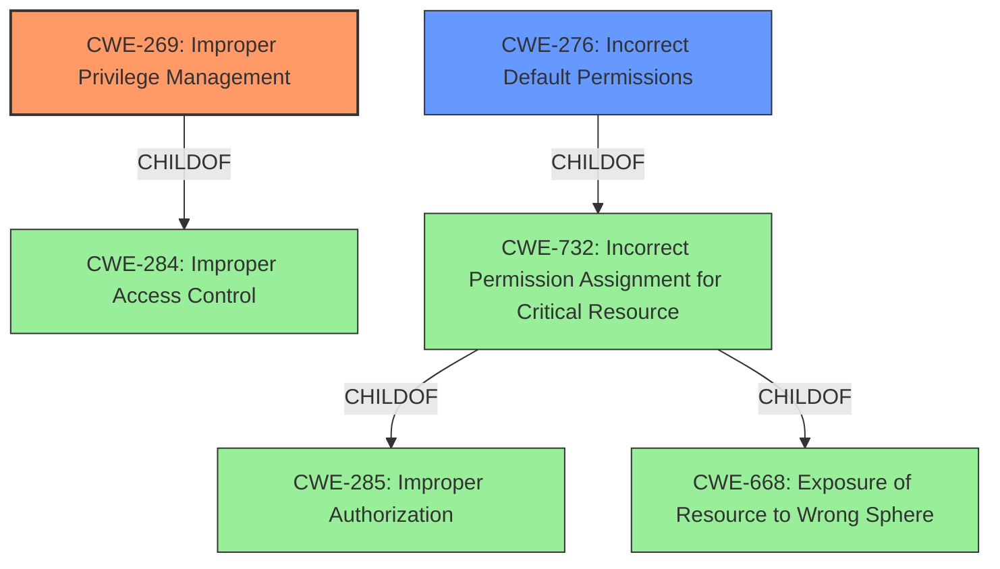

# Analysis Report for CVE-2021-31836

# Vulnerability Analysis Report: CVE-2021-31836

## Description


## Analysis (with Relationship Data)

# Summary
| CWE ID | CWE Name | Confidence | CWE Abstraction Level | CWE Vulnerability Mapping Label | CWE-Vulnerability Mapping Notes |
|---|---|---|---|---|---|
| CWE-269 | Improper Privilege Management | 0.9 | Class | Primary | Allowed-with-Review |
| CWE-276 | Incorrect Default Permissions | 0.7 | Base | Secondary | Allowed |

## Evidence and Confidence

*   **Confidence Score:** 0.8
*   **Evidence Strength:** HIGH

## Relationship Analysis
The primary CWE is CWE-269 Improper Privilege Management (Class), which is a child of CWE-284 Improper Access Control (Pillar). CWE-276 Incorrect Default Permissions (Base) is a child of CWE-732 Incorrect Permission Assignment for Critical Resource (Class), and CWE-732 is a child of CWE-285 Improper Authorization (Class) and CWE-668 Exposure of Resource to Wrong Sphere (Class). The decision to focus on CWE-269 is based on the clear statement of "Improper privilege management" in the vulnerability description. CWE-276 is chosen as a secondary weakness as the vulnerability involves a local user gaining access due to the utility being runnable from any location, suggesting incorrect default permissions.



## Vulnerability Chain
The vulnerability chain begins with **improper privilege management** (CWE-269), compounded by the fact that the utility can be run from any location by a low-privileged user (CWE-276), leading to a local user gaining access to sensitive information.

## Summary of Analysis
The initial assessment strongly indicates **Improper Privilege Management** (CWE-269) as the primary weakness due to the explicit mention of this phrase in the vulnerability description key phrases. The fact that "The utility was able to be run from any location on the file system and by a low privileged user" further supports this and suggests a problem with the default permissions, making CWE-276 a secondary consideration.

The graph relationships influenced the selection by illustrating how CWE-269 relates to higher-level access control issues. However, the specificity of the description guided the choice towards the more direct and relevant CWE-269.

The selected CWEs are at an appropriate level of specificity. CWE-269 captures the essence of the **improper privilege management**, while CWE-276 provides additional context regarding **incorrect default permissions** contributing to the vulnerability.

Relevant CWE Information:
- Vulnerability Description: **Improper privilege management** vulnerability in maconfig for McAfee Agent for Windows prior to 5.7.4 allows a local user to gain access to sensitive information. The utility was able to be run from any location on the file system and by a low privileged user.
- Vulnerability Description Key Phrases: **rootcause:** **Improper privilege management**
- Retriever Results:
  - CWE-269: Improper Privilege Management - Rank 1
  - CWE-276: Incorrect Default Permissions - Rank 6


## CWE Relationship Analysis

Current CWEs represent these abstraction levels: .


### Vulnerability Chain Analysis

**Chain starting from CWE-732:**
- 732 (Incorrect Permission Assignment for Critical Resource) - ROOT


**Chain starting from CWE-284:**
- 284 (Improper Access Control) - ROOT


### CWE Relationship Diagram

```mermaid
graph TD
    classDef primary fill:#f96,stroke:#333,stroke-width:2px
    classDef secondary fill:#69f,stroke:#333
    classDef tertiary fill:#9e9,stroke:#333
```


*Report generated on 2025-04-02 14:17:35*
