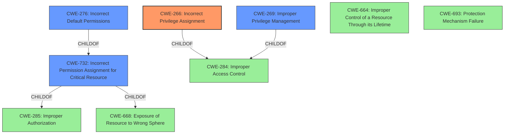

# Enhanced Analysis for CVE-2021-31839

# Summary
| CWE ID | CWE Name | Confidence | CWE Abstraction Level | CWE Vulnerability Mapping Label | CWE-Vulnerability Mapping Notes |
|---|---|---|---|---|---|
| CWE-266 | Incorrect Privilege Assignment | 0.8 | Base | Primary CWE | Allowed |
| CWE-732 | Incorrect Permission Assignment for Critical Resource | 0.6 | Class | Secondary Candidate | Allowed-with-Review |
| CWE-276 | Incorrect Default Permissions | 0.5 | Base | Secondary Candidate | Allowed |
| CWE-269 | Improper Privilege Management | 0.3 | Class | Secondary Candidate | Discouraged |

## Evidence and Confidence

*   **Confidence Score:** 0.8
*   **Evidence Strength:** HIGH

## Relationship Analysis
The primary CWE is CWE-266, which is a Base level CWE. The retriever results also suggested CWE-269, CWE-732, and CWE-276.

CWE-266 is a child of CWE-284 (Improper Access Control) and is related to CWE-664 (Improper Control of a Resource Through its Lifetime) and CWE-693 (Protection Mechanism Failure).

CWE-732 is a Class level CWE and a child of both CWE-285 (Improper Authorization) and CWE-668 (Exposure of Resource to Wrong Sphere).

CWE-276 is a child of CWE-732 (Incorrect Permission Assignment for Critical Resource).

CWE-269 is a Class level CWE and a child of CWE-284.

The selection of CWE-266 is based on the evidence of **incorrect privilege assignment** leading to unauthorized modification of event information. The relationships helped to understand the broader context of access control and resource management.



## Vulnerability Chain
The vulnerability chain starts with the **improper privilege management** (CWE-266) which leads to the ability for a local user to modify event information.
  - Root Cause: CWE-266 (**Incorrect Privilege Assignment**)
  - Impact: Modification of event information in the MA event folder

## Summary of Analysis
The initial analysis identified **improper privilege management** as the root cause. The retriever results and complete CWE specifications were used to refine the selection.

The evidence is strong, based on the vulnerability description that explicitly mentions **"Improper privilege management"** as the root cause. This leads directly to the ability of a local user to modify event information, which includes adding false events or removing events.

The selection of CWE-266 is based on its precise description of **incorrectly assigning a privilege to a particular actor, creating an unintended sphere of control for that actor.** This aligns perfectly with the vulnerability where the local user gains unintended control over event information due to improper privilege management.

CWE-269 (Improper Privilege Management) was considered but not selected as the primary CWE because it is a high-level class and discouraged by MITRE due to frequent misuse. The guidance suggests considering its children for more specific weaknesses.

CWE-732 (Incorrect Permission Assignment for Critical Resource) was considered as a secondary candidate because it relates to specifying permissions for critical resources in a way that allows unintended actors to modify them. This is a plausible alternative, but CWE-266 is a better fit because it focuses on the incorrect assignment of the privilege itself, rather than just the resulting permission on the resource.

CWE-276 (Incorrect Default Permissions) was considered as a secondary candidate, as this could have been a misconfiguration. However, the details provided do not indicate that this was a default permission issue.

The selected CWEs are at the optimal level of specificity, providing a clear and accurate representation of the underlying weakness.

Relevant CWE Information:

# Enhanced Context (25 CWEs)
The following CWEs were identified as potentially relevant to this vulnerability:

## CWE-274: Improper Handling of Insufficient Privileges
**Abstraction Level**: Base
**Similarity Score**: 0.78
**Source**: dense

**Description**:
The product does not handle or incorrectly handles when it has insufficient privileges to perform an operation, leading to resultant weaknesses.

**Mapping Guidance**:
- Usage: Discouraged
- Rationale: This CWE entry could be deprecated in a future version of CWE.


## CWE-280: Improper Handling of Insufficient Permissions or Privileges 
**Abstraction Level**: Base
**Similarity Score**: 0.77
**Source**: dense

**Description**:
The product does not handle or incorrectly handles when it has insufficient privileges to access resources or functionality as specified by their permissions. This may cause it to follow unexpected code paths that may leave the product in an invalid state.

**Mapping Guidance**:
- Usage: Allowed
- Rationale: This CWE entry is at the Base level of abstraction, which is a preferred level of abstraction for mapping to the root causes of vulnerabilities.


## CWE-266: Incorrect Privilege Assignment
**Abstraction Level**: Base
**Similarity Score**: 0.76
**Source**: dense

**Description**:
A product incorrectly assigns a privilege to a particular actor, creating an unintended sphere of control for that actor.

**Mapping Guidance**:
- Usage: Allowed
- Rationale: This CWE entry is at the Base level of abstraction, which is a preferred level of abstraction for mapping to the root causes of vulnerabilities.


## CWE-404: Improper Resource Shutdown or Release
**Abstraction Level**: Class
**Similarity Score**: 0.75
**Source**: dense

**Description**:
The product does not release or incorrectly releases a resource before it is made available for re-use.

**Mapping Guidance**:
- Usage: Allowed-with-Review
- Rationale: This CWE entry is a Class and might have Base-level children that would be more appropriate


## CWE-668: Exposure of Resource to Wrong Sphere
**Abstraction Level**: Class
**Similarity Score**: 0.75
**Source**: dense

**Description**:
The product exposes a resource to the wrong control sphere, providing unintended actors with inappropriate access to the resource.

**Mapping Guidance**:
- Usage: Discouraged
- Rationale: CWE-668 is high-level and is often misused as a catch-all when lower-level CWE IDs might be applicable. It is sometimes used for low-information vulnerability reports [REF-1287]. It is a level-1 Class (i.e., a child of a Pillar). It is not useful for trend analysis.


## CWE-281: Improper Preservation of Permissions
**Abstraction Level**: Base
**Similarity Score**: 0.75
**Source**: dense

**Description**:
The product does not preserve permissions or incorrectly preserves permissions when copying, restoring, or sharing objects, which can cause them to have less restrictive permissions than intended.

**Mapping Guidance**:
- Usage: Allowed
- Rationale: This CWE entry is at the Base level of abstraction, which is a preferred level of abstraction for mapping to the root causes of vulnerabilities.


## CWE-807: Reliance on Untrusted Inputs in a Security Decision
**Abstraction Level**: Base
**Similarity Score**: 0.75
**Source**: dense

**Description**:
The product uses a protection mechanism that relies on the existence or values of an input, but the input can be modified by an untrusted actor in a way that bypasses the protection mechanism.

**Mapping Guidance**:
- Usage: Allowed
- Rationale: This CWE entry is at the Base level of abstraction, which is a preferred level of abstraction for mapping to the root causes of vulnerabilities.


## CWE-267: Privilege Defined


## CWE Relationship Analysis

Current CWEs represent these abstraction levels: .


### Vulnerability Chain Analysis

**Chain starting from CWE-732:**
- 732 (Incorrect Permission Assignment for Critical Resource) - ROOT


**Chain starting from CWE-664:**
- 664 (Improper Control of a Resource Through its Lifetime) - ROOT


### CWE Relationship Diagram

```mermaid
graph TD
    classDef primary fill:#f96,stroke:#333,stroke-width:2px
    classDef secondary fill:#69f,stroke:#333
    classDef tertiary fill:#9e9,stroke:#333
```