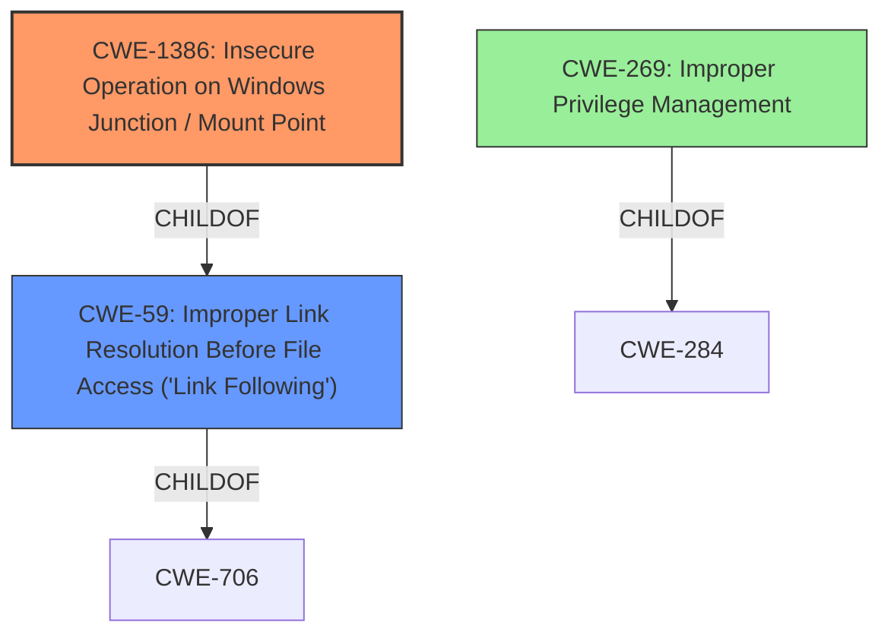

# Analysis for CVE-2021-31843

# Summary
| CWE ID | CWE Name | Confidence | CWE Abstraction Level | CWE Vulnerability Mapping Label | CWE-Vulnerability Mapping Notes |
|---|---|---|---|---|---|
| CWE-1386 | Insecure Operation on Windows Junction / Mount Point | 1.0 | Base | Allowed | Primary CWE |
| CWE-59 | Improper Link Resolution Before File Access ('Link Following') | 0.75 | Base | Allowed | Secondary Candidate |
| CWE-269 | Improper Privilege Management | 0.5 | Class | Discouraged | Secondary Candidate |

## Evidence and Confidence

*   **Confidence Score:** 0.9
*   **Evidence Strength:** HIGH

## Relationship Analysis
The primary CWE is CWE-1386, which describes insecure operations on Windows Junctions/Mount Points. It is a child of CWE-59, Improper Link Resolution, meaning it's a more specific case of link following. The vulnerability involves manipulating junction links, making CWE-1386 a more accurate fit than its parent. CWE-269, Improper Privilege Management, is a high-level class, and while the vulnerability description mentions "improper privileges management," the root cause is more specifically related to the insecure handling of junction points.

## Vulnerability Chain
The vulnerability chain starts with the **improper privileges management**, which enables the manipulation of junction links. This manipulation leads to the redirection of McAfee folder operations, ultimately allowing local users to access files they should not have access to. The root cause is the insecure handling of junction points (CWE-1386), and the impact is unauthorized file access.

## Summary of Analysis
The primary assessment is based on the provided evidence, specifically the "Vulnerability Description Key Phrases" that highlight "**improper privileges management**" as the root cause and "manipulating junction links to redirect McAfee folder operations to an unintended location" as the vector.

The graph relationships influenced the selection by clarifying the hierarchy of weaknesses. CWE-1386 is a specific type of CWE-59, making it a more precise fit for this vulnerability. CWE-269, while related to privileges, is a more general classification.

The selected CWEs are at the optimal level of specificity because CWE-1386 directly addresses the insecure handling of Windows junction points, which is the core issue in this vulnerability. This is more specific than the parent CWE-59 and the more general CWE-269.

Relevant CWE Information:

# Enhanced Context (25 CWEs)
The following CWEs were identified as potentially relevant to this vulnerability:

## CWE-59: Improper Link Resolution Before File Access ('Link Following')
**Abstraction Level**: Base
**Similarity Score**: 0.82
**Source**: dense

**Description**:
The product attempts to access a file based on the filename, but it does not properly prevent that filename from identifying a link or shortcut that resolves to an unintended resource.

**Mapping Guidance**:
- Usage: Allowed
- Rationale: This CWE entry is at the Base level of abstraction, which is a preferred level of abstraction for mapping to the root causes of vulnerabilities.

## CWE-269: Improper Privilege Management
**Abstraction Level**: Class
**Status:** Draft

### Description
The product does not properly assign, modify, track, or check privileges for an actor, creating an unintended sphere of control for that actor.

### Mapping Guidance
**Usage:** Discouraged
**Rationale:** CWE-269 is commonly misused. It can be conflated with "privilege escalation," which is a technical impact that is listed in many low-information vulnerability reports [REF-1287]. It is not useful for trend analysis.

## CWE-732: Incorrect Permission Assignment for Critical Resource
**Abstraction Level**: Class
**Similarity Score**: 0.76
**Source**: dense

**Description**:
The product specifies permissions for a security-critical resource in a way that allows that resource to be read or modified by unintended actors.

## CWE-61: UNIX Symbolic Link (Symlink) Following
**Abstraction Level**: Compound
**Similarity Score**: 0.77
**Source**: dense

**Description**:
The product, when opening a file or directory, does not sufficiently account for when the file is a symbolic link that resolves to a target outside of the intended control sphere. This could allow an attacker to cause the product to operate on unauthorized files.

## CWE-1386: Insecure Operation on Windows Junction / Mount Point
**Abstraction Level**: Base
**Similarity Score**: 0.77
**Source**: dense

**Description**:
The product opens a file or directory, but it does not properly prevent the name from being associated with a junction or mount point to a destination that is outside of the intended control sphere.

**Mapping Guidance**:
- Usage: Allowed
- Rationale: This CWE entry is at the Base level of abstraction, which is a preferred level of abstraction for mapping to the root causes of vulnerabilities.

---

**CWE-1386: Insecure Operation on Windows Junction / Mount Point**

*   **Explanation:** The vulnerability description specifically mentions "manipulating junction links to redirect McAfee folder operations," which aligns directly with CWE-1386's description of insecure operations on Windows junction points.
*   **Security Implications:** Attackers can redirect file operations to unintended locations, potentially accessing sensitive files or modifying critical system configurations.
*   **Relationship:** CWE-1386 is a child of CWE-59 (Improper Link Resolution), indicating a more specific type of link-following vulnerability.
*   **Mapping Guidance:** The MITRE mapping guidance allows for the use of CWE-1386 at the Base level of abstraction.
*   **Confidence:** 1.0

**CWE-59: Improper Link Resolution Before File Access ('Link Following')**

*   **Explanation:** While CWE-1386 is a more specific match, CWE-59 is still relevant as the broader category of link-following vulnerabilities. The vulnerability involves manipulating links (junction links) to access files.
*   **Security Implications:** Attackers can bypass intended access controls by exploiting the product's **failure** to properly validate or restrict link resolution.
*   **Relationship:** CWE-59 is a parent of CWE-1386.
*   **Mapping Guidance:** The MITRE mapping guidance allows for the use of CWE-59 at the Base level of abstraction.
*   **Confidence:** 0.75

**CWE-269: Improper Privilege Management**

*   **Explanation:** The vulnerability description mentions "**Improper privileges management**," which initially suggests CWE-269. However, the root cause is more precisely related to the insecure handling of junction points, rather than a general issue with privilege management. CWE-269 is a more general Class-level CWE.
*   **Security Implications:** **Failure** to properly manage privileges can lead to unauthorized access and privilege escalation.
*   **Relationship:** CWE-269 is a class, and has no direct relationship with CWE-1386 or CWE-59
*   **Mapping Guidance:** The MITRE mapping guidance discourages the use of CWE-269, recommending more specific CWEs instead.
*   **Confidence:** 0.5

**CWEs Considered but Not Used:**

*   CWE-732 (Incorrect Permission Assignment for Critical Resource): While the vulnerability leads to unauthorized access, the root cause is not directly related to incorrect permission assignments. The issue is the **failure** to properly handle junction points, which allows attackers to bypass intended access controls. Therefore, CWE-732 is not the most appropriate mapping.
*   CWE-61 (UNIX Symbolic Link (Symlink) Following): This CWE is specific to UNIX symbolic links, while the vulnerability involves Windows junction points. Although junction points are similar to symlinks, CWE-1386 is more appropriate as it specifically addresses Windows junctions.
*   CWE-427 (Uncontrolled Search Path Element): This CWE relates to the use of search paths that contain attacker-controlled elements. The vulnerability does not involve search paths, so CWE-427 is not applicable.