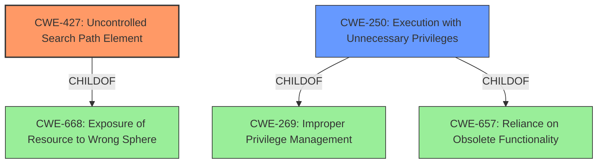

# Analysis for CVE-2021-31853

# Summary
| CWE ID | CWE Name | Confidence | CWE Abstraction Level | CWE Vulnerability Mapping Label | CWE-Vulnerability Mapping Notes |
|---|---|---|---|---|---|
| CWE-427 | Uncontrolled Search Path Element | 0.9 | Base | Allowed | Primary CWE |
| CWE-250 | Execution with Unnecessary Privileges | 0.6 | Base | Allowed | Secondary Candidate |

## Evidence and Confidence

*   **Confidence Score:** 0.8
*   **Evidence Strength:** HIGH

## Relationship Analysis
The primary CWE, CWE-427 **(Uncontrolled Search Path Element)**, is a Base-level CWE that is related to CWE-668 **(Exposure of Resource to Wrong Sphere)** and CWE-668. This indicates that the vulnerability involves a resource being exposed to an unintended actor due to an uncontrolled search path.

CWE-250 **(Execution with Unnecessary Privileges)** is a Base-level CWE that is related to CWE-269 **(Improper Privilege Management)** and CWE-657.

## Vulnerability Chain
The vulnerability chain starts with the **DLL Search Order Hijacking** (**ROOTCAUSE**) which allows local users to execute arbitrary code and escalate privileges (**IMPACT**) via execution from a compromised folder (**VECTOR**). The root cause is the uncontrolled search path element allowing execution of malicious DLLs. The execution occurs with elevated privileges.

## Summary of Analysis
The initial analysis identified CWE-427 **(Uncontrolled Search Path Element)** as the primary weakness because the vulnerability description explicitly mentions **DLL Search Order Hijacking**, which is a direct consequence of an uncontrolled search path. The "Vulnerability Description Key Phrases" lists "DLL Search Order Hijacking" as the **rootcause**. The "Retriever Results" also lists CWE-427 as the top CWE. The description of CWE-427 matches the vulnerability where "the product uses a fixed or controlled search path to find resources, but one or more locations in that path can be under the control of unintended actors."

CWE-250 **(Execution with Unnecessary Privileges)** was considered as a secondary weakness because the vulnerability allows local users to escalate privileges. However, the primary issue is the uncontrolled search path element.

I am selecting CWE-427 and CWE-250 because they are at the optimal level of specificity (Base level) and accurately represent the **rootcause** and **impact** of the vulnerability. The evidence from the vulnerability description and retriever results support this classification.

Relevant CWE Information:

# Enhanced Context (25 CWEs)
The following CWEs were identified as potentially relevant to this vulnerability:

## CWE-59: Improper Link Resolution Before File Access ('Link Following')
**Abstraction Level**: Base
**Similarity Score**: 0.79
**Source**: dense

**Description**:
The product attempts to access a file based on the filename, but it does not properly prevent that filename from identifying a link or shortcut that resolves to an unintended resource.

**Mapping Guidance**:
- Usage: Allowed
- Rationale: This CWE entry is at the Base level of abstraction, which is a preferred level of abstraction for mapping to the root causes of vulnerabilities.

## Technical Explanation for Selected CWEs:

### CWE-427: Uncontrolled Search Path Element
*   **How the vulnerability's details match the CWE's characteristics:** The vulnerability involves **DLL Search Order Hijacking**, which occurs when an application loads a DLL from an uncontrolled location due to the search path order. This aligns directly with the CWE-427 description: "The product uses a fixed or controlled search path to find resources, but one or more locations in that path can be under the control of unintended actors."
*   **The security implications and potential impact:** An attacker can place a malicious DLL in a directory that is searched before the intended location, leading to arbitrary code execution and privilege escalation.
*   **Any parent-child relationships or chain patterns that influenced your mapping:** CWE-427 is a child of CWE-668 **(Exposure of Resource to Wrong Sphere)**, indicating that the vulnerability involves a resource being exposed to an unintended actor.
*   **Whether the weakness is primary or secondary in the vulnerability:** This is the primary weakness, as the **DLL Search Order Hijacking** is the root cause of the vulnerability.
*   **How the official MITRE mapping guidance influenced your decision:** The MITRE mapping guidance allows the use of CWE-427 because it is at the Base level of abstraction.

### CWE-250: Execution with Unnecessary Privileges
*   **How the vulnerability's details match the CWE's characteristics:** The vulnerability leads to privilege escalation. This aligns with the CWE-250 description because the attacker is able to achieve higher privileges than necessary.
*   **The security implications and potential impact:** If code is executed with unnecessary privileges, the impact of any vulnerability in that code is amplified.
*   **Any parent-child relationships or chain patterns that influenced your mapping:** CWE-250 is a child of CWE-269 **(Improper Privilege Management)**
*   **Whether the weakness is primary or secondary in the vulnerability:** This is a secondary weakness, as the root cause is CWE-427.
*   **How the official MITRE mapping guidance influenced your decision:** The MITRE mapping guidance allows the use of CWE-250 because it is at the Base level of abstraction.

## Summary of Other CWEs Considered but Not Used:

*   **CWE-59 (Improper Link Resolution Before File Access ('Link Following')):** While symlink issues can be related to file access, the primary issue here is the search path, not the resolution of a link.
*   **CWE-732 (Incorrect Permission Assignment for Critical Resource):** This is not directly related to permission assignment, but rather the order in which directories are searched for DLLs.
*   **CWE-278 (Insecure Preserved Inherited Permissions):** While the compromised folder could have insecure permissions, the root cause of the vulnerability is the DLL search order, not the inherited permissions.
*   **CWE-426 (Untrusted Search Path):** The product uses a fixed or controlled search path to find resources, but one or more locations in that path can be under the control of unintended actors. In this vulnerability the search path is not untrusted but the **DLL Search Order Hijacking** occurs when an application loads a DLL from an uncontrolled location due to the search path order.