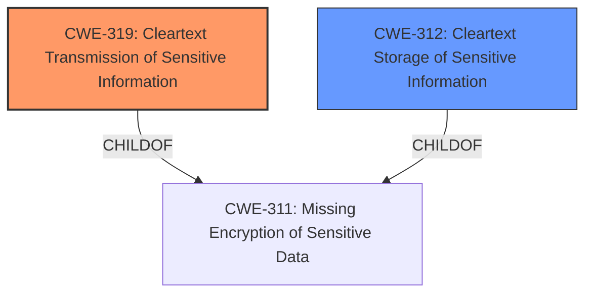

# Enhanced Analysis for CVE-2021-31855

# Summary
| CWE ID | CWE Name | Confidence | CWE Abstraction Level | CWE Vulnerability Mapping Label | CWE-Vulnerability Mapping Notes |
|---|---|---|---|---|---|
| CWE-319 | Cleartext Transmission of Sensitive Information | 0.9 | Base | Allowed | Primary CWE: The decrypted content of the message is uploaded to the remote server in cleartext. |
| CWE-312 | Cleartext Storage of Sensitive Information | 0.7 | Base | Allowed | Secondary CWE: The decrypted content is ultimately stored on the remote server, even if temporarily. |

## Evidence and Confidence

*   **Confidence Score:** 0.8
*   **Evidence Strength:** HIGH

## Relationship Analysis
The primary relationship influencing my decision is the parent-child relationship between CWE-311 (Missing Encryption of Sensitive Data) and its children CWE-319 (Cleartext Transmission of Sensitive Information) and CWE-312 (Cleartext Storage of Sensitive Information). The vulnerability involves both transmission and storage of sensitive data in cleartext, making CWE-319 the more direct root cause since transmission leads to storage. The hierarchical structure guides the selection towards the most specific Base level CWEs.



## Vulnerability Chain
The vulnerability chain starts with the user decrypting an encrypted message. When an attachment is deleted, the decrypted message content is then transmitted in cleartext to the remote server and subsequently stored there.

*   **Root Cause:** **Improper handling of decrypted data** during attachment deletion leading to cleartext transmission.
*   **Weakness:** Cleartext Transmission and Storage of the decrypted message.
*   **Impact:** Potential compromise of sensitive information if the attacker has access to the email server.

## Summary of Analysis
Initially, the vulnerability description and the CVE reference link content summary clearly indicate that the core issue is the **transmission of decrypted message content** in cleartext to a remote server. The evidence is strong, as it is supported by the description of the vulnerable code (`ViewerPrivate::deleteAttachment`) and the identified fix.

The choice of CWE-319 (Cleartext Transmission of Sensitive Information) as the primary CWE is based on the fact that the vulnerability involves the transmission of sensitive data (decrypted message content) without encryption. The "**impact:** reveal cleartext of encrypted messages" and the CVE Reference Links Content Summary explicitly mentioning the "**Information Disclosure:** The core vulnerability is the unintended disclosure of the decrypted message content to the remote server" provides strong evidence.

CWE-312 (Cleartext Storage of Sensitive Information) is a secondary concern because the decrypted content is ultimately stored on the remote server, however, the primary action is the **transmission**.

The retriever results also support the choice of CWE-319 and CWE-312, as they are listed among the top candidates.

The mapping guidance for both CWE-319 and CWE-312 allows their usage and specifies that they are at the Base level of abstraction, which is a preferred level.

Other CWEs like CWE-79 (Improper Neutralization of Input During Web Page Generation ('Cross-site Scripting')), CWE-209 (Generation of Error Message Containing Sensitive Information), CWE-451 (User Interface (UI) Misrepresentation of Critical Information) were considered but not selected. CWE-79 is not relevant because there is no improper neutralization of input, and the vulnerability isn't related to web page generation. CWE-209 is not applicable because the vulnerability isn't about generating error messages containing sensitive data. CWE-451 is not applicable because there is no misrepresentation of information in the UI.

The selected CWEs are at the optimal level of specificity because they directly address the root cause and the immediate consequences of the vulnerability.


## CWE Relationship Analysis

Current CWEs represent these abstraction levels: .


### Vulnerability Chain Analysis

**Chain starting from CWE-79:**
- 79 (Improper Neutralization of Input During Web Page Generation ('Cross-site Scripting')) - ROOT


**Chain starting from CWE-312:**
- 312 (Cleartext Storage of Sensitive Information) - ROOT


### CWE Relationship Diagram

```mermaid
graph TD
    classDef primary fill:#f96,stroke:#333,stroke-width:2px
    classDef secondary fill:#69f,stroke:#333
    classDef tertiary fill:#9e9,stroke:#333
```