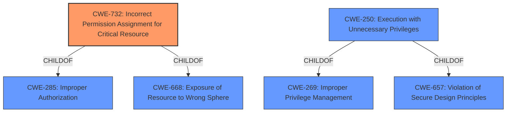

# Analysis Report for CVE-2021-31859

# Vulnerability Analysis Report: CVE-2021-31859

## Description


## Analysis (with Relationship Data)

# Summary
| CWE ID | CWE Name | Confidence | CWE Abstraction Level | CWE Vulnerability Mapping Label | CWE-Vulnerability Mapping Notes |
|---|---|---|---|---|---|
| CWE-732 | Incorrect Permission Assignment for Critical Resource | 0.9 | Class | Allowed-with-Review | Primary CWE |
| CWE-250 | Execution with Unnecessary Privileges | 0.6 | Base | Allowed | Secondary Candidate |

## Evidence and Confidence

*   **Confidence Score:** 0.75
*   **Evidence Strength:** MEDIUM

## Relationship Analysis
The primary CWE selected is CWE-732 (**Incorrect Permission Assignment for Critical Resource**), a Class-level CWE. It is a child of CWE-285 and CWE-668, which are related to authorization and control of resources respectively. CWE-284 (**Improper Access Control**) was considered, but as a Pillar-level CWE, it's too high-level. CWE-732 directly addresses the root cause of **incorrect privileges** which is a more specific classification. CWE-250 (**Execution with Unnecessary Privileges**) is a Base-level CWE and child of CWE-269 and CWE-657, which are about privilege management. This is considered as a secondary CWE since it aligns with the privilege escalation aspect of the vulnerability.



## Vulnerability Chain
The vulnerability chain starts with **incorrect privileges** assigned to the MU55 FlexiSpooler service. This allows a local user to overwrite the executable file via an alternative data stream, leading to local user privilege escalation.

Root Cause: **Incorrect Privileges** (CWE-732)
Weakness: Overwriting the executable file
Impact: Local user privilege escalation

## Summary of Analysis
The initial analysis identified CWE-732 as the primary candidate because the **root cause** is explicitly described as **incorrect privileges**. The vulnerability description directly states "**Incorrect privileges** in the MU55 FlexiSpooler service... allows local user privilege escalation...". The retriever results also listed CWE-732 as the top candidate. The MITRE mapping guidance for CWE-732 suggests reviewing closely the mistake to determine if it's an "authorization" weakness (CWE-285), however, in this case, the **incorrect permission assignment** itself is the root cause, making CWE-732 the more appropriate choice.
CWE-250 is added as a secondary candidate because the vulnerability leads to privilege escalation, suggesting the service might be running with more privileges than necessary. This supports the idea of **execution with unnecessary privileges**.
The selected CWEs are at the optimal level of specificity, with CWE-732 being a Class and CWE-250 being a Base. More generic CWEs like CWE-284 were considered but deemed too abstract to accurately represent the vulnerability.

Relevant CWE Information:

# Enhanced Context (25 CWEs)

## CWE-732: Incorrect Permission Assignment for Critical Resource
**Abstraction Level**: Class
**Similarity Score**: 0.171 (sparse)

**Description**:
The product specifies permissions for a security-critical resource in a way that allows that resource to be read or modified by unintended actors.

**Mapping Guidance**:
- Usage: Allowed-with-Review
- Rationale: While the name itself indicates an assignment of permissions for resources, this is often misused for vulnerabilities in which "permissions" are not checked, which is an "authorization" weakness (CWE-285 or descendants) within CWE's model [REF-1287].

## CWE-250: Execution with Unnecessary Privileges
**Abstraction Level**: Base
**Similarity Score**: 0.546 (dense)

**Description**:
The product performs an operation at a privilege level that is higher than the minimum level required, which creates new weaknesses or amplifies the consequences of other weaknesses.

**Mapping Guidance**:
- Usage: Allowed
- Rationale: This CWE entry is at the Base level of abstraction, which is a preferred level of abstraction for mapping to the root causes of vulnerabilities.


## CWE Relationship Analysis

Current CWEs represent these abstraction levels: .


### Vulnerability Chain Analysis

**Chain starting from CWE-732:**
- 732 (Incorrect Permission Assignment for Critical Resource) - ROOT


**Chain starting from CWE-657:**
- 657 (Violation of Secure Design Principles) - ROOT


### CWE Relationship Diagram

```mermaid
graph TD
    classDef primary fill:#f96,stroke:#333,stroke-width:2px
    classDef secondary fill:#69f,stroke:#333
    classDef tertiary fill:#9e9,stroke:#333
```


*Report generated on 2025-04-02 01:44:16*
