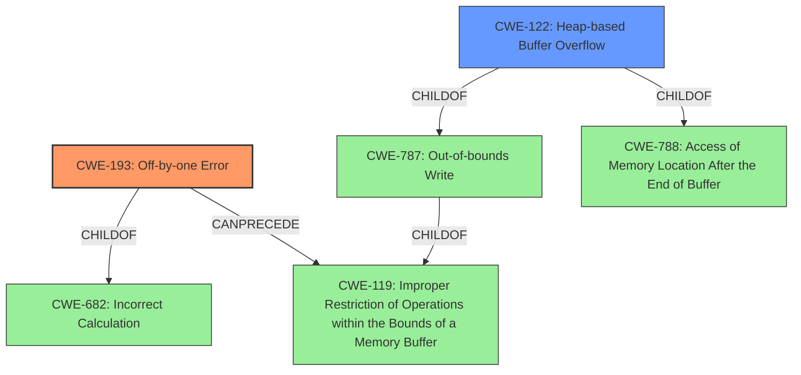

# Raw Analyzer Response for CVE-2021-31875

# Summary
| CWE ID | CWE Name | Confidence | CWE Abstraction Level | CWE Vulnerability Mapping Label | CWE-Vulnerability Mapping Notes |
|---|---|---|---|---|---|
| CWE-193 | Off-by-one Error | 0.9 | Base | Primary | Allowed |
| CWE-122 | Heap-based Buffer Overflow | 0.8 | Variant | Secondary | Allowed |

## Evidence and Confidence

*   **Confidence Score:** 0.9
*   **Evidence Strength:** HIGH

## Relationship Analysis
The primary CWE is CWE-193, which describes a product calculating or using an incorrect maximum or minimum value that is 1 more, or 1 less, than the correct value. CWE-193 is a child of CWE-682 (Incorrect Calculation). CWE-193 can precede CWE-119 (Improper Restriction of Operations within the Bounds of a Memory Buffer). CWE-122 is a variant of CWE-787 (Out-of-bounds Write) and CWE-788 (Access of Memory Location After the End of Buffer). CWE-119 is a class-level CWE, and the guidance discourages its use when more specific CWEs are available. Since we have evidence of an off-by-one error that leads to a heap-based buffer overflow, we can map to CWE-193 and CWE-122 respectively.

## Vulnerability Chain
The vulnerability chain starts with an **off-by-one error** (CWE-193) in the buffer allocation size, which leads to a **heap-based buffer overflow** (CWE-122) when parsing JSON strings. This overflow can potentially cause memory corruption and redirection of control flow.

## Summary of Analysis
The initial assessment based on the **Vulnerability Description Key Phrases** identified the "**off-by-one heap-based buffer overflow**" as a key weakness. The **CVE Reference Links Content Summary** provides more detailed evidence: "The vulnerability stems from an incorrect buffer allocation size when parsing JSON strings in `mjs_json.c`...the buffer was allocated with a size of `len + 1`...the null byte was not being written *after* the `memcpy`, causing a potential for out-of-bounds write." This confirms the **off-by-one error** (CWE-193) leading to the **heap-based buffer overflow** (CWE-122).

The retriever results also highlight relevant CWEs, including CWE-193 (Off-by-one Error) and CWE-122 (Heap-based Buffer Overflow). CWE-119 (Improper Restriction of Operations within the Bounds of a Memory Buffer) is listed but discouraged due to its high level of abstraction.

Based on the evidence, CWE-193 accurately captures the root cause (the incorrect calculation). CWE-122 accurately identifies the resulting buffer overflow on the heap.

Relevant CWE Information:

*   **CWE-193: Off-by-one Error**: The **Vulnerability Description** states "**off-by-one heap-based buffer overflow**". The **CVE Reference Links Content Summary** states "the buffer was allocated with a size of `len + 1`...the null byte was not being written *after* the `memcpy`, causing a potential for out-of-bounds write". This aligns perfectly with CWE-193, which describes an incorrect maximum or minimum value by 1.
*   **CWE-122: Heap-based Buffer Overflow**: The vulnerability is described as a **heap-based buffer overflow**, and the summary states "a heap buffer overflow can occur when parsing crafted JSON strings which may write out of allocated bounds". This aligns with CWE-122, which describes a buffer overflow occurring in the heap portion of memory.

CWEs Considered but Not Used:

*   CWE-119: Improper Restriction of Operations within the Bounds of a Memory Buffer - This CWE is too general and is discouraged when more specific CWEs are available. CWE-193 and CWE-122 are more specific and accurately describe the vulnerability.
*   CWE-190: Integer Overflow or Wraparound - While integer overflows can lead to buffer overflows, the primary cause here is the off-by-one error in buffer allocation, not an integer overflow.
*   CWE-120: Buffer Copy without Checking Size of Input ('Classic Buffer Overflow') - This CWE is relevant to buffer overflows, but the vulnerability is more accurately described as an off-by-one error leading to the overflow, rather than a simple unchecked buffer copy.