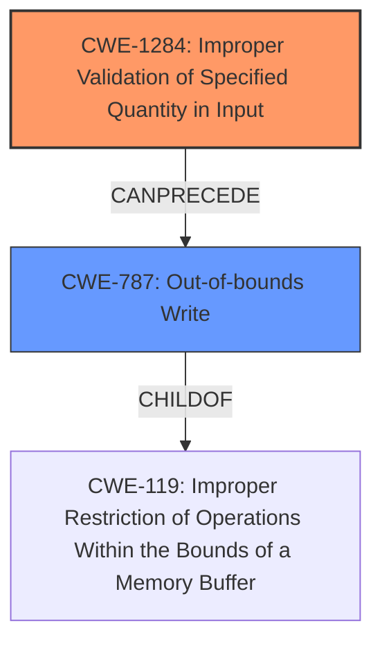

# Analysis Report for CVE-2021-31882

# Vulnerability Analysis Report: CVE-2021-31882

## Description


## Analysis (with Relationship Data)

# Summary
| CWE ID  | CWE Name                                                                                     | Confidence | CWE Abstraction Level | CWE Vulnerability Mapping Label | CWE-Vulnerability Mapping Notes |
| :-------- | :--------------------------------------------------------------------------------------------- | :---------- | :---------------------- | :-------------------------------- | :-------------------------------- |
| CWE-1284 | Improper Validation of Specified Quantity in Input                                             | 0.95      | Base                    | Primary                           | Allowed                           |
| CWE-787   | Out-of-bounds Write                                                                           | 0.75      | Base                    | Secondary                         | Allowed                           |

## Evidence and Confidence

*   **Confidence Score:** 0.85
*   **Evidence Strength:** HIGH

## Relationship Analysis
The primary CWE is CWE-1284, which focuses on the **improper validation** of input quantities, directly aligning with the vulnerability description highlighting the **lack of validation of the length of the Domain Name Server IP option**. CWE-787 is a secondary CWE because the **improper validation** leads to an out-of-bounds write due to the **lack of size checking**, which is a consequence of the **root cause** of the vulnerability.



## Vulnerability Chain
The vulnerability chain starts with the **DHCP client application failing to validate the length of the Domain Name Server IP option**. This **lack of validation** leads to a buffer overflow, which results in a denial-of-service condition.
  - **Root Cause:** **Improper Input Validation** (CWE-1284)
  - **Weakness:** Buffer Overflow (CWE-787)
  - **Impact:** Denial-of-Service

## Summary of Analysis
The analysis indicates that the **DHCP client application does not validate the length of the Domain Name Server IP option(s)** when processing DHCP ACK packets. This **weakness** can lead to a denial-of-service. The primary cause is the **improper validation of the length**, which is best captured by CWE-1284 (Improper Validation of Specified Quantity in Input). The resulting buffer overflow is captured by CWE-787 (Out-of-bounds Write).

The following evidence from the vulnerability description supports this assessment:
*   "The **DHCP client application does not validate the length of the Domain Name Server IP option(s)** (0x06) when processing DHCP ACK packets."
*   "This may lead to Denial-of-Service conditions."
*   "**Improper Input Validation:** The primary weakness is the lack of proper input validation of the length of the DNS server IP option within the DHCP ACK packet."
*   "**Buffer Overflow:** This **lack of validation** can lead to a buffer overflow condition when processing a crafted DHCP ACK packet with an oversized DNS server IP option."

CWE-1284 is the most specific and appropriate CWE because it directly addresses the root cause of the vulnerability, which is the **improper validation of the length of the DNS server IP option**. While CWE-20 (Improper Input Validation) is a broader category, CWE-1284 provides a more precise classification of the specific input validation failure.

CWE-787 (Out-of-bounds Write) is included as a secondary CWE because the **lack of input validation** leads to a buffer overflow, which results in writing data beyond the intended buffer.

Other CWEs Considered:

*   CWE-20: Improper Input Validation - While relevant, it's a broader, less specific category than CWE-1284.
*   CWE-120: Buffer Copy without Checking Size of Input ('Classic Buffer Overflow') - While the description mentions buffer overflow, CWE-1284 captures the **root cause** more accurately. The buffer overflow is a consequence of the **improper validation**.
*   CWE-125: Out-of-bounds Read - This is not the correct CWE since the vulnerability involves an out-of-bounds write, not read.
*   CWE-170: Improper Null Termination - Not relevant as the vulnerability doesn't relate to null termination issues.
*   CWE-401: Missing Release of Memory after Effective Lifetime - Incorrect, as the issue is with input validation, not memory management.
*   CWE-326: Inadequate Encryption Strength - Incorrect, since the vulnerability does not relate to encryption.

Relevant CWE Information:


## CWE Relationship Analysis

Current CWEs represent these abstraction levels: .


### Vulnerability Chain Analysis

**Chain starting from CWE-787:**
- 787 (Out-of-bounds Write) - ROOT


**Chain starting from CWE-170:**
- 170 (Improper Null Termination) - ROOT


### CWE Relationship Diagram

```mermaid
graph TD
    classDef primary fill:#f96,stroke:#333,stroke-width:2px
    classDef secondary fill:#69f,stroke:#333
    classDef tertiary fill:#9e9,stroke:#333
```


*Report generated on 2025-04-01 22:34:19*
