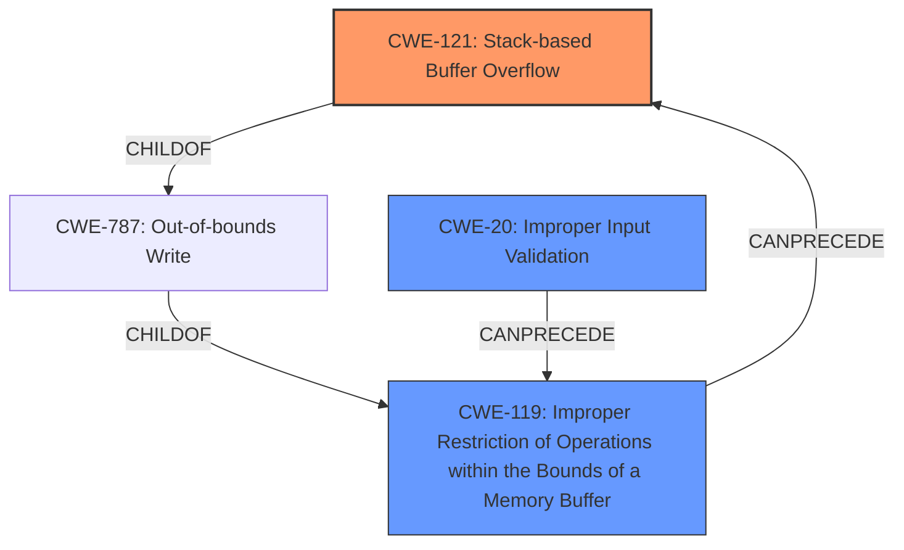

# Analysis Report for CVE-2021-31886

# Vulnerability Analysis Report: CVE-2021-31886

## Description


## Analysis (with Relationship Data)

# Summary
| CWE ID | CWE Name | Confidence | CWE Abstraction Level | CWE Vulnerability Mapping Label | CWE-Vulnerability Mapping Notes |
|---|---|---|---|---|---|
| CWE-121 | Stack-based Buffer Overflow | 1.0 | Variant | Primary | Allowed |
| CWE-119 | Improper Restriction of Operations within the Bounds of a Memory Buffer | 0.7 | Class | Secondary | Discouraged |
| CWE-20 | Improper Input Validation | 0.6 | Class | Secondary | Discouraged |

## Evidence and Confidence

*   **Confidence Score:** 0.9
*   **Evidence Strength:** HIGH

## Relationship Analysis
The primary CWE, CWE-121 (Stack-based Buffer Overflow), is a variant of CWE-787 (Out-of-bounds Write), which in turn is a child of CWE-119 (Improper Restriction of Operations within the Bounds of a Memory Buffer). CWE-119 is also related to CWE-20 (Improper Input Validation) because lack of proper input validation can lead to buffer overflows. The abstraction levels influenced the selection, favoring the more specific Variant (CWE-121) over the broader Class (CWE-119).



## Vulnerability Chain
The vulnerability chain starts with the FTP server failing to properly validate the length of the USER command (likely CWE-20), which leads to a **stack-based buffer overflow** (CWE-121), ultimately resulting in Denial-of-Service or Remote Code Execution.

## Summary of Analysis
The initial assessment strongly points towards a **stack-based buffer overflow** due to the FTP server's **improper validation** of the USER command length. The evidence provided, especially the "Vulnerability Description Key Phrases" and "CVE Reference Links Content Summary", directly mentions "**stack-based buffer overflows**" as the **weakness**.

The relationship graph highlights that CWE-121 is a specific type of CWE-787 (Out-of-bounds Write), which itself is a child of CWE-119. This hierarchical structure validates choosing CWE-121 as the most specific and accurate representation of the vulnerability, and the retriever results also include CWE-121. While CWE-119 is a parent, it's less specific. CWE-20, Improper Input Validation, is included as a secondary CWE because the root cause stems from the FTP server's failure to validate the length of the USER command, which allows the buffer overflow to occur.

The decision to use CWE-121 is justified by its precise match to the vulnerability description and its appropriate level of specificity (Variant). The evidence clearly states that the vulnerability is a "**stack-based buffer overflow**", and CWE-121 accurately captures this.

Relevant CWE Information:

# Enhanced Context (25 CWEs)

## CWE-1289: Improper Validation of Unsafe Equivalence in Input
**Abstraction Level**: Base
**Similarity Score**: 0.77
**Source**: dense

**Description**:
The product receives an input value that is used as a resource identifier or other type of reference, but it does not validate or incorrectly validates that the input is equivalent to a potentially-unsafe value.
**Rationale for not selecting**: While input validation is part of the issue, the core problem is a buffer overflow on the stack.

## CWE-838: Inappropriate Encoding for Output Context
**Abstraction Level**: Base
**Similarity Score**: 0.76
**Source**: dense

**Description**:
The product uses or specifies an encoding when generating output to a downstream component, but the specified encoding is not the same as the encoding that is expected by the downstream component.
**Rationale for not selecting**: This CWE is related to encoding issues, which is not the primary cause of the vulnerability.

## CWE-74: Improper Neutralization of Special Elements in Output Used by a Downstream Component ('Injection')
**Abstraction Level**: Class
**Similarity Score**: 0.75
**Source**: dense

**Description**:
The product constructs all or part of a command, data structure, or record using externally-influenced input from an upstream component, but it does not neutralize or incorrectly neutralizes special elements that could modify how it is parsed or interpreted when it is sent to a downstream component.
**Rationale for not selecting**: The vulnerability is not directly related to injection.

## CWE-226: Sensitive Information in Resource Not Removed Before Reuse
**Abstraction Level**: Base
**Similarity Score**: 0.75
**Source**: dense

**Description**:
The product releases a resource such as memory or a file so that it can be made available for reuse, but it does not clear or "zeroize" the information contained in the resource before the product performs a critical state transition or makes the resource available for reuse by other entities.
**Rationale for not selecting**: This CWE relates to sensitive information reuse, which is not applicable to this vulnerability.

## CWE-138: Improper Neutralization of Special Elements
**Abstraction Level**: Class
**Similarity Score**: 0.75
**Source**: dense

**Description**:
The product receives input from an upstream component, but it does not neutralize or incorrectly neutralizes special elements that could be interpreted as control elements or syntactic markers when they are sent to a downstream component.
**Rationale for not selecting**: This CWE is too general and not specific to the buffer overflow.

## CWE-184: Incomplete List of Disallowed Inputs
**Abstraction Level**: Base
**Similarity Score**: 0.74
**Source**: dense

**Description**:
The product implements a protection mechanism that relies on a list of inputs (or properties of inputs) that are not allowed by policy or otherwise require other action to neutralize before additional processing takes place, but the list is incomplete.
**Rationale for not selecting**: The description doesn't explicitly mention an incomplete list of disallowed inputs, so this CWE is not a good fit.

## CWE-125: Out-of-bounds Read
**Abstraction Level**: Base
**Similarity Score**: 0.74
**Source**: dense

**Description**:
The product reads data past the end, or before the beginning, of the intended buffer.
**Rationale for not selecting**: The vulnerability is a buffer overflow (write), not a read.

## CWE-134: Use of Externally-Controlled Format String
**Abstraction Level**: Base
**Similarity Score**: 0.74
**Source**: dense

**Description**:
The product uses a function that accepts a format string as an argument, but the format string originates from an external source.
**Rationale for not selecting**: The vulnerability is not related to format string issues.

## CWE-212: Improper Removal of Sensitive Information Before Storage or Transfer
**Abstraction Level**: Base
**Similarity Score**: 0.74
**Source**: dense

**Description**:
The product stores, transfers, or shares a resource that contains sensitive information, but it does not properly remove that information before the product makes the resource available to unauthorized actors.
**Rationale for not selecting**: This CWE deals with sensitive information handling, which is not directly related to the buffer overflow.

## CWE-404: Improper Resource Shutdown or Release
**Abstraction Level**: Class
**Similarity Score**: 0.74
**Source**: dense

**Description**:
The product does not release or incorrectly releases a resource before it is made available for re-use.
**Rationale for not selecting**: The vulnerability is not related to resource management.

## CWE-190: Integer Overflow or Wraparound
**Abstraction Level**: Base
**Similarity Score**: 9027.33
**Source**: sparse

**Description**:
The product performs a calculation that can
         produce an integer overflow or wraparound when the logic
         assumes that the resulting value will always be larger than
         the original value. This occurs when an integer value is
         incremented to a value that is too large to store in the
         associated representation. When this occurs, the value may
         become a very small or negative number.
**Rationale for not selecting**: While integer overflows could potentially lead to buffer overflows, the description doesn't explicitly mention this as the root cause.

## CWE-125: Out-of-bounds Read
**Abstraction Level**: Base
**Similarity Score**: 8724


## CWE Relationship Analysis

Current CWEs represent these abstraction levels: .


### Vulnerability Chain Analysis

**Chain starting from CWE-121:**
- 121 (Stack-based Buffer Overflow) - ROOT


**Chain starting from CWE-787:**
- 787 (Out-of-bounds Write) - ROOT


### CWE Relationship Diagram

```mermaid
graph TD
    classDef primary fill:#f96,stroke:#333,stroke-width:2px
    classDef secondary fill:#69f,stroke:#333
    classDef tertiary fill:#9e9,stroke:#333
```


*Report generated on 2025-04-02 08:11:10*
