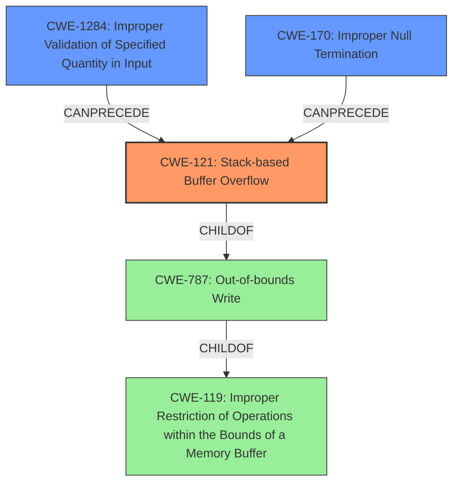

# Raw Analyzer Response for CVE-2021-31887

# Summary
| CWE ID | CWE Name | Confidence | CWE Abstraction Level | CWE Vulnerability Mapping Label | CWE-Vulnerability Mapping Notes |
|---|---|---|---|---|---|
| CWE-121 | Stack-based Buffer Overflow | 0.9 | Variant | Allowed | Primary CWE |
| CWE-1284 | Improper Validation of Specified Quantity in Input | 0.7 | Base | Allowed | Secondary Candidate |
| CWE-170 | Improper Null Termination | 0.6 | Base | Allowed | Secondary Candidate |

## Evidence and Confidence

*   **Confidence Score:** 0.8
*   **Evidence Strength:** HIGH

## Relationship Analysis
The primary weakness is a stack-based buffer overflow (CWE-121), a variant of the more general out-of-bounds write (CWE-787), which itself is a child of improper restriction of operations within memory buffer (CWE-119). The buffer overflow arises because the FTP server fails to properly validate the length of the PWD/XPWD command, meaning there is an improper validation of the input length (CWE-1284). There could also be a lack of or improper null termination (CWE-170) which is a peer of other issues such as CWE-463 and CWE-464. This structure clarifies how the specific coding error leads to a exploitable vulnerability.

## Vulnerability Chain
The vulnerability chain starts with the **improper validation of the length of the PWD/XPWD command** (CWE-1284), leading to a **stack-based buffer overflow** (CWE-121). The **improper null termination** (CWE-170) can also play a role in expanding the overflow. This ultimately results in Denial-of-Service conditions and Remote Code Execution.

## Summary of Analysis
The analysis identified the primary weakness as a **stack-based buffer overflow (CWE-121)**, stemming from the FTP server's failure to adequately validate the length of the PWD/XPWD command, as indicated in the vulnerability description: "**FTP server does not properly validate the length of the PWD/XPWD command**, leading to **stack-based buffer overflows**." This statement directly links the **root cause** to the resulting overflow.

The selection of CWE-121 is further supported by the CVE Reference Links Content Summary, which highlights "**Stack-based buffer overflow vulnerability due to improper length validation of the "PWD/XPWD" FTP command**."

The relationship analysis and graph helped solidify the understanding of how the **improper input validation** (CWE-1284) contributes to the buffer overflow (CWE-121). While CWE-119 (Improper Restriction of Operations within the Bounds of a Memory Buffer) could be considered, it is a more general class, and CWE-121 provides a more specific and accurate description of the vulnerability.

The decision to use CWE-121 is based on the evidence that the buffer is allocated on the stack and that the overflow occurs due to a copy operation without proper size checks.

Relevant CWE Information:

# Enhanced Context (25 CWEs)
The following CWEs were identified as potentially relevant to this vulnerability:

## CWE-1289: Improper Validation of Unsafe Equivalence in Input
**Abstraction Level**: Base
**Similarity Score**: 0.75

This CWE is not relevant. It deals with validating the equivalence of an input to a potentially unsafe value, which is not the core issue here.

## CWE-838: Inappropriate Encoding for Output Context
**Abstraction Level**: Base
**Similarity Score**: 0.74

This CWE is not relevant. The vulnerability is not related to encoding issues.

## CWE-226: Sensitive Information in Resource Not Removed Before Reuse
**Abstraction Level**: Base
**Similarity Score**: 0.72

This CWE is not relevant. The vulnerability has nothing to do with sensitive information.

## CWE-74: Improper Neutralization of Special Elements in Output Used by a Downstream Component ('Injection')
**Abstraction Level**: Class
**Similarity Score**: 0.72

This CWE is not the most appropriate. While remote code execution is an impact of the stack-based buffer overflow, the root cause is not an injection vulnerability. Therefore, it's better to focus on the overflow itself.

## CWE-1288: Improper Validation of Consistency within Input
**Abstraction Level**: Base
**Similarity Score**: 0.72

This CWE is not relevant. It deals with consistency between multiple input elements.

## CWE-807: Reliance on Untrusted Inputs in a Security Decision
**Abstraction Level**: Base
**Similarity Score**: 0.71

This CWE is not relevant. The issue is not about making a security decision based on untrusted inputs.

## CWE-606: Unchecked Input for Loop Condition
**Abstraction Level**: Base
**Similarity Score**: 0.71

This CWE is not relevant. There is no mention of unchecked inputs used for loop conditions.

## CWE-115: Misinterpretation of Input
**Abstraction Level**: Base
**Similarity Score**: 0.71

This CWE is not relevant. The issue is not about misinterpreting an input.

## CWE-138: Improper Neutralization of Special Elements
**Abstraction Level**: Class
**Similarity Score**: 0.71

This CWE is not relevant. It deals with neutralizing special elements in input, which is not the core issue here.

## CWE-131: Incorrect Calculation of Buffer Size
**Abstraction Level**: Base
**Similarity Score**: 0.71

This CWE is not explicitly supported by the evidence. While buffer overflows often involve incorrect size calculations, the primary issue identified is the **lack of validation** of the input length, rather than an explicit calculation error.

## CWE-190: Integer Overflow or Wraparound
**Abstraction Level**: Base
**Similarity Score**: 9584.25

Although integer overflows can be related to buffer overflows, there is no explicit evidence of an integer overflow in the description.

## CWE-125: Out-of-bounds Read
**Abstraction Level**: Base
**Similarity Score**: 9304.51

The vulnerability description and CVE reference links content summary highlight a "**stack-based buffer overflow**" arising from **improper length validation**. The root cause is related to writing past the end of the buffer.

## CWE-1284: Improper Validation of Specified Quantity in Input
**Abstraction Level**: Base
**Similarity Score**: 9120.95

This CWE is a strong candidate because the **root cause** is that the "**FTP server does not properly validate the length of the PWD/XPWD command**". This directly aligns with the description of CWE-1284, which covers situations where a product receives input specifying a quantity (in this case, length) but fails to validate it properly.

## CWE-119: Improper Restriction of Operations within the Bounds of a Memory Buffer
**Abstraction Level**: Class
**Similarity Score**: 9091.29

While this CWE is related to buffer overflows, it's a more general class. The description specifies a stack-based buffer overflow, so CWE-121 is a more precise match.

## CWE-193: Off-by-one Error
**Abstraction Level**: Base
**Similarity Score**: 8798.42

There's no direct evidence in the description to support this.

## CWE-170: Improper Null Termination
**Abstraction Level**: base
**Similarity Score**: 5.03

The CVE Reference Links Content Summary states "**Improper Null Termination (CWE-170)**."

## CWE-41: Improper Resolution of Path Equivalence
**Abstraction Level**: base
**Similarity Score**: 5.03

This CWE is not relevant. It deals with path equivalence issues.

## CWE-193: Off-by-one Error
**Abstraction Level**: base
**Similarity Score**: 4.33

This CWE is