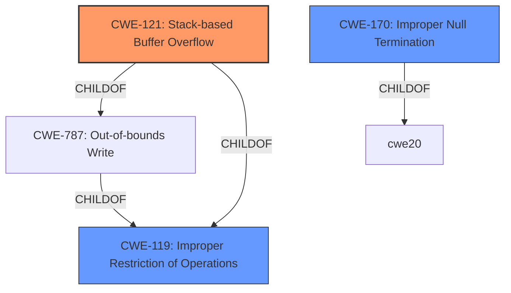

# Analysis Report for CVE-2021-31888

# Vulnerability Analysis Report: CVE-2021-31888

## Description


## Analysis (with Relationship Data)

# Summary

| CWE ID | CWE Name | Confidence | CWE Abstraction Level | CWE Vulnerability Mapping Label | CWE-Vulnerability Mapping Notes |
|---|---|---|---|---|---|
| CWE-121 | Stack-based Buffer Overflow | 1.0 | Variant | Allowed | Primary CWE |
| CWE-119 | Improper Restriction of Operations within the Bounds of a Memory Buffer | 0.7 | Class | Discouraged | Secondary Candidate |
| CWE-170 | Improper Null Termination | 0.6 | Base | Allowed | Secondary Candidate |

## Evidence and Confidence

*   **Confidence Score:** 0.8
*   **Evidence Strength:** HIGH

## Relationship Analysis
The primary CWE is CWE-121, which is a variant of CWE-787 (Out-of-bounds Write) and CWE-119 (Improper Restriction of Operations within the Bounds of a Memory Buffer). The vulnerability is a stack-based buffer overflow, so CWE-121 is the most specific and appropriate choice. CWE-170 (Improper Null Termination) is included as a secondary candidate, since the CVE Reference Links Content Summary indicated it could be a contributing factor.



## Vulnerability Chain
The vulnerability chain starts with **improper validation** of the length of the MKD/XMKD command, leading to a **stack-based buffer overflow**. This can result in **Denial-of-Service** and **Remote Code Execution**.

## Summary of Analysis
The analysis is based on the provided vulnerability description and the CVE Reference Links Content Summary. The description clearly states that the FTP server does not properly validate the length of the MKD/XMKD command, leading to **stack-based buffer overflows**. The CVE Reference Links Content Summary reinforces this by stating, "The lack of proper length validation allows an attacker to send overly long "MKD/XMKD" commands, overflowing the stack buffer."

The retriever results also suggest CWE-119 (Improper Restriction of Operations within the Bounds of a Memory Buffer), CWE-170 (Improper Null Termination), and CWE-787 (Out-of-bounds Write).

CWE-121 is chosen as the primary CWE because the vulnerability description and the CVE Reference Links Content Summary explicitly mention a **stack-based buffer overflow**. CWE-121 is a Variant of CWE-787 and CWE-119, which are more general.

CWE-119 is considered a secondary candidate because CWE-121 is a child of CWE-119. However, the mapping guidance for CWE-119 discourages its use when lower-level CWEs are available.

CWE-170 is considered a secondary candidate because the CVE Reference Links Content Summary mentions that **improper handling of null termination** could be a contributing factor.

The selected CWEs are at the optimal level of specificity because CWE-121 accurately describes the vulnerability as a **stack-based buffer overflow**, and CWE-170 may be a contributing factor.

Relevant CWE Information:

# Enhanced Context (25 CWEs)
The following CWEs were identified as potentially relevant to this vulnerability:

## CWE-838: Inappropriate Encoding for Output Context
**Abstraction Level**: Base
**Similarity Score**: 0.76
**Source**: dense
## CWE-1289: Improper Validation of Unsafe Equivalence in Input
**Abstraction Level**: Base
**Similarity Score**: 0.76
**Source**: dense
## CWE-74: Improper Neutralization of Special Elements in Output Used by a Downstream Component ('Injection')
**Abstraction Level**: Class
**Similarity Score**: 0.74
**Source**: dense
## CWE-226: Sensitive Information in Resource Not Removed Before Reuse
**Abstraction Level**: Base
**Similarity Score**: 0.74
**Source**: dense
## CWE-125: Out-of-bounds Read
**Abstraction Level**: Base
**Similarity Score**: 0.74
**Source**: dense
## CWE-138: Improper Neutralization of Special Elements
**Abstraction Level**: Class
**Similarity Score**: 0.73
**Source**: dense
## CWE-134: Use of Externally-Controlled Format String
**Abstraction Level**: Base
**Similarity Score**: 0.73
**Source**: dense
## CWE-184: Incomplete List of Disallowed Inputs
**Abstraction Level**: Base
**Similarity Score**: 0.73
**Source**: dense
## CWE-191: Integer Underflow (Wrap or Wraparound)
**Abstraction Level**: Base
**Similarity Score**: 0.73
**Source**: dense
## CWE-115: Misinterpretation of Input
**Abstraction Level**: Base
**Similarity Score**: 0.73
**Source**: dense
## CWE-190: Integer Overflow or Wraparound
**Abstraction Level**: Base
**Similarity Score**: 9161.71
**Source**: sparse
## CWE-125: Out-of-bounds Read
**Abstraction Level**: Base
**Similarity Score**: 8873.34
**Source**: sparse
## CWE-1284: Improper Validation of Specified Quantity in Input
**Abstraction Level**: Base
**Similarity Score**: 8684.03
**Source**: sparse
## CWE-119: Improper Restriction of Operations within the Bounds of a Memory Buffer
**Abstraction Level**: Class
**Similarity Score**: 8619.35
**Source**: sparse
## CWE-116: Improper Encoding or Escaping of Output
**Abstraction Level**: Class
**Similarity Score**: 8391.00
**Source**: sparse
## CWE-170: Improper Null Termination
**Abstraction Level**: base
**Similarity Score**: 5.03
**Source**: graph
## CWE-190: Integer Overflow or Wraparound
**Abstraction Level**: base
**Similarity Score**: 5.03
**Source**: graph
## CWE-128: Wrap-around Error
**Abstraction Level**: base
**Similarity Score**: 5.03
**Source**: graph
## CWE-120: Buffer Copy without Checking Size of Input ('Classic Buffer Overflow')
**Abstraction Level**: base
**Similarity Score**: 4.33
**Source**: graph
## CWE-681: Incorrect Conversion between Numeric Types
**Abstraction Level**: base
**Similarity Score**: 4.33
**Source**: graph
## CWE-22: Improper Limitation of a Pathname to a Restricted Directory ('Path Traversal')
**Abstraction Level**: base
**Similarity Score**: 4.33
**Source**: graph
## CWE-770: Allocation of Resources Without Limits or Throttling
**Abstraction Level**: base
**Similarity Score**: 4.33
**Source**: graph
## CWE-73: External Control of File Name or Path
**Abstraction Level**: base
**Similarity Score**: 4.33
**Source**: graph
## CWE-1284: Improper Validation of Specified Quantity in Input
**Abstraction Level**: base
**Similarity Score**: 4.33
**Source**: graph
## CWE-123: Write-what-where Condition
**Abstraction Level**: base
**Similarity Score**: 4.33
**Source**: graph

CWE-20 (Improper Input Validation) was considered but not used as the vulnerability description is more specific and details a **stack-based buffer overflow**, making CWE-121 a better fit. The mapping guidance for CWE-20 also discourages its use when lower-level CWEs are available.

CWE-787 (Out-of-bounds Write) was considered, but CWE-121 is a more specific variant that describes the vulnerability occurring on the stack.

CWE-120 (Buffer Copy without Checking Size of Input) was considered, but the description does not explicitly state that the buffer overflow is due to a buffer copy operation. Therefore, CWE-121 is a more appropriate choice.


## CWE Relationship Analysis

Current CWEs represent these abstraction levels: .


### Vulnerability Chain Analysis

**Chain starting from CWE-787:**
- 787 (Out-of-bounds Write) - ROOT


**Chain starting from CWE-123:**
- 123 (Write-what-where Condition) - ROOT


### CWE Relationship Diagram

```mermaid
graph TD
    classDef primary fill:#f96,stroke:#333,stroke-width:2px
    classDef secondary fill:#69f,stroke:#333
    classDef tertiary fill:#9e9,stroke:#333
```


*Report generated on 2025-04-02 00:21:17*
