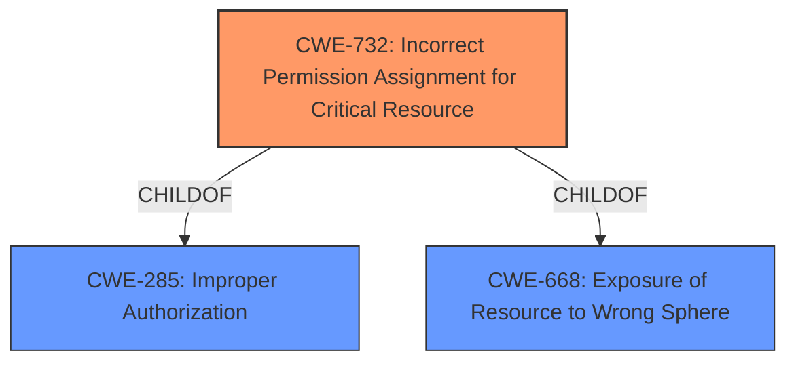

# Enhanced Analysis for CVE-2021-31894

# Summary
| CWE ID | CWE Name | Confidence | CWE Abstraction Level | CWE Vulnerability Mapping Label | CWE-Vulnerability Mapping Notes |
|---|---|---|---|---|---|
| CWE-732 | Incorrect Permission Assignment for Critical Resource | 1.0 | Class | Allowed-with-Review | Primary CWE |

## Evidence and Confidence

*   **Confidence Score:** 1.0
*   **Evidence Strength:** HIGH

## Relationship Analysis
The analysis focuses on the hierarchical relationship where CWE-732 is a child of CWE-285 (Improper Authorization) and CWE-668 (Exposure of Resource to Wrong Sphere). Though CWE-732 is a Class-level CWE, it accurately reflects the **incorrect permission assignment**, making it the most suitable choice despite the general preference for Base-level CWEs. The other CWEs, like CWE-538 and CWE-522, were considered but discarded as they didn't directly address the root cause of **incorrect permission assignment**.



## Vulnerability Chain
The vulnerability chain starts with the **incorrect assignment of write permissions** to a directory containing metafiles, leading to the attacker's ability to modify these metafiles. This modification can then be leveraged to **manipulate parameters or behavior of devices**. The chain is:
1.  **Incorrect Permission Assignment (CWE-732)**: Root cause is the write permissions on the directory containing metafiles.
2.  **Manipulation of Metafiles**: The attacker exploits the write permissions to change the content of the metafiles.
3.  **Manipulation of Device Parameters/Behavior**: The modified metafiles are then used to alter the configuration and behavior of devices.

## Summary of Analysis
The primary finding is CWE-732 (**Incorrect Permission Assignment for Critical Resource**), which is supported by the vulnerability description and CVE Reference Links Content Summary. The **root cause** is the **incorrect permission assignment** on the directory containing metafiles, which allows an attacker to **change the content of certain metafiles, which could then be used to manipulate parameters or behavior of devices configured by the affected software**.

The evidence to support the choice of CWE-732 is explicitly stated in the "CVE Reference Links Content Summary":
-   "**Root cause of vulnerability:** Incorrect permission assignment on a directory containing meta files relevant to device configurations. This directory has write permissions."
-   "**Weaknesses/vulnerabilities present:**  Incorrect Permission Assignment for Critical Resource (CWE-732)."

The provided information specifically identifies "Incorrect Permission Assignment for Critical Resource" as a present weakness.

CWE-538 (Insertion of Sensitive Information into Externally-Accessible File or Directory) was considered because the attacker can change metafiles, which could be considered inserting information. However, the root of the problem is the write permissions, not necessarily the insertion of sensitive information. Therefore, CWE-732 is more appropriate.

CWE-522 (Insufficiently Protected Credentials) was considered since **manipulating device parameters** could involve changing credentials. However, the provided description does not focus on credentials but on the broader manipulation of device behavior, making CWE-732 a better fit.

The selection of CWE-732 is at the optimal level of specificity because it directly addresses the identified **root cause** of the vulnerability.
# Relevant CWE Information:
## CWE-664: Improper Control of a Resource Through its Lifetime
**Abstraction Level**: Pillar
**Similarity Score**: 0.76
**Source**: dense

**Description**:
The product does not maintain or incorrectly maintains control over a resource throughout its lifetime of creation, use, and release.

**Mapping Guidance**:
- Usage: Discouraged
- Rationale: This CWE entry is high-level when lower-level children are available.

## CWE-703: Improper Check or Handling of Exceptional Conditions
**Abstraction Level**: Pillar
**Similarity Score**: 0.76
**Source**: dense

**Description**:
The product does not properly anticipate or handle exceptional conditions that rarely occur during normal operation of the product.

**Mapping Guidance**:
- Usage: Discouraged
- Rationale: This CWE entry is extremely high-level, a Pillar.

## CWE-653: Improper Isolation or Compartmentalization
**Abstraction Level**: Class
**Similarity Score**: 0.75
**Source**: dense

**Description**:
The product does not properly compartmentalize or isolate functionality, processes, or resources that require different privilege levels, rights, or permissions.

**Mapping Guidance**:
- Usage: Allowed
- Rationale: This CWE entry is at the Base level of abstraction, which is a preferred level of abstraction for mapping to the root causes of vulnerabilities.

## CWE-404: Improper Resource Shutdown or Release
**Abstraction Level**: Class
**Similarity Score**: 0.75
**Source**: dense

**Description**:
The product does not release or incorrectly releases a resource before it is made available for re-use.

**Mapping Guidance**:
- Usage: Allowed-with-Review
- Rationale: This CWE entry is a Class and might have Base-level children that would be more appropriate

## CWE-274: Improper Handling of Insufficient Privileges
**Abstraction Level**: Base
**Similarity Score**: 0.75
**Source**: dense

**Description**:
The product does not handle or incorrectly handles when it has insufficient privileges to perform an operation, leading to resultant weaknesses.

**Mapping Guidance**:
- Usage: Discouraged
- Rationale: This CWE entry could be deprecated in a future version of CWE.

## CWE-754: Improper Check for Unusual or Exceptional Conditions
**Abstraction Level**: Class
**Similarity Score**: 0.75
**Source**: dense

**Description**:
The product does not check or incorrectly checks for unusual or exceptional conditions that are not expected to occur frequently during day to day operation of the product.

**Mapping Guidance**:
- Usage: Allowed-with-Review
- Rationale: This CWE entry is a Class and might have Base-level children that would be more appropriate

## CWE-280: Improper Handling of Insufficient Permissions or Privileges 
**Abstraction Level**: Base
**Similarity Score**: 0.75
**Source**: dense

**Description**:
The product does not handle or incorrectly handles when it has insufficient privileges to access resources or functionality as specified by their permissions. This may cause it to follow unexpected code paths that may leave the product in an invalid state.

**Mapping Guidance**:
- Usage: Allowed
- Rationale: This CWE entry is at the Base level of abstraction, which is a preferred level of abstraction for mapping to the root causes of vulnerabilities.

## CWE-691: Insufficient Control Flow Management
**Abstraction Level**: Pillar
**Similarity Score**: 0.74
**Source**: dense

**Description**:
The code does not sufficiently manage its control flow during execution, creating conditions in which the control flow can be modified in unexpected ways.

**Mapping Guidance**:
- Usage: Discouraged
- Rationale: This CWE entry is extremely high-level, a Pillar. However, classification research is limited for weaknesses of this type, so there can be gaps or organizational difficulties within CWE that force use of this weakness, even at such a high level of abstraction.

## CWE-1289: Improper Validation of Unsafe Equivalence in Input
**Abstraction Level**: Base
**Similarity Score**: 0.74
**Source**: dense

**Description**:
The product receives an input value that is used as a resource identifier or other type of reference, but it does not validate or incorrectly validates that the input is equivalent to a potentially-unsafe value.

**Mapping Guidance**:
- Usage: Allowed
- Rationale: This CWE entry is at the Base level of abstraction, which is a preferred level of abstraction for mapping to the root causes of vulnerabilities.

## CWE-913: Improper Control of Dynamically-Managed Code Resources
**Abstraction Level**: Class
**Similarity Score**: 0.74
**Source**: dense

**Description**:
The product does not properly restrict reading from or writing to dynamically-managed code resources such as variables, objects, classes, attributes, functions, or executable instructions or statements.

**Mapping Guidance**:
- Usage: Allowed-with-Review
- Rationale: This CWE entry is a Class and might have Base-level children that would be more appropriate

## CWE-116: Improper Encoding or Escaping of Output
**Abstraction Level**: Class
**Similarity Score**: 5942.26
**Source**: sparse

**Description**:
The product prepares a structured message for communication with another component, but encoding or escaping of the data is either missing or done incorrectly. As


## CWE Relationship Analysis

Current CWEs represent these abstraction levels: .


### Vulnerability Chain Analysis

**Chain starting from CWE-732:**
- 732 (Incorrect Permission Assignment for Critical Resource) - ROOT


**Chain starting from CWE-754:**
- 754 (Improper Check for Unusual or Exceptional Conditions) - ROOT


### CWE Relationship Diagram

```mermaid
graph TD
    classDef primary fill:#f96,stroke:#333,stroke-width:2px
    classDef secondary fill:#69f,stroke:#333
    classDef tertiary fill:#9e9,stroke:#333
```