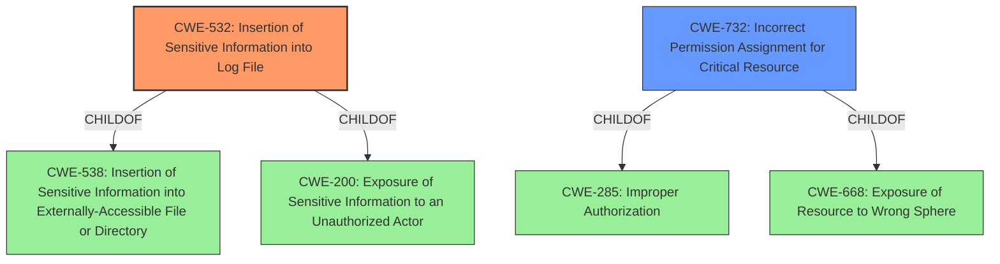

# Analysis Report for CVE-2021-31918

# Vulnerability Analysis Report: CVE-2021-31918

## Description


## Analysis (with Relationship Data)

# Summary
| CWE ID | CWE Name | Confidence | CWE Abstraction Level | CWE Vulnerability Mapping Label | CWE-Vulnerability Mapping Notes |
|---|---|---|---|---|---|
| CWE-532 | Insertion of Sensitive Information into Log File | 1.0 | Base | Allowed | Primary CWE |
| CWE-732 | Incorrect Permission Assignment for Critical Resource | 0.7 | Class | Allowed-with-Review | Secondary CWE |

## Evidence and Confidence

*   **Confidence Score:** 0.9
*   **Evidence Strength:** HIGH

## Relationship Analysis
The primary CWE is CWE-532 (Base), which is a child of CWE-538 and CWE-200. CWE-732 is a Class-level CWE that is related to incorrect permissions. The relationship analysis influenced the decision to select CWE-532 as the primary because the root cause was directly related to writing sensitive information to a log file, which is a specific instance of exposing sensitive information. CWE-732 is considered as a secondary, because the file was created with world readable permissions.



## Vulnerability Chain
The vulnerability chain starts with the **incorrect creation of the ansible.log file with world-readable permissions**, leading to the **insertion of sensitive information into the log file**, and ultimately resulting in the **exposure of sensitive information to unprivileged users**.

## Summary of Analysis
The initial assessment strongly points to CWE-532 as the primary weakness, with high confidence due to the direct evidence from the CVE description and summary. The **root cause** is the **writing of sensitive information to a log file**. The "CVE Reference Links Content Summary" explicitly states, "The ansible.log file was created with world-readable permissions" and "Exposure of sensitive information such as passwords, keys, and other secrets to unprivileged users". The Retriever Results also list CWE-532 with a high score.

CWE-732 is considered a secondary factor because the log file having incorrect permissions allows all users to access the sensitive information within the log file.

CWE-200 was considered but not chosen as the primary because it is too high-level and represents the impact (exposure of sensitive information) rather than the root cause. The guidance for CWE-200 explicitly discourages its use when a more specific CWE is available. The selected CWEs (CWE-532 and CWE-732) are at the optimal level of specificity, representing the actual coding error and the resource permission issue respectively.

The final selection is based on the available evidence, relationship analysis, and adherence to MITRE's CWE mapping guidance, resulting in a high confidence level.


## CWE Relationship Analysis

Current CWEs represent these abstraction levels: .


### Vulnerability Chain Analysis

**Chain starting from CWE-732:**
- 732 (Incorrect Permission Assignment for Critical Resource) - ROOT


**Chain starting from CWE-538:**
- 538 (Insertion of Sensitive Information into Externally-Accessible File or Directory) - ROOT


### CWE Relationship Diagram

```mermaid
graph TD
    classDef primary fill:#f96,stroke:#333,stroke-width:2px
    classDef secondary fill:#69f,stroke:#333
    classDef tertiary fill:#9e9,stroke:#333
```


*Report generated on 2025-04-02 15:16:46*
