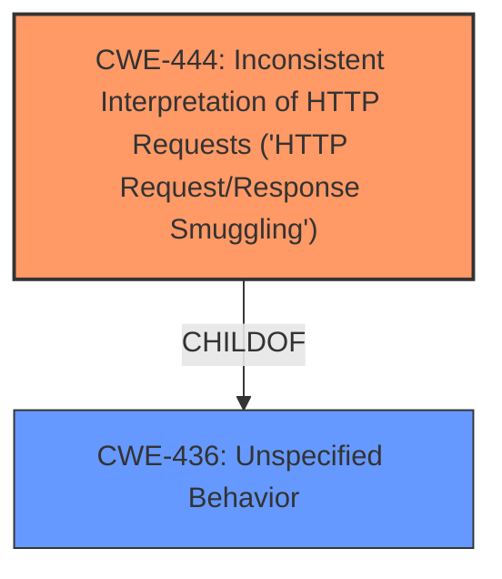

# Analysis Report for CVE-2021-31922

# Vulnerability Analysis Report: CVE-2021-31922

## Description


## Analysis (with Relationship Data)

# Summary
| CWE ID | CWE Name | Confidence | CWE Abstraction Level | CWE Vulnerability Mapping Label | CWE-Vulnerability Mapping Notes |
|---|---|---|---|---|---|
| CWE-444 | Inconsistent Interpretation of HTTP Requests ('HTTP Request/Response Smuggling') | 1.0 | Base | Allowed | Primary CWE |

## Evidence and Confidence

*   **Confidence Score:** 1.0
*   **Evidence Strength:** HIGH

## Relationship Analysis
The primary relationship that influenced the decision was the direct match between the vulnerability description, especially the key phrase "**HTTP Request Smuggling**", and the name of **CWE-444** Inconsistent Interpretation of HTTP Requests ('HTTP Request/Response Smuggling'). CWE-444 is a Base level CWE, which is the preferred level of abstraction.



## Vulnerability Chain
The vulnerability chain starts with the **inconsistent interpretation of HTTP requests**, leading to the ability to **smuggle HTTP requests**.

## Summary of Analysis
The primary CWE, **CWE-444** Inconsistent Interpretation of HTTP Requests ('HTTP Request/Response Smuggling'), was chosen because the vulnerability description explicitly states "**HTTP Request Smuggling** vulnerability".

The vulnerability description states:
"An **HTTP Request Smuggling** vulnerability in Pulse Secure Virtual Traffic Manager before 21.1 could allow an attacker to smuggle an HTTP request through an HTTP/2 Header."

The retriever results listed CWE-444 as the top combined result. The description of CWE-444 also includes "HTTP Request Smuggling" as an alternative term. CWE-444 is a Base level CWE, which is the preferred level of abstraction.

**CWE-113** Improper Neutralization of CRLF Sequences in HTTP Headers ('HTTP Request/Response Splitting') was considered because it was also in the retriever results, but it was determined to be less specific than CWE-444 because the vulnerability description makes no mention of CRLF sequences.

**CWE-400** Uncontrolled Resource Consumption and **CWE-770** Allocation of Resources Without Limits or Throttling were also considered because they relate to resource management, but these are not the root cause of the vulnerability. The root cause is the **inconsistent interpretation of HTTP requests**.


## CWE Relationship Analysis

Current CWEs represent these abstraction levels: .


### Vulnerability Chain Analysis

**Chain starting from CWE-113:**
- 113 (Improper Neutralization of CRLF Sequences in HTTP Headers ('HTTP Request/Response Splitting')) - ROOT


**Chain starting from CWE-444:**
- 444 (Inconsistent Interpretation of HTTP Requests ('HTTP Request/Response Smuggling')) - ROOT


### CWE Relationship Diagram

```mermaid
graph TD
    classDef primary fill:#f96,stroke:#333,stroke-width:2px
    classDef secondary fill:#69f,stroke:#333
    classDef tertiary fill:#9e9,stroke:#333
```


*Report generated on 2025-04-01 21:05:23*
