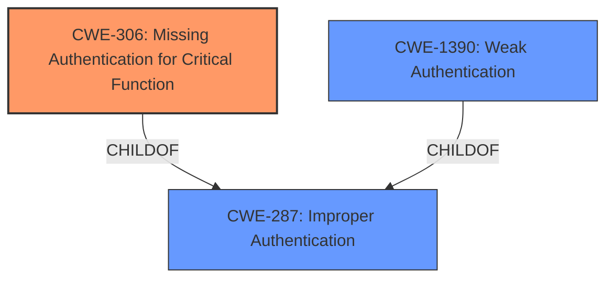

# Raw Analyzer Response for CVE-2021-31924

# Summary
| CWE ID | CWE Name | Confidence | CWE Abstraction Level | CWE Vulnerability Mapping Label | CWE-Vulnerability Mapping Notes |
|---|---|---|---|---|---|
| CWE-306 | Missing Authentication for Critical Function | 0.8 | Base | Allowed | Primary CWE |
| CWE-287 | Improper Authentication | 0.6 | Class | Discouraged | Secondary Candidate |
| CWE-1390 | Weak Authentication | 0.6 | Class | Allowed-with-Review | Secondary Candidate |

## Evidence and Confidence

*   **Confidence Score:** 0.8
*   **Evidence Strength:** HIGH

## Relationship Analysis
The primary CWE is CWE-306, which is a child of CWE-287. CWE-287 is a class-level CWE, and the guidance suggests using more specific child CWEs when possible. CWE-1390 is also a child of CWE-287, representing a more general case of weak authentication, whereas CWE-306 specifically describes the absence of authentication for critical functions, which aligns more closely with the vulnerability description. Therefore, the hierarchical relationship influenced the selection of CWE-306 as the primary CWE due to its specificity.

## Vulnerability Chain
The vulnerability chain starts with the **logic issue** in the `pam-u2f` module. This leads to the `pam-u2f` module attempting a FIDO2 authentication without PIN verification when the application using `pam-u2f` allows the submission of a NULL PIN. The end result is a **local PIN bypass**, which is a form of **missing authentication for a critical function**.
  - Initial Flaw: **Logic issue** in pam-u2f
  - Trigger: Application allows NULL PIN submission.
  - Weakness: PAM module does not enforce PIN verification
  - Impact: Local PIN Bypass

## Summary of Analysis
Based on the evidence provided, the primary CWE is CWE-306 (Missing Authentication for Critical Function). This is because the vulnerability description and the CVE Reference Links Content Summary indicate that the `pam-u2f` module proceeds with FIDO2 authentication without PIN verification when a NULL PIN is submitted by the application, effectively bypassing the PIN requirement.

The vulnerability description states: "If pam-u2f is configured to require PIN authentication, and the application using pam-u2f allows the user to submit NULL as the PIN, pam-u2f will attempt to perform a FIDO2 authentication without PIN. If this authentication is successful, the PIN requirement is bypassed." This directly supports the idea that a critical function (PIN verification) is missing authentication.

The selection of CWE-306 is also supported by the CVE Reference Links Content Summary, which highlights: "The core vulnerability is that if an application using `pam-u2f` allows a user to submit a NULL PIN, `pam-u2f` will proceed with FIDO2 authentication *without* verifying the PIN, effectively bypassing the PIN requirement."

The graph relationships support the selection of CWE-306 over CWE-287 and CWE-1390 because CWE-306 is a more specific child of CWE-287, and the guidance suggests using the most specific CWE available. CWE-1390 is also a child of CWE-287, but it describes a general case of weak authentication, while CWE-306 specifically describes the absence of authentication for critical functions, which aligns more closely with the vulnerability description.

The selected CWE is at the optimal level of specificity because it accurately represents the **missing PIN verification** in the `pam-u2f` module when a NULL PIN is submitted. This aligns with the Base level of abstraction, which is the preferred level for mapping root causes.

Relevant CWE Information:

# Enhanced Context (25 CWEs)
The following CWEs were identified as potentially relevant to this vulnerability:

## CWE-916: Use of Password Hash With Insufficient Computational Effort
**Abstraction Level**: Base
**Similarity Score**: 0.79
**Source**: dense

**Description**:
The product generates a hash for a password, but it uses a scheme that does not provide a sufficient level of computational effort that would make password cracking attacks infeasible or expensive.

**Mapping Guidance**:
- Usage: Allowed
- Rationale: This CWE entry is at the Base level of abstraction, which is a preferred level of abstraction for mapping to the root causes of vulnerabilities.

*Not Selected*: This CWE is not relevant because the vulnerability does not involve password hashing or computational effort. It's a PIN bypass issue, not a password strength issue.

## CWE-1391: Use of Weak Credentials
**Abstraction Level**: Class
**Similarity Score**: 0.77
**Source**: dense

**Description**:
The product uses weak credentials (such as a default key or hard-coded password) that can be calculated, derived, reused, or guessed by an attacker.

**Mapping Guidance**:
- Usage: Allowed-with-Review
- Rationale: This CWE entry is a Class and might have Base-level children that would be more appropriate

*Not Selected*: This CWE is not relevant because the vulnerability is not related to the use of weak credentials like default keys or hard-coded passwords. It's a logic flaw that allows bypassing PIN verification.

## CWE-328: Use of Weak Hash
**Abstraction Level**: Base
**Similarity Score**: 0.77
**Source**: dense

**Description**:
The product uses an algorithm that produces a digest (output value) that does not meet security expectations for a hash function that allows an adversary to reasonably determine the original input (preimage attack), find another input that can produce the same hash (2nd preimage attack), or find multiple inputs that evaluate to the same hash (birthday attack).

**Mapping Guidance**:
- Usage: Allowed
- Rationale: This CWE entry is at the Base level of abstraction, which is a preferred level of abstraction for mapping to the root causes of vulnerabilities.

*Not Selected*: This CWE is not relevant because the vulnerability is not related to the use of weak hashing algorithms.

## CWE-1390: Weak Authentication
**Abstraction Level**: Class
**Similarity Score**: 0.76
**Source**: dense

**Description**:
The product uses an authentication mechanism to restrict access to specific users or identities, but the mechanism does not sufficiently prove that the claimed identity is correct.

**Mapping Guidance**:
- Usage: Allowed-with-Review
- Rationale: This CWE entry is a Class and might have Base-level children that would be more appropriate

*Considered, Secondary Candidate*: While this could be a general classification, CWE-306 is a more specific child of CWE-287 (Improper Authentication) that directly addresses the missing authentication.

## CWE-303: Incorrect Implementation of Authentication Algorithm
**Abstraction Level**: Base
**Similarity Score**: 0.76
**Source**: dense

**Description**:
The requirements for the product dictate the use of an established authentication algorithm, but the implementation of the algorithm is incorrect.

**Mapping Guidance**:
- Usage: Allowed
- Rationale: This CWE entry is at the Base level of abstraction, which is a preferred level of abstraction for mapping to the root causes of vulnerabilities.

*Not Selected*: This CWE is not relevant because the vulnerability is not about an incorrect implementation of an authentication algorithm, but rather a missing step (PIN verification).

## CWE-288: Authentication Bypass Using an Alternate Path or Channel
**Abstraction Level**: Base
**Similarity Score**: 0.75
**Source**: dense

**Description**:
The product requires authentication, but the product has an alternate path or channel that does not require authentication.

**Mapping Guidance**:
- Usage: Allowed
- Rationale: This CWE entry is at the Base level of abstraction, which is a preferred level of abstraction for mapping to the root causes of vulnerabilities.

*Not Selected*: This CWE is not relevant because there is no alternate path or channel. The PIN bypass happens within the existing authentication flow due to a logic flaw.

## CWE-345: Insufficient Verification of Data Authenticity
**Abstraction Level**: Class
**Similarity Score**: 0.75
**Source**: dense

**Description**:
The product does not sufficiently verify the origin or authenticity of data, in a way that causes it to accept invalid data.

**Mapping Guidance**:
- Usage: Discouraged
- Rationale: This CWE entry is a level-1 Class (i.e., a child of a Pillar). It might have lower-level children that would be more appropriate

*Not Selected*: This CWE is not directly related to data authenticity verification, but to the PIN verification process.

## CWE