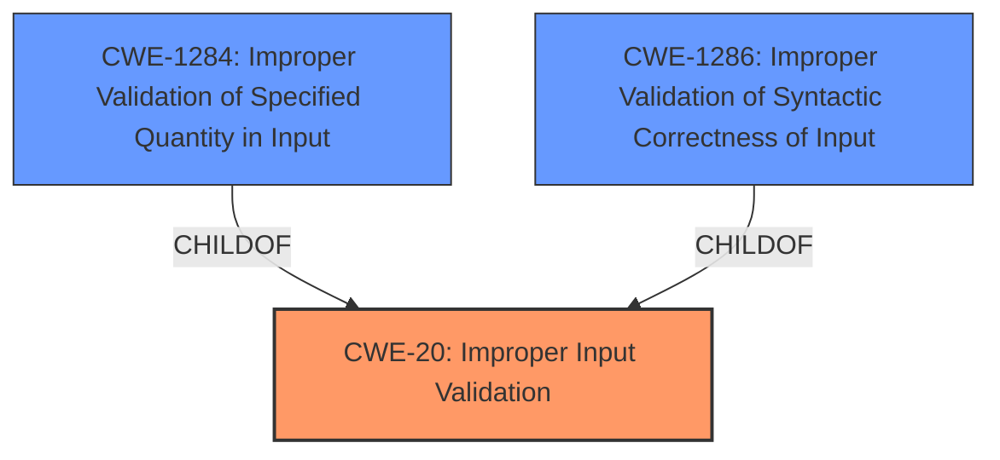

# Analysis Report for CVE-2021-31925

# Vulnerability Analysis Report: CVE-2021-31925

## Description


## Analysis (with Relationship Data)

# Summary
| CWE ID | CWE Name | Confidence | CWE Abstraction Level | CWE Vulnerability Mapping Label | CWE-Vulnerability Mapping Notes |
|---|---|---|---|---|---|
| CWE-20 | Improper Input Validation | 0.8 | Class | Primary | Discouraged |
| CWE-1286 | Improper Validation of Syntactic Correctness of Input | 0.6 | Base | Secondary | Allowed |
| CWE-1284 | Improper Validation of Specified Quantity in Input | 0.5 | Base | Secondary | Allowed |

## Evidence and Confidence

*   **Confidence Score:** 0.8
*   **Evidence Strength:** MEDIUM

## Relationship Analysis
The primary relationship considered was the parent-child relationship between CWE-20, CWE-1284, and CWE-1286. CWE-20 is a class-level CWE, while CWE-1284 and CWE-1286 are base-level CWEs and children of CWE-20. The decision to include CWE-20 as the primary CWE was influenced by the high-level nature of the vulnerability description. The lack of specific details about the type of input validation that was missing makes the more general CWE-20 more appropriate. However, since the root cause mentions "Improper Input Validation," and the **impact** is denial of service, selecting a specific child of CWE-20 is hard to determine.



## Vulnerability Chain
The vulnerability chain is relatively simple:
1.  **Root Cause:** **Improper Input Validation** (CWE-20)
2.  **Impact:** Denial of Service

## Summary of Analysis
The initial analysis focused on identifying the root cause of the vulnerability, which is clearly stated as **Improper Input Validation**. The challenge was to determine the most specific CWE that accurately represents this weakness.

The vulnerability description states: "Pexip Infinity 25.x before 25.4 has **Improper Input Validation**, and thus an unauthenticated remote attacker can cause a denial of service via the administrative web interface."

The selection of CWE-20 is directly supported by the vulnerability description, which explicitly mentions **Improper Input Validation**. However, CWE-20 is a Class-level CWE and the mapping guidance discourages its use when more specific CWEs are available.

Given the limited information available, it is difficult to pinpoint the exact type of input that is not being properly validated. It could be related to the syntactic correctness of the input (CWE-1286) or a specified quantity (CWE-1284). Therefore, while CWE-20 is the primary CWE, CWE-1286 and CWE-1284 are included as secondary candidates. The graph relationships confirm that these CWEs are children of CWE-20, making them potential candidates.

Ultimately, the selection of CWE-20 as the primary CWE is based on the available evidence, the high-level nature of the vulnerability description, and the mapping guidance provided by MITRE.

Relevant CWE Information:

# Enhanced Context (25 CWEs)
The following CWEs were identified as potentially relevant to this vulnerability:

## CWE-20: Improper Input Validation
**Abstraction:** Class
**Status:** Stable

### Description
The product receives input or data, but it does
        not validate or incorrectly validates that the input has the
        properties that are required to process the data safely and
        correctly.

### Observed Examples
- **CVE-2021-30860:** Chain: **improper input validation** (CWE-20) leads to integer overflow (CWE-190) in mobile OS, as exploited in the wild per CISA KEV.

## CWE-1286: Improper Validation of Syntactic Correctness of Input
**Abstraction:** Base
**Status:** Incomplete

### Description
The product receives input that is expected to be well-formed - i.e., to comply with a certain syntax - but it does not validate or incorrectly validates that the input complies with the syntax.

## CWE-1284: Improper Validation of Specified Quantity in Input
**Abstraction:** Base
**Status:** Incomplete

### Description
The product receives input that is expected to specify a quantity (such as size or length), but it does not validate or incorrectly validates that the quantity has the required properties.


## CWE Relationship Analysis

Current CWEs represent these abstraction levels: .


### Vulnerability Chain Analysis

**Chain starting from CWE-1286:**
- 1286 (Improper Validation of Syntactic Correctness of Input) - ROOT


**Chain starting from CWE-190:**
- 190 (Integer Overflow or Wraparound) - ROOT


### CWE Relationship Diagram

```mermaid
graph TD
    classDef primary fill:#f96,stroke:#333,stroke-width:2px
    classDef secondary fill:#69f,stroke:#333
    classDef tertiary fill:#9e9,stroke:#333
```


*Report generated on 2025-04-01 17:42:15*
