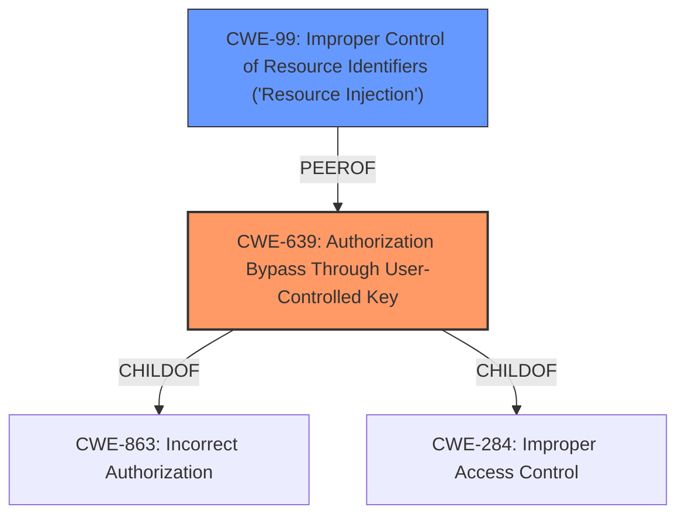

# Analysis for CVE-2021-31927

# Summary
| CWE ID | CWE Name | Confidence | CWE Abstraction Level | CWE Vulnerability Mapping Label | CWE-Vulnerability Mapping Notes |
|---|---|---|---|---|---|
| CWE-639 | Authorization Bypass Through User-Controlled Key | 1.0 | Base | Allowed | Primary CWE |
| CWE-99 | Improper Control of Resource Identifiers ('Resource Injection') | 0.7 | Class | Allowed-with-Review | Secondary Candidate |

## Evidence and Confidence

*   **Confidence Score:** 0.9
*   **Evidence Strength:** HIGH

## Relationship Analysis
The primary relationship that influenced the selection was the ChildOf relationship between CWE-639 and CWE-863 (Incorrect Authorization) and CWE-284 (Improper Access Control). CWE-639 is a Base level CWE and more specific than its parents, making it a better fit. CWE-99 was considered as a secondary option due to its alternative name "Insecure Direct Object Reference" but was ultimately deemed less suitable as it's a Class level CWE.

## Vulnerability Chain
The chain of weaknesses starts with the **Insecure Direct Object Reference** (**IDOR**), which leads to the ability to modify any existing user. This can be summarized as:
1.  **Insecure Direct Object Reference (IDOR)** - Root Cause
2.  **Authorization Bypass** - Consequence of IDOR
3.  **Modification of User Data** - Impact

## Summary of Analysis
The initial analysis identified CWE-639 as the primary candidate due to the **Insecure Direct Object Reference** (**IDOR**) vulnerability. The vulnerability description states that "any authenticated attacker [can] modify any existing user." The "CVE Reference Links Content Summary" confirms the **IDOR** root cause and indicates that the system "**fails to properly validate user authorization when accessing resources, allowing an attacker to directly reference and access objects that should be protected**."

CWE-639's description directly matches this: "The system's authorization functionality does not prevent one user from gaining access to another user's data or record by modifying the key value identifying the data."

CWE-99 was considered because of its alternative term "Insecure Direct Object Reference", however it is a class level CWE and therefore less specific. The chosen CWEs are at the optimal level of specificity because CWE-639 directly describes the mechanism of the vulnerability: an authorization bypass via a user-controlled key.

Other CWEs considered but not used:

*   CWE-425 (Direct Request ('Forced Browsing')): While related to authorization, it doesn't specifically address the **IDOR** aspect.
*   CWE-285 (Improper Authorization): Too high-level.
*   CWE-306 (Missing Authentication for Critical Function): Authentication is present, but authorization is bypassed.
*   CWE-73 (External Control of File Name or Path): This is about file paths, not object references.
*   CWE-668 (Exposure of Resource to Wrong Sphere): Too high-level and doesn't capture the specifics of the authorization bypass.
*   CWE-94 (Improper Control of Generation of Code ('Code Injection')): Not relevant, as this is not about code injection.

Relevant CWE Information:

# Enhanced Context (25 CWEs)
The following CWEs were identified as potentially relevant to this vulnerability:

## CWE-668: Exposure of Resource to Wrong Sphere
**Abstraction Level**: Class
**Similarity Score**: 0.76
**Source**: dense

**Description**:
The product exposes a resource to the wrong control sphere, providing unintended actors with inappropriate access to the resource.

**Mapping Guidance**:
- Usage: Discouraged
- Rationale: CWE-668 is high-level and is often misused as a catch-all when lower-level CWE IDs might be applicable. It is sometimes used for low-information vulnerability reports [REF-1287]. It is a level-1 Class (i.e., a child of a Pillar). It is not useful for trend analysis.

## CWE-664: Improper Control of a Resource Through its Lifetime
**Abstraction Level**: Pillar
**Similarity Score**: 0.76
**Source**: dense

**Description**:
The product does not maintain or incorrectly maintains control over a resource throughout its lifetime of creation, use, and release.

**Mapping Guidance**:
- Usage: Discouraged
- Rationale: This CWE entry is high-level when lower-level children are available.

## CWE-610: Externally Controlled Reference to a Resource in Another Sphere
**Abstraction Level**: Class
**Similarity Score**: 0.75
**Source**: dense

**Description**:
The product uses an externally controlled name or reference that resolves to a resource that is outside of the intended control sphere.

**Mapping Guidance**:
- Usage: Discouraged
- Rationale: This CWE entry is a level-1 Class (i.e., a child of a Pillar). It might have lower-level children that would be more appropriate

## CWE-552: Files or Directories Accessible to External Parties
**Abstraction Level**: Base
**Similarity Score**: 0.74
**Source**: dense

**Description**:
The product makes files or directories accessible to unauthorized actors, even though they should not be.

**Mapping Guidance**:
- Usage: Allowed
- Rationale: This CWE entry is at the Base level of abstraction, which is a preferred level of abstraction for mapping to the root causes of vulnerabilities.

## CWE-669: Incorrect Resource Transfer Between Spheres
**Abstraction Level**: Class
**Similarity Score**: 0.74
**Source**: dense

**Description**:
The product does not properly transfer a resource/behavior to another sphere, or improperly imports a resource/behavior from another sphere, in a manner that provides unintended control over that resource.

**Mapping Guidance**:
- Usage: Allowed-with-Review
- Rationale: This CWE entry is a Class and might have Base-level children that would be more appropriate

## CWE-99: Improper Control of Resource Identifiers ('Resource Injection')
**Abstraction Level**: Class
**Similarity Score**: 0.74
**Source**: dense

**Description**:
The product receives input from an upstream component, but it does not restrict or incorrectly restricts the input before it is used as an identifier for a resource that may be outside the intended sphere of control.

**Mapping Guidance**:
- Usage: Allowed-with-Review
- Rationale: This CWE entry is a Class and might have Base-level children that would be more appropriate

## CWE-653: Improper Isolation or Compartmentalization
**Abstraction Level**: Class
**Similarity Score**: 0.74
**Source**: dense

**Description**:
The product does not properly compartmentalize or isolate functionality, processes, or resources that require different privilege levels, rights, or permissions.

**Mapping Guidance**:
- Usage: Allowed
- Rationale: This CWE entry is at the Base level of abstraction, which is a preferred level of abstraction for mapping to the root causes of vulnerabilities.

## CWE-73: External Control of File Name or Path
**Abstraction Level**: Base
**Similarity Score**: 0.73
**Source**: dense

**Description**:
The product allows user input to control or influence paths or file names that are used in filesystem operations.

**Mapping Guidance**:
- Usage: Allowed
- Rationale: This CWE entry is at the Base level of abstraction, which is a preferred level of abstraction for mapping to the root causes of vulnerabilities.

## CWE-405: Asymmetric Resource Consumption (Amplification)
**Abstraction Level**: Class
**Similarity Score**: 0.73
**Source**: dense

**Description**:
The product does not properly control situations in which an adversary can cause the product to consume or produce excessive resources without requiring the adversary to invest equivalent work or otherwise prove authorization, i.e., the adversary's influence is "asymmetric."

**Mapping Guidance**:
- Usage: Allowed-with-Review
- Rationale: This CWE entry is a Class and might have Base-level children that would be more appropriate

## CWE-41: Improper Resolution of Path Equivalence
**Abstraction Level**: Base
**Similarity Score**: 0.73
**Source**: dense

**Description**:
The product is vulnerable to file system contents disclosure through path equivalence. Path equivalence involves the use of special