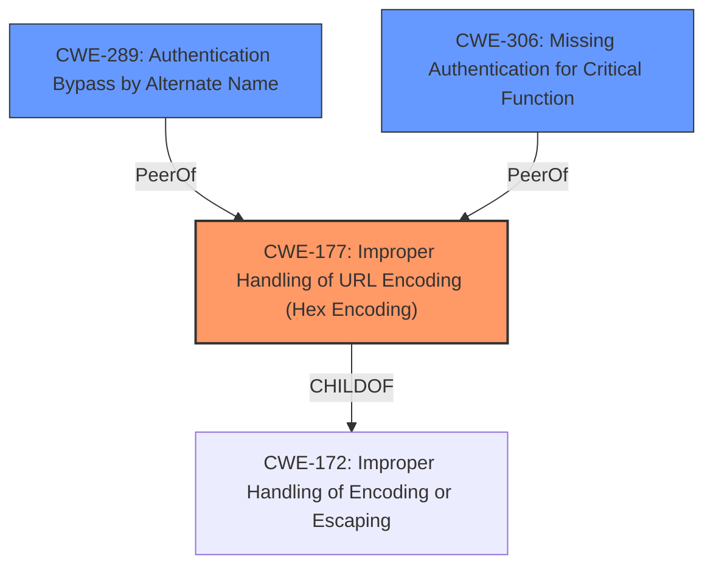

# Raw Analyzer Response for CVE-2021-31932

# Summary
| CWE ID | CWE Name | Confidence | CWE Abstraction Level | CWE Vulnerability Mapping Label | CWE-Vulnerability Mapping Notes |
|---|---|---|---|---|---|
| CWE-177 | Improper Handling of URL Encoding (Hex Encoding) | 0.9 | Variant | Allowed | Primary CWE |
| CWE-289 | Authentication Bypass by Alternate Name | 0.7 | Base | Allowed | Secondary Candidate |
| CWE-306 | Missing Authentication for Critical Function | 0.6 | Base | Allowed | Secondary Candidate |

## Evidence and Confidence

*   **Confidence Score:** 0.8
*   **Evidence Strength:** MEDIUM

## Relationship Analysis
The primary CWE, CWE-177, is a variant of CWE-172 (Improper Handling of Encoding or Escaping). The vulnerability involves URL encoding, making CWE-177 a more specific fit than its parent. CWE-289 (Authentication Bypass by Alternate Name) and CWE-306 (Missing Authentication for Critical Function) are considered as secondary candidates. CWE-289 relates to authentication bypass through name manipulation which could be related to URL encoding. CWE-306 is applicable because the **authentication** is being **bypassed**. The relationship between these CWEs helps refine the classification toward the most precise representation of the vulnerability.

## Vulnerability Chain
The vulnerability chain starts with the **improper handling of URL encoding (CWE-177)**, which leads to **authentication bypass (CWE-289/CWE-306)**, ultimately granting unauthorized access to all functionalities.

## Summary of Analysis
The initial assessment identified CWE-177 as the primary candidate due to the vulnerability description explicitly mentioning URL encoding as the means of **bypassing authentication**.

The vulnerability description states: "Nokia BTS TRS web console FTM_W20_FP2_2019.08.16_0010 allows Authentication Bypass...by using URL encoding for the . (dot) character."

This statement is direct evidence that the **weakness** is related to how the application handles URL encoding.

The retriever results further support this by listing CWE-177 as the top combined result.

CWE-289 and CWE-306 are secondary considerations because they represent the impact of the **weakness** (authentication bypass), but CWE-177 describes the root cause.

The selection of CWE-177 is at the optimal level of specificity, as it is a variant that directly addresses the URL encoding issue.

Relevant CWE Information:

# Enhanced Context (25 CWEs)

## CWE-289: Authentication Bypass by Alternate Name
**Abstraction Level**: Base
**Similarity Score**: 0.81
**Source**: dense

**Description**:
The product performs authentication based on the name of a resource being accessed, or the name of the actor performing the access, but it does not properly check all possible names for that resource or actor.

**Mapping Guidance**:
- Usage: Allowed
- Rationale: This CWE entry is at the Base level of abstraction, which is a preferred level of abstraction for mapping to the root causes of vulnerabilities.

## CWE-177: Improper Handling of URL Encoding (Hex Encoding)
**Abstraction:** Variant
**Status:** Draft

### Description
The product does not properly handle when all or part of an input has been URL encoded.

### Extended Description
Not provided

### Alternative Terms
None

### Relationships
ChildOf -> CWE-172

### Mapping Guidance
**Usage:** Allowed
**Rationale:** This CWE entry is at the Variant level of abstraction, which is a preferred level of abstraction for mapping to the root causes of vulnerabilities.
**Comments:** Carefully read both the name and description to ensure that this mapping is an appropriate fit. Do not try to 'force' a mapping to a lower-level Base/Variant simply to comply with this preferred level of abstraction.
**Reasons:**
- Acceptable-Use

### Observed Examples
- **CVE-2000-0900:** Hex-encoded path traversal variants - "%2e%2e", "%2e%2e%2f", "%5c%2e%2e"
- **CVE-2005-2256:** Hex-encoded path traversal variants - "%2e%2e", "%2e%2e%2f", "%5c%2e%2e"
- **CVE-2004-2121:** Hex-encoded path traversal variants - "%2e%2e", "%2e%2e%2f", "%5c%2e%2e"