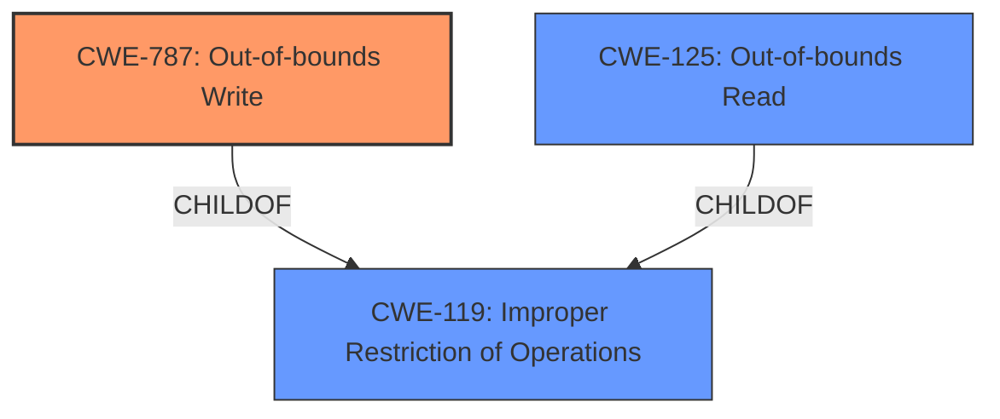

# Analysis for CVE-2021-31969

# Summary
| CWE ID    | CWE Name                                                                    | Confidence | CWE Abstraction Level | CWE Vulnerability Mapping Label | CWE-Vulnerability Mapping Notes |
| :--------- | :-------------------------------------------------------------------------- | :---------- | :---------------------- | :------------------------------ | :------------------------------ |
| CWE-787     | Out-of-bounds Write                                                         | 0.85       | Base                    | Primary CWE                     | Allowed                       |
| CWE-125     | Out-of-bounds Read                                                         | 0.75       | Base                    | Secondary Candidate             | Allowed                       |
| CWE-119     | Improper Restriction of Operations within the Bounds of a Memory Buffer      | 0.60       | Class                    | Secondary Candidate             | Allowed-with-Review           |

## Evidence and Confidence

*   **Confidence Score:** 0.75
*   **Evidence Strength:** HIGH

## Relationship Analysis
The primary weakness is an out-of-bounds write (CWE-787), which is often related to improper buffer operations (CWE-119). The vulnerability description specifically mentions an integer underflow before writing to memory, which can lead to writing outside the intended memory boundaries. This underflow could also lead to an out-of-bounds read (CWE-125) if the underflowed value is used as an index for reading.

## Vulnerability Chain
The vulnerability chain starts with **"lack of proper validation of user-supplied data"** leading to an **"integer underflow"** and finally resulting in an **"out-of-bounds write"**. This leads to privilege escalation.

## Summary of Analysis
The vulnerability involves an integer underflow due to **lack of proper validation of user-supplied data**, which results in an out-of-bounds write in the Cloud Files Mini Filter Driver. This allows a local attacker to escalate privileges to SYSTEM.

The primary CWE, CWE-787 (Out-of-bounds Write), is chosen because the **root cause** directly leads to writing data outside the intended buffer. The CVE Reference Links Content Summary explicitly states "The issue results from the **lack of proper validation of user-supplied data, which can result in an integer underflow before writing to memory**."

CWE-125 (Out-of-bounds Read) is considered as a secondary CWE because an integer underflow might also lead to reading data from unintended memory locations. However, the description primarily focuses on the write operation.

CWE-119 (Improper Restriction of Operations within the Bounds of a Memory Buffer) is a more general class that encompasses both out-of-bounds read and write. While relevant, CWE-787 provides a more specific classification of the **root cause**.

The selection of CWE-787 is at the Base level of abstraction, which is optimal for mapping to the **root causes** of vulnerabilities according to MITRE's mapping guidance.

Relevant CWE Information:

# Enhanced Context (25 CWEs)

## CWE-59: Improper Link Resolution Before File Access ('Link Following')
This CWE is not applicable because the vulnerability doesn't involve symbolic links or file access issues.

## CWE-266: Incorrect Privilege Assignment
This CWE is not applicable because the vulnerability is about writing to memory out of bounds, not incorrect privilege assignment.

## CWE-274: Improper Handling of Insufficient Privileges
This CWE is not applicable because the vulnerability is not about insufficient privileges.

## CWE-41: Improper Resolution of Path Equivalence
This CWE is not applicable because the vulnerability doesn't involve path equivalence issues.

## CWE-668: Exposure of Resource to Wrong Sphere
This CWE is too high-level and doesn't accurately represent the specific **root cause** of the vulnerability.

## CWE-667: Improper Locking
This CWE is not applicable because the vulnerability doesn't involve locking mechanisms or concurrent access to resources.

## CWE-280: Improper Handling of Insufficient Permissions or Privileges
This CWE is not applicable because the vulnerability is not about insufficient privileges.

## CWE-653: Improper Isolation or Compartmentalization
This CWE is not applicable because the vulnerability doesn't involve isolation or compartmentalization issues.

## CWE-267: Privilege Defined With Unsafe Actions
This CWE is not applicable because the vulnerability is not about defining privileges with unsafe actions.

## CWE-73: External Control of File Name or Path
This CWE is not applicable because the vulnerability doesn't involve external control of file names or paths.

## CWE-367: Time-of-check Time-of-use (TOCTOU) Race Condition
This CWE is not applicable because the vulnerability doesn't involve race conditions or time-of-check time-of-use issues.

## CWE-59: Improper Link Resolution Before File Access ('Link Following')
This CWE is not applicable because the vulnerability doesn't involve symbolic links or file access issues.

## CWE-362: Concurrent Execution using Shared Resource with Improper Synchronization ('Race Condition')
This CWE is not applicable because the vulnerability doesn't involve concurrent execution or synchronization issues.

## CWE-1386: Insecure Operation on Windows Junction / Mount Point
This CWE is not applicable because the vulnerability doesn't involve Windows junctions or mount points.

## CWE-61: UNIX Symbolic Link (Symlink) Following
This CWE is not applicable because the vulnerability doesn't involve symbolic links.

## CWE-363: Race Condition Enabling Link Following
This CWE is not applicable because the vulnerability doesn't involve race conditions or symbolic links.

## CWE-476: NULL Pointer Dereference
This CWE is not applicable because the vulnerability doesn't involve null pointer dereferences.

## CWE-782: Exposed IOCTL with Insufficient Access Control
This CWE is not applicable because the vulnerability doesn't involve exposed IOCTLs.

## CWE-781: Improper Address Validation in IOCTL with METHOD_NEITHER I/O Control Code
This CWE is not applicable because the vulnerability doesn't involve IOCTLs.

## CWE-322: Key Exchange without Entity Authentication
This CWE is not applicable because the vulnerability doesn't involve key exchange or authentication.

## CWE-295: Improper Certificate Validation
This CWE is not applicable because the vulnerability doesn't involve certificate validation.

## CWE-386: Symbolic Name not Mapping to Correct Object
This CWE is not applicable because the vulnerability doesn't involve symbolic names.

## CWE-123: Write-what-where Condition
While this CWE relates to writing to arbitrary memory locations, CWE-787 is more specific to out-of-bounds writes.

## CWE-416: Use After Free
This CWE is not applicable because the vulnerability doesn't involve use-after-free issues.

## CWE-787: Out-of-bounds Write
This is the selected CWE because the **root cause** leads to writing outside the intended memory boundaries.