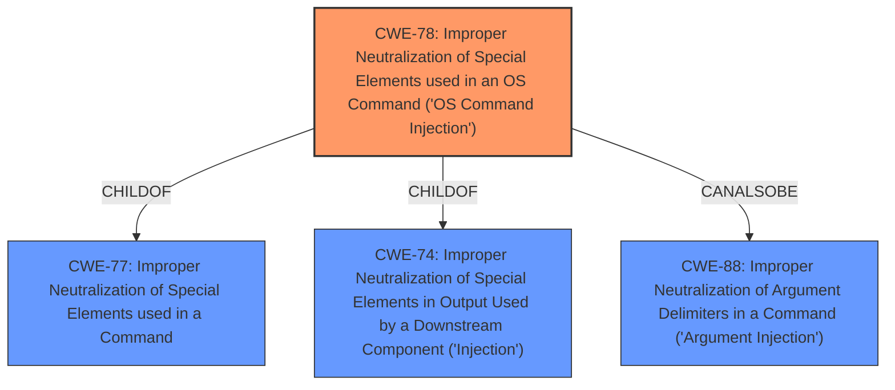

# Enhanced Analysis for CVE-2021-3197

# Summary
| CWE ID | CWE Name | Confidence | CWE Abstraction Level | CWE Vulnerability Mapping Label | CWE-Vulnerability Mapping Notes |
|---|---|---|---|---|---|
| CWE-78 | Improper Neutralization of Special Elements used in an OS Command ('OS Command Injection') | 1.0 | Base | Allowed | Primary CWE |

## Evidence and Confidence

*   **Confidence Score:** 1.0
*   **Evidence Strength:** HIGH

## Relationship Analysis
The primary relationship that influenced the decision was the ChildOf relationship between CWE-78 and CWE-77 (Improper Neutralization of Special Elements used in a Command). While CWE-77 is a parent class, CWE-78 provides the necessary specificity by focusing on OS commands, which aligns directly with the vulnerability description that specifies **shell injection**. The other relationships to CWE-74 (Improper Neutralization of Special Elements in Output Used by a Downstream Component ('Injection')) and CWE-88 (Improper Neutralization of Argument Delimiters in a Command ('Argument Injection')) also support the choice of CWE-78 because the root cause is related to injection and argument handling in OS commands.



## Vulnerability Chain
The vulnerability chain involves the **improper neutralization** of special elements within an OS command.

1.  The initial flaw is the lack of proper input validation or sanitization when constructing OS commands.
2.  The weakness is the **shell injection** that occurs due to the inclusion of `ProxyCommand` in an argument, or via `ssh_options` provided in an API request.
3.  The impact is arbitrary command execution on the target system.

## Summary of Analysis
The analysis is based on the vulnerability description, which explicitly mentions **shell injection** and the use of `ProxyCommand` or `ssh_options` in API requests to inject commands. The CVE Reference Links Content Summary confirms that the root cause is **shell injection** when including `ProxyCommand` in an argument.

The graph relationships influenced the selection by highlighting the connections between injection-related CWEs. The primary CWE, CWE-78, is at the optimal level of specificity because it directly addresses the **improper neutralization** of special elements used in OS commands, leading to **shell injection**.

The evidence strongly supports CWE-78 as the primary weakness. The vulnerability description states: "The salt-apis ssh client is vulnerable to a **shell injection** by including ProxyCommand in an argument, or via ssh_options provided in an API request." The CVE Reference Links Content Summary states: "Shell injection vulnerability in salt-ssh when including ProxyCommand in an argument."

The retriever results also list CWE-78 as the top combined result with a score of 1.0.

CWE-116 (Improper Encoding or Escaping of Output) was considered but not chosen because the core issue is not about encoding or escaping of output, but rather the construction of the OS command itself. Similarly, CWE-88 (Improper Neutralization of Argument Delimiters in a Command ('Argument Injection')) was considered, but the primary weakness is the ability to inject an entire OS command, not just manipulate arguments. CWE-93 (Improper Neutralization of CRLF Sequences ('CRLF Injection')) is not relevant as the vulnerability is not related to CRLF sequences. CWE-918 (Server-Side Request Forgery (SSRF)) is not applicable because the vulnerability does not involve making requests to internal servers based on user input.


## CWE Relationship Analysis

Current CWEs represent these abstraction levels: .


### Vulnerability Chain Analysis

**Chain starting from CWE-88:**
- 88 (Improper Neutralization of Argument Delimiters in a Command ('Argument Injection')) - ROOT


**Chain starting from CWE-78:**
- 78 (Improper Neutralization of Special Elements used in an OS Command ('OS Command Injection')) - ROOT


### CWE Relationship Diagram

```mermaid
graph TD
    classDef primary fill:#f96,stroke:#333,stroke-width:2px
    classDef secondary fill:#69f,stroke:#333
    classDef tertiary fill:#9e9,stroke:#333
```