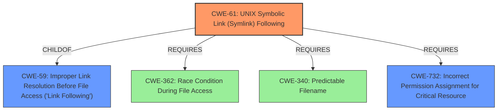

# Analysis for CVE-2021-31997

# Summary
| CWE ID | CWE Name | Confidence | CWE Abstraction Level | CWE Vulnerability Mapping Label | CWE-Vulnerability Mapping Notes |
|---|---|---|---|---|---|
| CWE-61 | UNIX Symbolic Link (Symlink) Following | 1.0 | Compound | Allowed | Primary CWE |
| CWE-59 | Improper Link Resolution Before File Access ('Link Following') | 0.7 | Base | Allowed | Secondary Candidate |
| CWE-732 | Incorrect Permission Assignment for Critical Resource | 0.6 | Class | Allowed-with-Review | Secondary Candidate |

## Evidence and Confidence

*   **Confidence Score:** 0.9
*   **Evidence Strength:** HIGH

## Relationship Analysis
The primary CWE selected is CWE-61, **UNIX Symbolic Link (Symlink) Following**, which is a Compound CWE. It is related to CWE-59, **Improper Link Resolution Before File Access ('Link Following')** through a ChildOf relationship (CWE-61 ChildOf CWE-59). CWE-61 also Requires CWE-362 (Race Condition), CWE-340 (Predictable Filename), and CWE-732 (Incorrect Permission Assignment for Critical Resource). This complex of weaknesses is well-captured by CWE-61, given the specific context of the vulnerability.

## Vulnerability Chain
The vulnerability chain begins with **incorrect permission assignment** allowing the postorius or postorius-admin user to create symbolic links in directories that the root user will later operate on. This leads to the **symbolic link being followed** by the root user's script, resulting in **privilege escalation** to root.
  - **Root Cause:** Incorrect permission assignment.
  - **Weakness 1:** Creation of symbolic links by a lower-privileged user in a directory that a higher-privileged user will operate on.
  - **Weakness 2:** Unsafe operation by a higher-privileged user (root) that follows symbolic links.
  - **Impact:** Privilege escalation.

## Summary of Analysis
The initial assessment identified CWE-61 (**UNIX Symbolic Link (Symlink) Following**) as the primary weakness, supported by the vulnerability description explicitly mentioning "UNIX Symbolic Link (Symlink) Following" as the **rootcause**. The CVE Reference Links Content Summary provides further evidence, highlighting the **unconditional ownership changes** and **symbolic link vulnerability** within the `postorius-permissions.sh` script. The script recursively changes ownership and ACL settings on directories owned by `postorius` or `postorius-admin`, allowing a malicious actor to create symbolic links to arbitrary locations. When the script executes, it recursively changes ownership of the pointed files to `postorius` or `postorius-admin`, leading to **privilege escalation**.

The retriever results also strongly suggest CWE-61, with a high similarity score. CWE-59 (**Improper Link Resolution Before File Access ('Link Following')**) is also a strong candidate, as it is a parent of CWE-61.

CWE-732 (**Incorrect Permission Assignment for Critical Resource**) is considered a secondary issue because the root cause involves both incorrect permission assignment *and* the unsafe following of symlinks.

The decision to prioritize CWE-61 is based on the explicit mention in the vulnerability description and the detailed explanation of how symbolic links are exploited to achieve privilege escalation. This is further supported by the retriever results, which give CWE-61 a high similarity score. The relationships between CWE-61, CWE-59 and other required CWEs (362, 340, 732) confirm that CWE-61 is the most appropriate and specific classification.

Relevant CWE Information:

# Enhanced Context (25 CWEs)
The following CWEs were identified as potentially relevant to this vulnerability:

## CWE-59: Improper Link Resolution Before File Access ('Link Following')
**Abstraction Level**: Base
**Similarity Score**: 0.81
**Source**: dense

**Description**:
The product attempts to access a file based on the filename, but it does not properly prevent that filename from identifying a link or shortcut that resolves to an unintended resource.

**Mapping Guidance**:
- Usage: Allowed
- Rationale: This CWE entry is at the Base level of abstraction, which is a preferred level of abstraction for mapping to the root causes of vulnerabilities.

## CWE-61: UNIX Symbolic Link (Symlink) Following
**Abstraction Level**: Compound
**Similarity Score**: 0.78
**Source**: dense

**Description**:
The product, when opening a file or directory, does not sufficiently account for when the file is a symbolic link that resolves to a target outside of the intended control sphere. This could allow an attacker to cause the product to operate on unauthorized files.

**Mapping Guidance**:
- Usage: Allowed
- Rationale: This is a well-known Composite of multiple weaknesses that must all occur simultaneously, although it is attack-oriented in nature.

## CWE-732: Incorrect Permission Assignment for Critical Resource
**Abstraction Level**: Class
**Similarity Score**: 0.271
**Source**: sparse

**Description**:
The product specifies permissions for a security-critical resource in a way that allows that resource to be read or modified by unintended actors.

**Mapping Guidance**:
- Usage: Allowed-with-Review
- Rationale: While the name itself indicates an assignment of permissions for resources, this is often misused for vulnerabilities in which "permissions" are not checked, which is an "authorization" weakness (CWE-285 or descendants) within CWE's model [REF-1287].
- Comments: Closely analyze the specific mistake that is allowing the resource to be exposed, and perform a CWE mapping for that mistake.