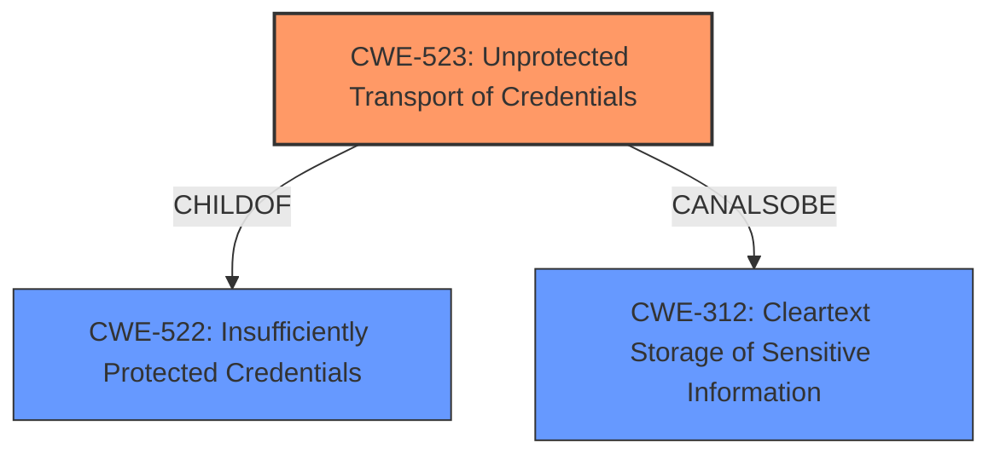

# Enhanced Analysis for CVE-2021-32003

# Summary
| CWE ID | CWE Name | Confidence | CWE Abstraction Level | CWE Vulnerability Mapping Label | CWE-Vulnerability Mapping Notes |
|---|---|---|---|---|---|
| CWE-523 | Unprotected Transport of Credentials | 0.9 | Base | Allowed | Primary CWE |

## Evidence and Confidence

*   **Confidence Score:** 0.9
*   **Evidence Strength:** MEDIUM

## Relationship Analysis
The primary relationship that influenced the decision was the ChildOf relationship between CWE-523 (Unprotected Transport of Credentials) and CWE-522 (Insufficiently Protected Credentials). While CWE-522 is a Class-level CWE, CWE-523 is a Base-level CWE, providing a more specific classification directly related to the transport of credentials. There is also a CANALSOBE relationship from CWE-523 to CWE-312 (Cleartext Storage of Sensitive Information).



## Vulnerability Chain
The vulnerability chain is straightforward: the **unprotected transport of credentials** (root cause) leads to the potential for a local attacker to **capture credentials** (impact).

## Summary of Analysis
The initial analysis focused on identifying the root cause of the vulnerability. The vulnerability description explicitly mentions "**unprotected transport of credentials**" as the root cause and "capture credentials" as the impact.

The Retriever Results strongly suggested CWE-523 (Unprotected Transport of Credentials) as the most relevant CWE, with a score of 0.414. This aligns directly with the vulnerability description.

The relationships between CWEs further solidified this choice. CWE-523 is a child of CWE-522 (Insufficiently Protected Credentials), which is a class-level CWE. Selecting CWE-523 provides a more specific and accurate representation of the vulnerability.

The MITRE mapping guidance for CWE-523 states that its usage is "Allowed" and that it is at the Base level of abstraction, which is preferred.

Therefore, based on the provided evidence and the characteristics of the CWE, CWE-523 (Unprotected Transport of Credentials) is the optimal choice for classifying this vulnerability.

CWE-319 (Cleartext Transmission of Sensitive Information) was considered, as it relates to transmitting data in cleartext. However, the vulnerability description specifically focuses on the transport of credentials, making CWE-523 a more precise fit.
CWE-798 (Use of Hard-coded Credentials) was not chosen since there was no mention of hardcoded credentials.
CWE-257 (Storing Passwords in a Recoverable Format) was not chosen since there was no mention of storing passwords in a recoverable format.


## CWE Relationship Analysis

Current CWEs represent these abstraction levels: .


### Vulnerability Chain Analysis

**Chain starting from CWE-312:**
- 312 (Cleartext Storage of Sensitive Information) - ROOT


**Chain starting from CWE-319:**
- 319 (Cleartext Transmission of Sensitive Information) - ROOT


### CWE Relationship Diagram

```mermaid
graph TD
    classDef primary fill:#f96,stroke:#333,stroke-width:2px
    classDef secondary fill:#69f,stroke:#333
    classDef tertiary fill:#9e9,stroke:#333
```