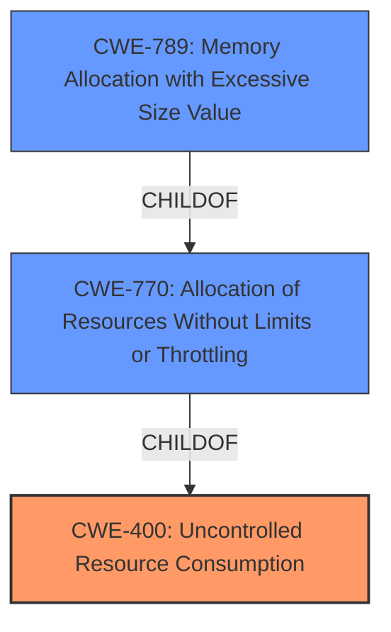

# Analysis for CVE-2021-32013

# Summary
| CWE ID | CWE Name | Confidence | CWE Abstraction Level | CWE Vulnerability Mapping Label | CWE-Vulnerability Mapping Notes |
|---|---|---|---|---|---|
| CWE-400 | Uncontrolled Resource Consumption | 0.8 | Class | Primary | Allowed-with-Review |
| CWE-770 | Allocation of Resources Without Limits or Throttling | 0.7 | Base | Secondary | Allowed |
| CWE-789 | Memory Allocation with Excessive Size Value | 0.6 | Variant | Secondary | Allowed |

## Evidence and Confidence

*   **Confidence Score:** 0.8
*   **Evidence Strength:** MEDIUM

## Relationship Analysis
The primary CWE selected is CWE-400, Uncontrolled Resource Consumption, which is a Class-level CWE. While generally discouraged, it aligns with the overall symptom of the vulnerability, which is a denial-of-service due to excessive memory consumption. The supporting CWEs are lower-level CWE-770, Allocation of Resources Without Limits or Throttling, and CWE-789, Memory Allocation with Excessive Size Value, providing more specific details about the **root cause**. CWE-770 is a ChildOf CWE-400. CWE-789 is a ChildOf CWE-770.

## Vulnerability Chain
The vulnerability chain starts with a crafted .xlsx document leading to mishandling by xlsx.js, resulting in excessive memory consumption, ultimately causing a denial of service.

- **Root Cause:** Mishandling of crafted .xlsx document due to **lack of proper input validation and resource management** when parsing. This relates to CWE-770 (Allocation of Resources Without Limits or Throttling) and CWE-789 (Memory Allocation with Excessive Size Value).
- **Weakness:** Uncontrolled memory allocation and consumption during the parsing process. This is directly tied to CWE-400 (Uncontrolled Resource Consumption).
- **Impact:** Denial of service due to memory exhaustion.

## Summary of Analysis
The initial analysis identified CWE-400 as the primary candidate due to the denial-of-service impact. However, a more detailed examination reveals that the **root cause** lies in the application's failure to properly manage resource allocation when processing a crafted .xlsx file. This mishandling directly leads to excessive memory consumption.

The provided evidence, specifically the vulnerability description and CVE Reference Links Content Summary, indicates that the application **fails to limit or throttle resource allocation** when parsing a malicious .xlsx document. This directly aligns with CWE-770 (Allocation of Resources Without Limits or Throttling) and CWE-789 (Memory Allocation with Excessive Size Value).

The graph relationships highlight that CWE-400 is a higher-level class, while CWE-770 and CWE-789 are more specific base and variant level CWEs. While CWE-400 is the direct result, the root cause is the failure to limit resource allocation and the allocation of memory with an excessive size value.

Therefore, the final selection includes CWE-400 to represent the impact (denial of service) and CWE-770 and CWE-789 to represent the **root cause** of the vulnerability (uncontrolled resource allocation and memory allocation with excessive size value). The selected CWEs are at the optimal level of specificity, representing both the high-level impact and the underlying technical weakness.

Relevant CWE Information:

# Enhanced Context (25 CWEs)
The following CWEs were identified as potentially relevant to this vulnerability:

## CWE-789: Memory Allocation with Excessive Size Value
**Abstraction Level**: Variant
**Similarity Score**: 0.78
**Source**: dense

**Description**:
The product allocates memory based on an untrusted, large size value, but it does not ensure that the size is within expected limits, allowing arbitrary amounts of memory to be allocated.

**Mapping Guidance**:
- Usage: Allowed
- Rationale: This CWE entry is at the Variant level of abstraction, which is a preferred level of abstraction for mapping to the root causes of vulnerabilities.

**Technical Explanation:** The vulnerability description mentions a "crafted .xlsx document," suggesting that the attacker can influence the size value used for memory allocation. If the application does not properly validate this size, it could allocate an excessive amount of memory, leading to a denial of service. The security implication is a denial of service, and the potential impact is that the application becomes unavailable due to memory exhaustion.

## CWE-404: Improper Resource Shutdown or Release
**Abstraction Level**: Class
**Similarity Score**: 0.77
**Source**: dense

**Description**:
The product does not release or incorrectly releases a resource before it is made available for re-use.

**Mapping Guidance**:
- Usage: Allowed-with-Review
- Rationale: This CWE entry is a Class and might have Base-level children that would be more appropriate

**Technical Explanation:** While a missing resource release could contribute to resource exhaustion, the primary issue described in the vulnerability is the uncontrolled allocation of resources. This CWE is more about the failure to release resources, whereas the vulnerability is about the failure to limit resource allocation. Therefore, CWE-404 is not the best fit.

## CWE-131: Incorrect Calculation of Buffer Size
**Abstraction Level**: Base
**Similarity Score**: 0.77
**Source**: dense

**Description**:
The product does not correctly calculate the size to be used when allocating a buffer, which could lead to a buffer overflow.

**Mapping Guidance**:
- Usage: Allowed
- Rationale: This CWE entry is at the Base level of abstraction, which is a preferred level of abstraction for mapping to the root causes of vulnerabilities.

**Technical Explanation:** The vulnerability description does not explicitly mention an incorrect calculation of buffer size. It focuses more on the **lack of limits or throttling** on resource allocation. Therefore, CWE-131 is not the best fit.

## CWE-226: Sensitive Information in Resource Not Removed Before Reuse
**Abstraction Level**: Base
**Similarity Score**: 0.76
**Source**: dense

**Description**:
The product releases a resource such as memory or a file so that it can be made available for reuse, but it does not clear or "zeroize" the information contained in the resource before the product performs a critical state transition or makes the resource available for reuse by other entities.

**Mapping Guidance**:
- Usage: Allowed
- Rationale: This CWE entry is at the Base level of abstraction, which is a preferred level of abstraction for mapping to the root causes of vulnerabilities.

**Technical Explanation:** This CWE is not related to the vulnerability description as it does not mention anything about sensitive information.

## CWE-1325: Improperly Controlled Sequential Memory Allocation
**Abstraction Level**: Base
**Similarity Score**: 0.76
**Source**: dense

**Description**:
The product manages a group of objects or resources and performs a separate memory allocation for each object, but it does not properly limit the total amount of memory that is consumed by all of the combined objects.

**Mapping Guidance**:
- Usage: Allowed
- Rationale: This CWE entry is at the Base level of abstraction, which is a preferred level of abstraction for mapping to the root causes of vulnerabilities.

**Technical Explanation:** While uncontrolled memory allocation can lead to DoS, the description is not specific enough.

## CWE-125: Out-of-bounds Read
**Abstraction Level**: Base
**Similarity Score**: 0.76
**Source**: dense

**Description**:
The product reads data past the end, or before the beginning, of the intended buffer.

**Mapping Guidance**:
- Usage: Allowed
- Rationale: This CWE entry is at the Base level of abstraction, which is a preferred level of abstraction for mapping to the root causes of vulnerabilities.

**Technical Explanation:** The vulnerability description does not mention anything about out-of-bounds read.

## CWE-674: Uncontrolled Recursion
**Abstraction Level**: Class
**Similarity Score**: 0.76
**Source**: dense

**Description**:
The product does not properly control the amount of recursion that takes place, consuming excessive resources, such as allocated memory or the program stack.

**Mapping Guidance**:
- Usage: Allowed-with-Review
- Rationale: This CWE entry is a Class and might have Base-level children that would be more appropriate

**Technical Explanation:** The vulnerability description does not mention anything about uncontrolled recursion.

## CWE-668: Exposure of Resource to Wrong Sphere
**Abstraction Level**: Class
**Similarity Score**: 0.75
**Source**: dense

**Description**:
The