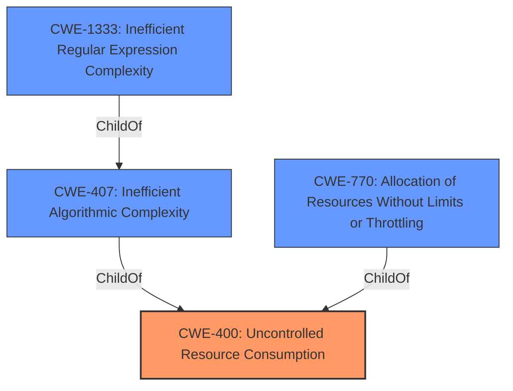

# Analysis Report for CVE-2021-32014

# Vulnerability Analysis Report: CVE-2021-32014

## Description


## Analysis (with Relationship Data)

# Summary
| CWE ID  | CWE Name  | Confidence | CWE Abstraction Level | CWE Vulnerability Mapping Label | CWE-Vulnerability Mapping Notes |
|---|---|---|---|---|---|
| CWE-400 | Uncontrolled Resource Consumption | 0.9 | Class | Allowed-with-Review | Primary CWE |
| CWE-407 | Inefficient Algorithmic Complexity | 0.7 | Class | Allowed-with-Review | Secondary CWE |
| CWE-1333 | Inefficient Regular Expression Complexity | 0.6 | Base | Allowed | Secondary CWE |
| CWE-770 | Allocation of Resources Without Limits or Throttling | 0.5 | Base | Allowed | Secondary CWE |

## Evidence and Confidence

*   **Confidence Score:** 0.9
*   **Evidence Strength:** MEDIUM

## Relationship Analysis
The primary relationship influencing the CWE selection is the parent-child relationship between CWE-400 (Uncontrolled Resource Consumption) and its children such as CWE-770 (Allocation of Resources Without Limits or Throttling), CWE-407 (Inefficient Algorithmic Complexity) and CWE-1333 (Inefficient Regular Expression Complexity). The vulnerability involves CPU consumption due to a crafted .xlsx document, which aligns with uncontrolled resource consumption. Since there is evidence of inefficient CPU computation (due to mishandling of the crafted document) this makes CWE-407 a candidate as well. The abstraction levels influenced the decision to start at the Class level (CWE-400) and then consider more specific Base or Variant level CWEs if the evidence supported it.



## Vulnerability Chain
The vulnerability chain starts with a crafted .xlsx document (input) that is mishandled by xlsx.js, leading to excessive CPU consumption and ultimately a denial of service. The root cause is the **improper handling** of the document, which results in **uncontrolled resource consumption**.

## Summary of Analysis
The initial analysis focused on the denial of service (CPU consumption) impact, which pointed towards CWE-400. The retriever results also highlighted CWE-407 (Inefficient Algorithmic Complexity) and CWE-1333 (Inefficient Regular Expression Complexity) as potential candidates.

The vulnerability description states: "SheetJS and SheetJS Pro through 0.16.9 allows attackers to cause a denial of service (CPU consumption) via a **crafted .xlsx document that is mishandled** when read by xlsx.js." The "CVE Reference Links Content Summary" indicates that "The root cause is a vulnerability in the SheetJS library".

Based on this evidence, CWE-400 is selected as the primary CWE because the core issue is that the application **does not properly control the resources** (CPU) when processing a crafted .xlsx document, leading to denial of service. The selection of CWE-400 is further supported by the MITRE mapping guidance, which states that CWE-400 addresses scenarios where the product is expected to track and restrict resource consumption. Although the MITRE mapping guidance discourages direct mapping to CWE-400 and recommends mapping to its children, there isn't enough information to narrow down the selection to a more specific child CWE. However, the phrase "document that is **mishandled**" suggests that the algorithm may be inefficient so CWE-407 may also be present.

CWE-407 (Inefficient Algorithmic Complexity) is considered a secondary CWE because the "mishandling" of the crafted .xlsx document implies that the algorithm used to process the document may have inefficient complexity, leading to excessive CPU usage.

CWE-1333 (Inefficient Regular Expression Complexity) is another secondary CWE, because even though the vulnerability description doesn't explicitly mention regular expressions, the parsing of a complex document format like .xlsx often involves regular expressions, which if inefficient, could contribute to the CPU consumption.

CWE-770 (Allocation of Resources Without Limits or Throttling) is a potential secondary CWE because the mishandling of the crafted document might lead to the allocation of resources without proper limits or throttling, contributing to the CPU consumption.

The selected CWEs are at the optimal level of specificity given the available information. While more specific CWEs might exist, there isn't sufficient evidence to definitively map to them.

Relevant CWE Information:

# Enhanced Context (25 CWEs)
The following CWEs were identified as potentially relevant to this vulnerability:

## CWE-1176: Inefficient CPU Computation
**Abstraction Level**: Class
**Similarity Score**: 0.76
**Source**: dense

**Description**:
The product performs CPU computations using
         algorithms that are not as efficient as they could be for the
         needs of the developer, i.e., the computations can be
         optimized further.

**Mapping Guidance**:
- Usage: Allowed-with-Review
- Rationale: This CWE entry is a Class and might have Base-level children that would be more appropriate

## CWE-405: Asymmetric Resource Consumption (Amplification)
**Abstraction Level**: Class
**Similarity Score**: 0.76
**Source**: dense

**Description**:
The product does not properly control situations in which an adversary can cause the product to consume or produce excessive resources without requiring the adversary to invest equivalent work or otherwise prove authorization, i.e., the adversary's influence is "asymmetric."

**Mapping Guidance**:
- Usage: Allowed-with-Review
- Rationale: This CWE entry is a Class and might have Base-level children that would be more appropriate

## CWE-407: Inefficient Algorithmic Complexity
**Abstraction Level**: Class
**Similarity Score**: 0.74
**Source**: dense

**Description**:
An algorithm in a product has an inefficient worst-case computational complexity that may be detrimental to system performance and can be triggered by an attacker, typically using crafted manipulations that ensure that the worst case is being reached.

**Mapping Guidance**:
- Usage: Allowed-with-Review
- Rationale: This CWE entry is a Class and might have Base-level children that would be more appropriate

## CWE-404: Improper Resource Shutdown or Release
**Abstraction Level**: Class
**Similarity Score**: 0.74
**Source**: dense

**Description**:
The product does not release or incorrectly releases a resource before it is made available for re-use.

**Mapping Guidance**:
- Usage: Allowed-with-Review
- Rationale: This CWE entry is a Class and might have Base-level children that would be more appropriate

## CWE-789: Memory Allocation with Excessive Size Value
**Abstraction Level**: Variant
**Similarity Score**: 0.73
**Source**: dense

**Description**:
The product allocates memory based on an untrusted, large size value, but it does not ensure that the size is within expected limits, allowing arbitrary amounts of memory to be allocated.

**Mapping Guidance**:
- Usage: Allowed
- Rationale: This CWE entry is at the Variant level of abstraction, which is a preferred level of abstraction for mapping to the root causes of vulnerabilities.

## CWE-1325: Improperly Controlled Sequential Memory Allocation
**Abstraction Level**: Base
**Similarity Score**: 0.73
**Source**: dense

**Description**:
The product manages a group of objects or resources and performs a separate memory allocation for each object, but it does not properly limit the total amount of memory that is consumed by all of the combined objects.

**Mapping Guidance**:
- Usage: Allowed
- Rationale: This CWE entry is at the Base level of abstraction, which is a preferred level of abstraction for mapping to the root causes of vulnerabilities.

## CWE-226: Sensitive Information in Resource Not Removed Before Reuse
**Abstraction Level**: Base
**Similarity Score**: 0.73
**Source**: dense

**Description**:
The product releases a resource such as memory or a file so that it can be made available for reuse, but it does not clear or "zeroize" the information contained in the resource before the product performs a critical state transition or makes the resource available for reuse by other entities.

**Mapping Guidance**:
- Usage: Allowed
- Rationale: This CWE entry is at the Base level of abstraction, which is a preferred level of abstraction for mapping to the root causes of vulnerabilities.

## CWE-664: Improper Control of a Resource Through its Lifetime
**Abstraction Level**: Pillar
**Similarity Score**: 0.72
**Source**:


## CWE Relationship Analysis

Current CWEs represent these abstraction levels: .


### Vulnerability Chain Analysis

**Chain starting from CWE-664:**
- 664 (Improper Control of a Resource Through its Lifetime) - ROOT


**Chain starting from CWE-404:**
- 404 (Improper Resource Shutdown or Release) - ROOT


### CWE Relationship Diagram

```mermaid
graph TD
    classDef primary fill:#f96,stroke:#333,stroke-width:2px
    classDef secondary fill:#69f,stroke:#333
    classDef tertiary fill:#9e9,stroke:#333
```


*Report generated on 2025-04-02 06:40:13*
