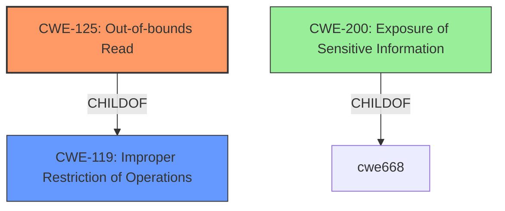

# Analysis for CVE-2021-32029

# Summary
| CWE ID | CWE Name | Confidence | CWE Abstraction Level | CWE Vulnerability Mapping Label | CWE-Vulnerability Mapping Notes |
|---|---|---|---|---|---|
| CWE-125 | Out-of-bounds Read | 0.9 | Base | Allowed | Primary CWE |
| CWE-200 | Exposure of Sensitive Information to an Unauthorized Actor | 0.6 | Class | Discouraged | Secondary Candidate |

## Evidence and Confidence

*   **Confidence Score:** 0.9
*   **Evidence Strength:** HIGH

## Relationship Analysis
The primary relationship influencing the decision is the ChildOf relationship, specifically how CWE-125 (Out-of-bounds Read) is a child of CWE-119 (Improper Restriction of Operations within the Bounds of a Memory Buffer). While CWE-119 is a broader class, CWE-125 provides a more specific description of the vulnerability. CWE-200 is a Class level CWE and is generally discouraged.

## Vulnerability Chain
The vulnerability chain starts with a **flaw** in how PostgreSQL handles `UPDATE ... RETURNING` commands on purpose-crafted partitioned tables, leading to an **out-of-bounds read** (CWE-125) and ultimately resulting in the **exposure of sensitive server memory** (impact).

## Summary of Analysis
The initial analysis focused on identifying the root cause of the vulnerability. The "CVE Reference Links Content Summary" clearly indicates that the vulnerability stems from a **flaw** in how PostgreSQL handles `UPDATE ... RETURNING` commands on specially crafted partitioned tables, which leads to a memory disclosure.

The Retriever Results pointed to several potential CWEs, including CWE-125 (Out-of-bounds Read), CWE-787 (Out-of-bounds Write), CWE-190 (Integer Overflow or Wraparound), and CWE-200 (Exposure of Sensitive Information to an Unauthorized Actor).

The primary driver for selecting CWE-125 was the evidence in the "CVE Reference Links Content Summary" stating that "Authenticated database users can **read arbitrary bytes of server memory**." This directly aligns with the description of CWE-125: "The product **reads data past the end, or before the beginning, of the intended buffer**."

CWE-200 was considered because the vulnerability ultimately leads to the exposure of sensitive information. However, CWE-200 is a Class-level CWE and is discouraged when a more specific CWE is available. Since the root cause is an **out-of-bounds read**, CWE-125 is a more accurate and specific representation of the vulnerability. The use of CWE-200 is also discouraged since it is a technical impact and not a root cause.

The selection of CWE-125 is at the optimal level of specificity (Base) and is directly supported by the provided evidence.

Relevant CWE Information:

# Enhanced Context (25 CWEs)

## CWE-226: Sensitive Information in Resource Not Removed Before Reuse
**Abstraction Level**: Base
**Similarity Score**: 0.80
**Source**: dense

**Description**:
The product releases a resource such as memory or a file so that it can be made available for reuse, but it does not clear or "zeroize" the information contained in the resource before the product performs a critical state transition or makes the resource available for reuse by other entities.

**Mapping Guidance**:
- Usage: Allowed
- Rationale: This CWE entry is at the Base level of abstraction, which is a preferred level of abstraction for mapping to the root causes of vulnerabilities.
- This was not selected because the vulnerability is not due to the release of a resource without clearing sensitive information.

## CWE-404: Improper Resource Shutdown or Release
**Abstraction Level**: Class
**Similarity Score**: 0.78
**Source**: dense

**Description**:
The product does not release or incorrectly releases a resource before it is made available for re-use.

**Mapping Guidance**:
- Usage: Allowed-with-Review
- Rationale: This CWE entry is a Class and might have Base-level children that would be more appropriate
- This was not selected because the vulnerability is not due to the improper shutdown or release of a resource.

## CWE-667: Improper Locking
**Abstraction Level**: Class
**Similarity Score**: 0.76
**Source**: dense

**Description**:
The product does not properly acquire or release a lock on a resource, leading to unexpected resource state changes and behaviors.

**Mapping Guidance**:
- Usage: Allowed-with-Review
- Rationale: This CWE entry is a Class and might have Base-level children that would be more appropriate
- This was not selected because the vulnerability is not due to improper locking.

## CWE-789: Memory Allocation with Excessive Size Value
**Abstraction Level**: Variant
**Similarity Score**: 0.76
**Source**: dense

**Description**:
The product allocates memory based on an untrusted, large size value, but it does not ensure that the size is within expected limits, allowing arbitrary amounts of memory to be allocated.

**Mapping Guidance**:
- Usage: Allowed
- Rationale: This CWE entry is at the Variant level of abstraction, which is a preferred level of abstraction for mapping to the root causes of vulnerabilities.
- This was not selected because the vulnerability is not due to excessive memory allocation.

## CWE-212: Improper Removal of Sensitive Information Before Storage or Transfer
**Abstraction Level**: Base
**Similarity Score**: 0.75
**Source**: dense

**Description**:
The product stores, transfers, or shares a resource that contains sensitive information, but it does not properly remove that information before the product makes the resource available to unauthorized actors.

**Mapping Guidance**:
- Usage: Allowed
- Rationale: This CWE entry is at the Base level of abstraction, which is a preferred level of abstraction for mapping to the root causes of vulnerabilities.
- This was not selected because the vulnerability is not due to the improper removal of sensitive information before storage or transfer.

## CWE-131: Incorrect Calculation of Buffer Size
**Abstraction Level**: Base
**Similarity Score**: 0.74
**Source**: dense

**Description**:
The product does not correctly calculate the size to be used when allocating a buffer, which could lead to a buffer overflow.

**Mapping Guidance**:
- Usage: Allowed
- Rationale: This CWE entry is at the Base level of abstraction, which is a preferred level of abstraction for mapping to the root causes of vulnerabilities.
- This was not selected because the vulnerability is not due to incorrect calculation of buffer size, but from reading memory out of bounds.

## CWE-909: Missing Initialization of Resource
**Abstraction Level**: Class
**Similarity Score**: 0.74
**Source**: dense

**Description**:
The product does not initialize a critical resource.

**Mapping Guidance**:
- Usage: Allowed-with-Review
- Rationale: This CWE entry is a Class and might have Base-level children that would be more appropriate
- This was not selected because the vulnerability is not due to a missing initialization of a resource.

## CWE-125: Out-of-bounds Read
**Abstraction Level**: Base
**Similarity Score**: 0.74
**Source**: dense

**Description**:
The product reads data past the end, or before the beginning, of the intended buffer.

**Mapping Guidance**:
- Usage: Allowed
- Rationale: This CWE entry is at the Base level of abstraction, which is a preferred level of abstraction for mapping to the root causes of vulnerabilities.
- **This was selected as the primary CWE.**

## CWE-665: Improper Initialization
**Abstraction Level**: Class
**Similarity Score**: 0.74
**Source**: dense

**Description**:
The product does not initialize or incorrectly initializes a resource, which might leave the resource in an unexpected state when it is accessed or used.

**Mapping Guidance**:
- Usage: Discouraged
- Rationale: This CWE entry is a level-1 Class (i.e., a child of a Pillar). It might have lower-level children that would be more appropriate
- This was not selected because the vulnerability is not due to improper initialization.

## CWE-908: Use of Uninitialized Resource
**Abstraction Level**: Base
**Similarity Score**: 0.74
**Source**: dense

**Description**:
The product uses or accesses a resource that has not been initialized.

**Mapping Guidance**:
- Usage: Allowed
- Rationale: This CWE entry is at the Base level of abstraction, which is a preferred level of