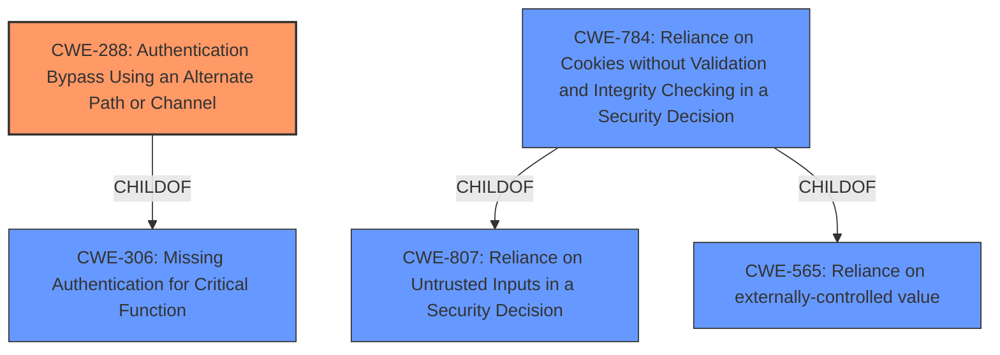

# Raw Analyzer Response for CVE-2021-32030

# Summary
| CWE ID | CWE Name | Confidence | CWE Abstraction Level | CWE Vulnerability Mapping Label | CWE-Vulnerability Mapping Notes |
|---|---|---|---|---|---|
| CWE-288 | Authentication Bypass Using an Alternate Path or Channel | 0.9 | Base | Allowed | Primary CWE |
| CWE-306 | Missing Authentication for Critical Function | 0.7 | Base | Allowed | Secondary Candidate |
| CWE-784 | Reliance on Cookies without Validation and Integrity Checking in a Security Decision | 0.6 | Variant | Allowed | Secondary Candidate |

## Evidence and Confidence

*   **Confidence Score:** 0.8
*   **Evidence Strength:** HIGH

## Relationship Analysis
The primary CWE, CWE-288 Authentication Bypass Using an Alternate Path or Channel, is a base-level CWE that accurately describes the vulnerability. It is related to CWE-306 Missing Authentication for Critical Function, which is a parent. However, CWE-288 is more specific because it highlights the existence of an alternate path, which aligns with the vulnerability description.
CWE-784: Reliance on Cookies without Validation and Integrity Checking in a Security Decision is a Variant of CWE-807 and CWE-565, which indicates a weakness in how cookies are handled in the authentication process.

## Vulnerability Chain
The vulnerability chain involves an **authentication bypass vulnerability** due to **insufficient cookie validation**. The attacker leverages a malformed `asus_token` to bypass authentication checks, leading to **unauthorized access** to the router's administrative interface and full router control.
  - **Root Cause:** **Insufficient cookie validation** in `auth_check` function
  - **Weakness:** **Authentication Bypass** due to malformed `asus_token`
  - **Impact:** **Unauthorized Access** to the router's administrative interface and full router control.

## Summary of Analysis
The initial assessment focused on the **authentication bypass vulnerability** stemming from **insufficient cookie validation**. The `auth_check` function's failure to properly validate the `asus_token` when it starts with a null byte allows an attacker to gain unauthorized access. The final decision favors CWE-288 because it directly addresses the presence of an alternate path that bypasses authentication.

The vulnerability description states: "The administrator application on ASUS GT-AC2900 devices before 3.0.0.4.386.42643 allows **authentication bypass** when processing remote input from an unauthenticated user, leading to **unauthorized access** to the administrator interface. This relates to handle_request in router/httpd/httpd.c and auth_check in web_hook.o. An attacker-supplied value of \0 matches the devices default value of \0 in some situations."

The choice of CWE-288 is further supported by the CVE Reference Links Content Summary, which states: "The vulnerability stems from a flaw in how the ASUS GT-AC2900 router's administrative web application validates session cookies (`asus_token`). Specifically, the `auth_check` function within the `web_hook.o` object has a logical flaw in its authentication process" and "**Authentication Bypass:** The core issue is an **authentication bypass vulnerability**. By crafting a specific request with a malformed `asus_token` (starting with a null byte), an attacker can bypass the standard authentication checks."

CWE-288 is at the optimal level of specificity because it highlights the existence of an alternate path that bypasses authentication, which aligns with the vulnerability description.

Relevant CWE Information:

## Enhanced Context (25 CWEs)
The following CWEs were identified as potentially relevant to this vulnerability:

### CWE-288: Authentication Bypass Using an Alternate Path or Channel
**Technical Explanation:** The ASUS GT-AC2900 router's administrative application has a flaw in its authentication process, specifically within the `auth_check` function in `web_hook.o`. By supplying a malformed `asus_token` (starting with a null byte), an unauthenticated user can bypass the intended authentication checks and gain unauthorized access to the administrator interface.

**Security Implications:** This vulnerability allows an attacker to completely bypass the authentication mechanism, granting them full access to the router's administrative functions. This can lead to a compromise of the entire network, including connected devices, and the ability to change router settings, monitor traffic, and establish a foothold on the network.

**Relationship Explanation:** CWE-288 is a child of CWE-306 (Missing Authentication for Critical Function) and CWE-284 (Improper Access Control). While CWE-306 could be considered, CWE-288 is more specific because it highlights the existence of an alternate path that bypasses authentication, which is the core of this vulnerability.

**Mapping Guidance Influence:** The mapping guidance for CWE-288 states that it is at the Base level of abstraction, which is a preferred level for mapping to the root causes of vulnerabilities. The "Usage: Allowed" designation confirms that this is an appropriate mapping.

### CWE-306: Missing Authentication for Critical Function
**Technical Explanation:** While the router has an authentication mechanism in place, the vulnerability allows it to be bypassed under certain conditions (malformed `asus_token`), effectively meaning authentication is missing in those specific cases.

**Security Implications:** Similar to CWE-288, this can lead to unauthorized access, although it doesn't explicitly state the presence of an alternate path.

**Relationship Explanation:** CWE-306 is a parent of CWE-288. While it's relevant, CWE-288 is more descriptive of the specific bypass mechanism.

**Mapping Guidance Influence:** The mapping guidance for CWE-306 states that it is at the Base level of abstraction and has a "Usage: Allowed" designation.

### CWE-784: Reliance on Cookies without Validation and Integrity Checking in a Security Decision
**Technical Explanation:** The vulnerability stems from the router's reliance on the `asus_token` cookie without properly validating its integrity or contents. An attacker can manipulate the cookie to bypass authentication checks.

**Security Implications:** By exploiting this weakness, an attacker can gain unauthorized access to the router's administrative interface.

**Relationship Explanation:** CWE-784 is a variant of CWE-807 (Reliance on Untrusted Inputs in a Security Decision) and CWE-565 (Reliance on externally-controlled value), which indicates a weakness in how cookies are handled in the authentication process.

**Mapping Guidance Influence:** The mapping guidance for CWE-784 states that it is at the Variant level of abstraction and has a "Usage: Allowed" designation.

### Other CWEs Considered but Not Used:
*   **CWE-22: Improper Limitation of a Pathname to a Restricted Directory ('Path Traversal')**: This CWE is not relevant because the vulnerability does not involve path traversal.
*   **CWE-287: Improper Authentication**: This CWE is too high-level and doesn't capture the specific bypass mechanism.
*   **CWE-73: External Control of File Name or Path**: This CWE is not relevant because the vulnerability does not involve file name or path manipulation.
*   **CWE-798: Use of Hard-coded Credentials, CWE-259: Use of Hard-coded Password, CWE-321: Use of Hard-coded Cryptographic Key**: The vulnerability does not involve hardcoded credentials.
*   **CWE-1188: Initialization of a Resource with an Insecure Default**: While the `ifttt_token` is not set by default, the core vulnerability is the bypass of the authentication mechanism rather than the insecure default.
*   **CWE-20: Improper Input Validation**: This CWE is too general. The weakness is the authentication bypass and the lack of proper cookie validation, which are better captured by other CWEs.