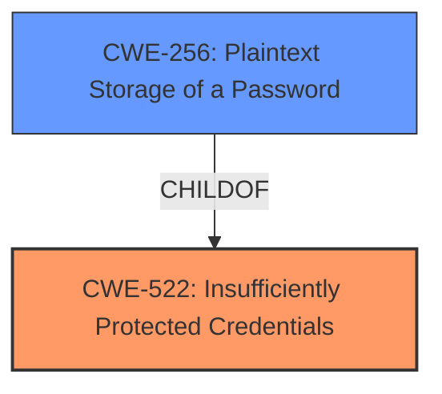

# Analysis for CVE-2021-32039

# Summary
| CWE ID | CWE Name | Confidence | CWE Abstraction Level | CWE Vulnerability Mapping Label | CWE-Vulnerability Mapping Notes |
|---|---|---|---|---|---|
| CWE-522 | Insufficiently Protected Credentials | 1.0 | Class | Allowed-with-Review | Primary CWE |
| CWE-256 | Plaintext Storage of a Password | 0.9 | Base | Allowed | Secondary Candidate |

## Evidence and Confidence

*   **Confidence Score:** 0.95
*   **Evidence Strength:** HIGH

## Relationship Analysis
The primary CWE selected is CWE-522, a Class-level CWE describing the general case of insufficiently protected credentials. A more specific Base CWE, CWE-256, Plaintext Storage of a Password, was also considered and selected as a secondary candidate because the credentials were saved in an unencrypted binary file which is effectively plaintext. CWE-256 is a ChildOf CWE-522.

## Vulnerability Chain
The chain of events for this vulnerability is as follows:
1.  The MongoDB Extension for VS Code **insufficiently protects credentials** (CWE-522) by storing them in an unencrypted format within a binary file, which is effectively **plaintext storage of a password** (CWE-256).
2.  An attacker with appropriate file access can then access these unencrypted credentials.
3.  The attacker can use these credentials to perform unauthorized actions on the user's MongoDB databases.

Here, CWE-522 and CWE-256 represent the root cause, while unauthorized actions represent the impact.

## Summary of Analysis
The analysis concludes that CWE-522 (Insufficiently Protected Credentials) is the most appropriate primary CWE, with CWE-256 (Plaintext Storage of a Password) as a secondary candidate.

The vulnerability description clearly states that the MongoDB Extension for VS Code stores user credentials in an unencrypted format within a binary file. The "CVE Reference Links Content Summary" confirms this, stating that the root cause is the storage of user credentials in an unencrypted format. The key phrase "access unencrypted user credentials" reinforces this.

CWE-522 aligns with this description because it covers the general case of transmitting or storing authentication credentials using an insecure method. The Mapping Guidance suggests examining children of CWE-522 for a better fit, which led to the consideration of CWE-256.

CWE-256 is a more specific Base CWE that accurately describes the vulnerability because the credentials are stored in plaintext.

The decision to include both CWEs is based on providing a comprehensive representation of the vulnerability, capturing both the general weakness (CWE-522) and the specific implementation flaw (CWE-256). Both CWEs are at appropriate levels of specificity, with CWE-522 being a Class and CWE-256 being a Base.

Other CWEs Considered:

*   CWE-532 (Insertion of Sensitive Information into Log File): While sensitive information is exposed, it's not specifically in a log file, making this less relevant.
*   CWE-201 (Insertion of Sensitive Information Into Sent Data): This is about sending data, not storing it, so it's not applicable.
*   CWE-922 (Insecure Storage of Sensitive Information): This is a broader class, and CWE-522 is more specific to credentials.
*   CWE-306 (Missing Authentication for Critical Function): Authentication isn't missing; the credentials are just poorly protected.
* CWE-183: (Permissive List of Allowed Inputs) Not applicable as there is no allow list mentioned.