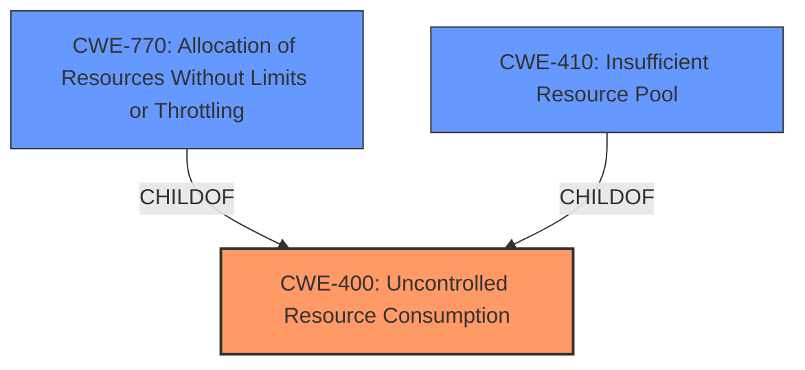

# Analysis for CVE-2021-32053

# Summary
| CWE ID | CWE Name | Confidence | CWE Abstraction Level | CWE Vulnerability Mapping Label | CWE-Vulnerability Mapping Notes |
|---|---|---|---|---|---|
| CWE-400 | Uncontrolled Resource Consumption | 0.8 | Class | Primary | Allowed-with-Review |
| CWE-770 | Allocation of Resources Without Limits or Throttling | 0.7 | Base | Secondary | Allowed |
| CWE-410 | Insufficient Resource Pool | 0.6 | Base | Secondary | Allowed |

## Evidence and Confidence

*   **Confidence Score:** 0.8
*   **Evidence Strength:** HIGH

## Relationship Analysis
The primary CWE is CWE-400 **Uncontrolled Resource Consumption**, which is a Class-level CWE. CWE-770 **Allocation of Resources Without Limits or Throttling** and CWE-410 **Insufficient Resource Pool** are both children of CWE-400 and are more specific Base-level CWEs. The relationships helped determine that while the issue is about resource consumption, the root cause can be further specified.

## Vulnerability Chain
The vulnerability chain starts with the server executing a slow count query every time `_history` is invoked which leads to **Uncontrolled Resource Consumption** and eventually a denial of service.

## Summary of Analysis
The initial assessment considered the provided information about the **weakness** and **root_cause**. The **weakness** described a performance bottleneck due to a slow count query, and the **root_cause** identified a `SELECT COUNT(...)` query that overwhelmed the database when executed concurrently.

The Retriever Results suggested CWE-1176 **Inefficient CPU Computation**, CWE-400 **Uncontrolled Resource Consumption**, CWE-770 **Allocation of Resources Without Limits or Throttling**, and CWE-410 **Insufficient Resource Pool** as potential matches.

CWE-400 **Uncontrolled Resource Consumption** was chosen as the primary CWE because it directly addresses the core issue of the server being overwhelmed by concurrent requests, leading to resource exhaustion. From the description: "The product does not properly control the allocation and maintenance of a limited resource, thereby enabling an actor to influence the amount of resources consumed, eventually leading to the exhaustion of available resources." This aligns with the "excessive disk space, leading to instability when multiple clients request history concurrently" description.

CWE-770 **Allocation of Resources Without Limits or Throttling** was considered as a secondary CWE because the server does not impose restrictions on the number of resources allocated for history requests. From the description: "The product allocates a reusable resource or group of resources on behalf of an actor without imposing any restrictions on the size or number of resources that can be allocated, in violation of the intended security policy for that actor."

CWE-410 **Insufficient Resource Pool** was also considered as a secondary CWE because the resource pool may be too small to handle the peak demand of history requests. From the description: "The product's resource pool is not large enough to handle peak demand, which allows an attacker to prevent others from accessing the resource by using a (relatively) large number of requests for resources."

CWE-1176 **Inefficient CPU Computation** was not selected because the primary issue is not the inefficiency of CPU computation, but rather the uncontrolled consumption of resources.

The selected CWEs are at the optimal level of specificity because they accurately represent the **root_cause** and the resulting impact of the vulnerability. The graph relationships confirm that CWE-770 and CWE-410 are more specific types of CWE-400.

Relevant CWE Information:

# Enhanced Context (25 CWEs)

## CWE-400: Uncontrolled Resource Consumption
**Abstraction:** Class
**Status:** Draft

### Description
The product does not properly control the allocation and maintenance of a limited resource, thereby enabling an actor to influence the amount of resources consumed, eventually leading to the exhaustion of available resources.

### Extended Description
Limited resources include memory, file system storage, database connection pool entries, and CPU. If an attacker can trigger the allocation of these limited resources, but the number or size of the resources is not controlled, then the attacker could cause a denial of service that consumes all available resources. This would prevent valid users from accessing the product, and it could potentially have an impact on the surrounding environment. For example, a memory exhaustion attack against an application could slow down the application as well as its host operating system.

### Mapping Guidance
**Usage:** Allowed-with-Review
**Rationale:** CWE-400 is intended for incorrect behaviors in which the product is expected to track and restrict how many resources it consumes, but CWE-400 is often misused because it is conflated with the "technical impact" of vulnerabilities in which resource consumption occurs. It is sometimes used for low-information vulnerability reports. It is a level-1 Class (i.e., a child of a Pillar).
**Comments:** Closely analyze the specific mistake that is causing resource consumption, and perform a CWE mapping for that mistake. Consider children/descendants such as CWE-770: Allocation of Resources Without Limits or Throttling, CWE-771: Missing Reference to Active Allocated Resource, CWE-410: Insufficient Resource Pool, CWE-772: Missing Release of Resource after Effective Lifetime, CWE-834: Excessive Iteration, CWE-405: Asymmetric Resource Consumption (Amplification), and others.

## CWE-770: Allocation of Resources Without Limits or Throttling
**Abstraction:** Base
**Status:** Incomplete

### Description
The product allocates a reusable resource or group of resources on behalf of an actor without imposing any restrictions on the size or number of resources that can be allocated, in violation of the intended security policy for that actor.

### Extended Description
Code frequently has to work with limited resources, so programmers must be careful to ensure that resources are not consumed too quickly, or too easily. Without use of quotas, resource limits, or other protection mechanisms, it can be easy for an attacker to consume many resources by rapidly making many requests, or causing larger resources to be used than is needed. When too many resources are allocated, or if a single resource is too large, then it can prevent the code from working correctly, possibly leading to a denial of service.

### Mapping Guidance
**Usage:** Allowed
**Rationale:** This CWE entry is at the Base level of abstraction, which is a preferred level of abstraction for mapping to the root causes of vulnerabilities.
**Comments:** Carefully read both the name and description to ensure that this mapping is an appropriate fit. Do not try to 'force' a mapping to a lower-level Base/Variant simply to comply with this preferred level of abstraction.

## CWE-410: Insufficient Resource Pool
**Abstraction:** Base
**Status:** Incomplete

### Description
The product's resource pool is not large enough to handle peak demand, which allows an attacker to prevent others from accessing the resource by using a (relatively) large number of requests for resources.

### Extended Description
Frequently the consequence is a "flood" of connection or sessions.

### Mapping Guidance
**Usage:** Allowed
**Rationale:** This CWE entry is at the Base level of abstraction, which is a preferred level of abstraction for mapping to the root causes of vulnerabilities.
**Comments:** Carefully read both the name and description to ensure that this mapping is an appropriate fit. Do not try to 'force' a mapping to a lower-level Base/Variant simply to comply with this preferred level of abstraction.