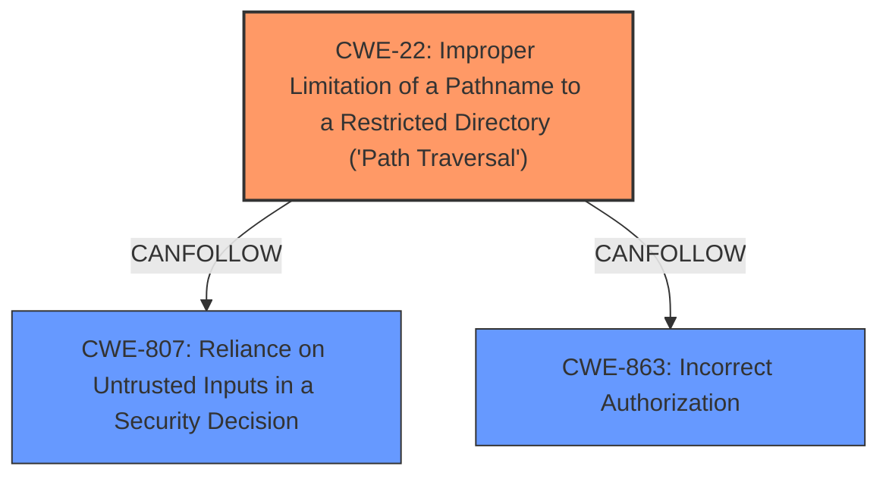

# Analysis Report for CVE-2021-32062

# Vulnerability Analysis Report: CVE-2021-32062

## Description


## Analysis (with Relationship Data)

# Summary

| CWE ID | CWE Name | Confidence | CWE Abstraction Level | CWE Vulnerability Mapping Label | CWE-Vulnerability Mapping Notes |
|---|---|---|---|---|---|
| CWE-22 | Improper Limitation of a Pathname to a Restricted Directory ('Path Traversal') | 0.9 | Base | Primary | Allowed |
| CWE-807 | Reliance on Untrusted Inputs in a Security Decision | 0.7 | Base | Secondary | Allowed |
| CWE-863 | Incorrect Authorization | 0.6 | Class | Secondary | Allowed-with-Review |

## Evidence and Confidence

*   **Confidence Score:** 0.8
*   **Evidence Strength:** HIGH

## Relationship Analysis

The primary CWE is CWE-22, which reflects the core issue of path traversal due to improper restriction of pathnames. CWE-807 and CWE-863 are considered as secondary issues, highlighting the reliance on untrusted inputs for security decisions and the incorrect authorization mechanisms respectively. CWE-22 is a base-level CWE, providing sufficient specificity for this vulnerability. The relationships show a progression from untrusted input to path traversal and potentially bypassing authorization checks.



## Vulnerability Chain

The vulnerability chain starts with the **improper enforcement of MS_MAP_NO_PATH and MS_MAP_PATTERN restrictions**. This leads to **reliance on untrusted inputs (CWE-807)**, resulting in **improper limitation of pathnames (CWE-22)** and potentially **incorrect authorization (CWE-863)**. The chain highlights the sequence from initial misconfiguration to final impact, with CWE-22 as the direct result of the initial **weakness**.

## Summary of Analysis

The analysis focuses on the **failure to properly enforce path restrictions**, allowing for path traversal. The primary CWE, CWE-22, accurately reflects this core issue.

The evidence is strong, based on the vulnerability description, key phrases, and CVE reference links.

> **Vulnerability Description Key Phrases**
> -   **rootcause:** **does not properly enforce the MS_MAP_NO_PATH and MS_MAP_PATTERN restrictions**

The vulnerability is a result of **insufficient input validation** and **bypass of security controls**, allowing attackers to load arbitrary mapfiles. This aligns directly with CWE-22, which describes the improper limitation of pathnames. The retriever results also support CWE-22 as the top candidate.

The relationships in the graph highlight the potential for untrusted inputs to lead to path traversal and bypass authorization checks. While CWE-807 and CWE-863 are relevant, CWE-22 is the most specific and accurate representation of the vulnerability.

The selected CWEs are at the optimal level of specificity. CWE-22 is a base-level CWE, providing sufficient detail without being overly abstract.

Relevant CWE Information:

# Enhanced Context (25 CWEs)

## CWE-74: Improper Neutralization of Special Elements in Output Used by a Downstream Component ('Injection')
**Abstraction Level**: Class
**Similarity Score**: 0.76
**Source**: dense

**Description**:
The product constructs all or part of a command, data structure, or record using externally-influenced input from an upstream component, but it does not neutralize or incorrectly neutralizes special elements that could modify how it is parsed or interpreted when it is sent to a downstream component.

**Mapping Guidance**:
- Usage: Discouraged
- Rationale: CWE-74 is high-level and often misused when lower-level weaknesses are more appropriate.

*CWE-74 was considered, but it is too high-level. The vulnerability is more specific than a general injection issue.*

## CWE-184: Incomplete List of Disallowed Inputs
**Abstraction Level**: Base
**Similarity Score**: 0.76
**Source**: dense

**Description**:
The product implements a protection mechanism that relies on a list of inputs (or properties of inputs) that are not allowed by policy or otherwise require other action to neutralize before additional processing takes place, but the list is incomplete.

**Mapping Guidance**:
- Usage: Allowed
- Rationale: This CWE entry is at the Base level of abstraction, which is a preferred level of abstraction for mapping to the root causes of vulnerabilities.

*CWE-184 was considered but the issue isn't an incomplete list but more so that the existing list isn't being enforced*

## CWE-41: Improper Resolution of Path Equivalence
**Abstraction Level**: Base
**Similarity Score**: 0.76
**Source**: dense

**Description**:
The product is vulnerable to file system contents disclosure through path equivalence. Path equivalence involves the use of special characters in file and directory names. The associated manipulations are intended to generate multiple names for the same object.

**Mapping Guidance**:
- Usage: Allowed
- Rationale: This CWE entry is at the Base level of abstraction, which is a preferred level of abstraction for mapping to the root causes of vulnerabilities.

*CWE-41 was considered but it is more related to path equivalence than enforcement of path restrictions*

## CWE-73: External Control of File Name or Path
**Abstraction Level**: Base
**Similarity Score**: 0.75
**Source**: dense

**Description**:
The product allows user input to control or influence paths or file names that are used in filesystem operations.

**Mapping Guidance**:
- Usage: Allowed
- Rationale: This CWE entry is at the Base level of abstraction, which is a preferred level of abstraction for mapping to the root causes of vulnerabilities.

*CWE-73 was considered but the issue isn't the external control but rather the improper limitation of that control*

## CWE-1289: Improper Validation of Unsafe Equivalence in Input
**Abstraction Level**: Base
**Similarity Score**: 0.75
**Source**: dense

**Description**:
The product receives an input value that is used as a resource identifier or other type of reference, but it does not validate or incorrectly validates that the input is equivalent to a potentially-unsafe value.

**Mapping Guidance**:
- Usage: Allowed
- Rationale: This CWE entry is at the Base level of abstraction, which is a preferred level of abstraction for mapping to the root causes of vulnerabilities.

*CWE-1289 was considered, but path equivalence isn't part of the problem.*

## CWE-807: Reliance on Untrusted Inputs in a Security Decision
**Abstraction Level**: Base
**Similarity Score**: 0.75
**Source**: dense

**Description**:
The product uses a protection mechanism that relies on the existence or values of an input, but the input can be modified by an untrusted actor in a way that bypasses the protection mechanism.

**Mapping Guidance**:
- Usage: Allowed
- Rationale: This CWE entry is at the Base level of abstraction, which is a preferred level of abstraction for mapping to the root causes of vulnerabilities.

*CWE-807 was selected as a secondary CWE, given that the MS_MAP_NO_PATH and MS_MAP_PATTERN restrictions rely on trusted inputs.*

## CWE-23: Relative Path Traversal
**Abstraction Level**: Base
**Similarity Score**: 0.74
**Source**: dense

**Description**:
The product uses external input to construct a pathname that should be within a restricted directory, but it does not properly neutralize sequences such as ".." that can resolve to a location that is outside of that directory.

**Mapping Guidance**:
- Usage: Allowed
- Rationale: This CWE entry is at the Base level of abstraction, which is a preferred level of abstraction for mapping to the root causes of vulnerabilities.

*CWE-23 was considered, but CWE-22 is the more general case for both relative and absolute path traversal.*

## CWE-138: Improper Neutralization of Special Elements
**Abstraction Level**: Class
**Similarity Score**: 0.74
**Source**: dense

**Description**:
The product receives input from an upstream component, but it does not neutralize or incorrectly neutralizes special elements that could be interpreted as control elements or syntactic markers when they are sent to a downstream component.

**Mapping Guidance**:
- Usage: Discouraged
- Rationale: This CWE entry is a level-1 Class (i.e., a child of a Pillar). It might have lower-level children that would be more appropriate

*CWE-138 was considered, but is too general.*

## CWE-274: Improper Handling of Insufficient Privileges
**Abstraction Level**: Base
**Similarity Score**: 0.74
**Source**: dense

**Description**:
The product does not handle or incorrectly handles when it has


## CWE Relationship Analysis

Current CWEs represent these abstraction levels: .


### Vulnerability Chain Analysis

**Chain starting from CWE-41:**
- 41 (Improper Resolution of Path Equivalence) - ROOT


**Chain starting from CWE-73:**
- 73 (External Control of File Name or Path) - ROOT


### CWE Relationship Diagram

```mermaid
graph TD
    classDef primary fill:#f96,stroke:#333,stroke-width:2px
    classDef secondary fill:#69f,stroke:#333
    classDef tertiary fill:#9e9,stroke:#333
```


*Report generated on 2025-04-01 21:20:16*
