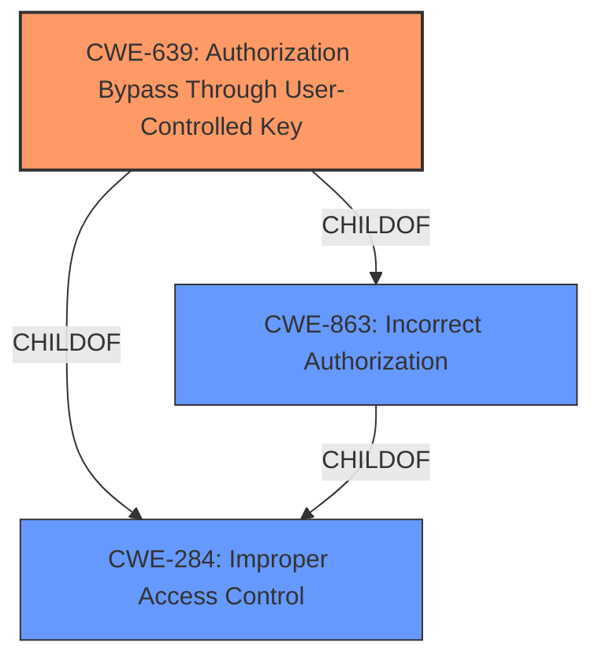

# Analysis for CVE-2021-32101

# Summary
| CWE ID | CWE Name | Confidence | CWE Abstraction Level | CWE Vulnerability Mapping Label | CWE-Vulnerability Mapping Notes |
|---|---|---|---|---|---|
| CWE-639 | Authorization Bypass Through User-Controlled Key | 0.9 | Base | Allowed | Primary CWE |
| CWE-863 | Incorrect Authorization | 0.7 | Class | Allowed-with-Review | Secondary Candidate |

## Evidence and Confidence

*   **Confidence Score:** 0.9
*   **Evidence Strength:** HIGH

## Relationship Analysis
The primary CWE is CWE-639 (Authorization Bypass Through User-Controlled Key), which is a base-level CWE. It's a child of CWE-863 (Incorrect Authorization) and CWE-284 (Improper Access Control). CWE-863, being a class-level CWE, is less specific. The choice of CWE-639 is driven by its precise description of the vulnerability, involving user-controlled keys for authorization bypass. This base-level specificity is more appropriate than the broader class-level CWEs, providing a more accurate representation of the vulnerability's root cause.

## Vulnerability Chain
The vulnerability chain begins with **incorrect access control** during user registration. An unauthenticated attacker registers, bypassing API permission checks because the `$_SESSION['register']` variable is not cleared. This allows the attacker to manipulate and read patient data, ultimately leading to a potential data breach.
- Root Cause: **Incorrect access control system** (CWE-639)
- Impact: Manipulate data of every registered patient and read data of every registered patient.

## Summary of Analysis
The initial assessment and resulting conclusion are primarily based on the evidence provided in the vulnerability description and the CVE Reference Links Content Summary. The vulnerability description explicitly states "**incorrect access control system**" in `portal/patient/_machine_config.php`. The CVE Reference Links Content Summary highlights the insecure API permissions, where the authentication check can be bypassed during user registration due to improper session variable handling. "This is due to the session variable `$_SESSION['register']` not being destroyed after the initial request to `register.php`, which sets this variable to true. This allows an attacker to skip authentication and use API features as a 'registered' patient portal user." This evidence strongly supports the selection of CWE-639 (Authorization Bypass Through User-Controlled Key) as the primary CWE.

The graph relationships influenced the final selection by emphasizing the hierarchical structure of CWEs, leading to the choice of the most specific base-level CWE (CWE-639) over the more general class-level CWEs (CWE-863 and CWE-284).

The selected CWEs are at the optimal level of specificity because CWE-639 accurately describes the vulnerability's root cause, involving a user-controlled key (the session variable) that bypasses authorization checks.

Relevant CWE Information:

# Enhanced Context (25 CWEs)
The following CWEs were identified as potentially relevant to this vulnerability:

## CWE-639: Authorization Bypass Through User-Controlled Key
**Abstraction Level**: Base
**Similarity Score**: 0.77
**Source**: dense

**Description**:
The system's authorization functionality does not prevent one user from gaining access to another user's data or record by modifying the key value identifying the data.

**Mapping Guidance**:
- Usage: Allowed
- Rationale: This CWE entry is at the Base level of abstraction, which is a preferred level of abstraction for mapping to the root causes of vulnerabilities.

## CWE-285: Improper Authorization
**Abstraction Level**: Class
**Similarity Score**: 6897.99
**Source**: sparse

**Description**:
The product does not perform or incorrectly performs an authorization check when an actor attempts to access a resource or perform an action.

**Mapping Guidance**:
- Usage: Discouraged
- Rationale: CWE-285 is high-level and lower-level CWEs can frequently be used instead. It is a level-1 Class (i.e., a child of a Pillar).

### Detailed Analysis of Selected CWEs:

*   **CWE-639: Authorization Bypass Through User-Controlled Key**
    *   **Match:** The vulnerability allows an unauthenticated attacker to register and bypass permission checks by manipulating the `$_SESSION['register']` variable, which acts as a user-controlled key.
    *   **Implication:** This allows unauthorized access to patient data, leading to potential data breaches.
    *   **Relationship:** This is a base-level CWE, providing the most specific description of the vulnerability. It is a child of CWE-863 and CWE-284, but these are higher-level classifications.
    *   **Guidance:** The MITRE mapping guidance allows this CWE.
*   **CWE-863: Incorrect Authorization**
    *   **Match:** The product performs an authorization check, but it can be bypassed through manipulation of the session variable.
    *   **Implication:** Unauthorized access to sensitive data.
    *   **Relationship:** Class-level CWE that encompasses broader authorization issues. CWE-639 is a more specific child.
    *   **Guidance:** The MITRE mapping guidance allows this CWE with review, suggesting a more specific CWE might be appropriate.

### CWEs Considered but Not Used:

*   **CWE-285: Improper Authorization**: This was considered but not used because it is a high-level class CWE, and CWE-639 provides a more specific description of the vulnerability.
*   **CWE-367: Time-of-check Time-of-use (TOCTOU) Race Condition**: While race conditions can sometimes be related to authorization issues, this CWE does not fit the specifics of the vulnerability, which is primarily about bypassing authorization checks through a user-controlled key.
*   **CWE-472: External Control of Assumed-Immutable Web Parameter**: Although the session variable could be considered an assumed-immutable web parameter, the core issue is the authorization bypass rather than the modification of the parameter itself. Therefore, CWE-639 is a more accurate fit.
*   **CWE-306: Missing Authentication for Critical Function**: While the vulnerability involves a bypass of authentication during the registration process, the core issue is that the system incorrectly authorizes the user based on a manipulated session variable, rather than completely missing authentication. Thus, CWE-639 is more appropriate.