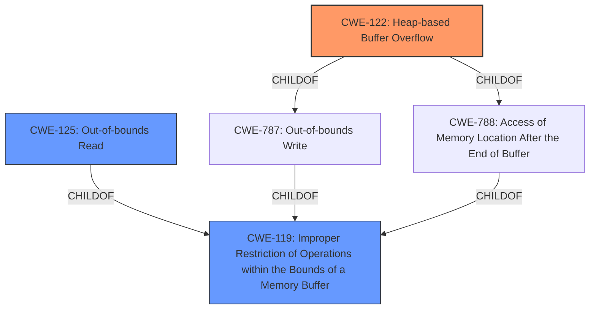

# Analysis Report for CVE-2021-32136

# Vulnerability Analysis Report: CVE-2021-32136

## Description


## Analysis (with Relationship Data)

# Summary
| CWE ID | CWE Name | Confidence | CWE Abstraction Level | CWE Vulnerability Mapping Label | CWE-Vulnerability Mapping Notes |
|---|---|---|---|---|---|
| CWE-122 | Heap-based Buffer Overflow | 0.9 | Variant | Allowed | Primary CWE |
| CWE-125 | Out-of-bounds Read | 0.7 | Base | Allowed | Secondary CWE |
| CWE-119 | Improper Restriction of Operations within the Bounds of a Memory Buffer | 0.5 | Class | Discouraged | Secondary CWE, considered but not best fit |

## Evidence and Confidence

*   **Confidence Score:** 0.8
*   **Evidence Strength:** HIGH

## Relationship Analysis
The primary CWE is CWE-122 (Heap-based Buffer Overflow), which is a variant of CWE-788 (Access of Memory Location After the End of Buffer) and CWE-787 (Out-of-bounds Write). CWE-125 (Out-of-bounds Read) is a related CWE, also a child of CWE-119, but representing a read operation instead of a write. CWE-119 is a more general class that encompasses both read and write issues within a memory buffer and is discouraged as a mapping choice when more specific options are available.



## Vulnerability Chain
The vulnerability chain starts with a **heap buffer overflow** due to **missing size check**, leading to an **out-of-bounds read**. The attacker can then cause a denial of service or execute arbitrary code by supplying a crafted file.

## Summary of Analysis
The initial assessment identifies a **heap buffer overflow** in the `print_udta` function in MP4Box in GPAC 1.0.1. This is due to a **missing size check** allowing the code to read past the end of the buffer.

The primary CWE is CWE-122 (Heap-based Buffer Overflow) because the vulnerability description explicitly mentions a "**Heap buffer overflow**". This aligns directly with the CWE's description: "A heap overflow condition is a buffer overflow, where the buffer that can be overwritten is allocated in the heap portion of memory". The evidence from "CVE Reference Links Content Summary" section states: "A heap buffer overflow vulnerability exists in the `print_udta` function of the MP4Box utility in GPAC."

CWE-125 (Out-of-bounds Read) is considered as a secondary CWE because the "CVE Reference Links Content Summary" section mentions: "The code iterates through the udta buffer based on index until it finds a null terminator or reaches `udta_size` boundary, but the `fprintf(stderr, "%c", udta[idx]);` continues to read past the null terminator in the second print loop, leading to out of bounds read." While the root cause is a write issue (overflow), the mechanism involves reading out of bounds.

CWE-119 (Improper Restriction of Operations within the Bounds of a Memory Buffer) was considered due to its broad applicability to buffer issues. However, the MITRE mapping guidance discourages its use when more specific CWEs are available. Since CWE-122 and CWE-125 more precisely describe the vulnerability, CWE-119 is not chosen.

The selection of CWE-122 is at the optimal level of specificity as it directly addresses the **heap buffer overflow**. The relationships in the graph support this decision, positioning CWE-122 as a variant of more general buffer overflow CWEs, but more specific than the class-level CWE-119.
Relevant CWE Information:

# Enhanced Context (25 CWEs)
The following CWEs were identified as potentially relevant to this vulnerability:

## CWE-197: Numeric Truncation Error
**Abstraction Level**: Base
**Similarity Score**: 0.80
**Source**: dense

**Description**:
Truncation errors occur when a primitive is cast to a primitive of a smaller size and data is lost in the conversion.

**Mapping Guidance**:
- Usage: Allowed
- Rationale: This CWE entry is at the Base level of abstraction, which is a preferred level of abstraction for mapping to the root causes of vulnerabilities.


## CWE-191: Integer Underflow (Wrap or Wraparound)
**Abstraction Level**: Base
**Similarity Score**: 0.79
**Source**: dense

**Description**:
The product subtracts one value from another, such that the result is less than the minimum allowable integer value, which produces a value that is not equal to the correct result.

**Mapping Guidance**:
- Usage: Allowed
- Rationale: This CWE entry is at the Base level of abstraction, which is a preferred level of abstraction for mapping to the root causes of vulnerabilities.


## CWE-131: Incorrect Calculation of Buffer Size
**Abstraction Level**: Base
**Similarity Score**: 0.78
**Source**: dense

**Description**:
The product does not correctly calculate the size to be used when allocating a buffer, which could lead to a buffer overflow.

**Mapping Guidance**:
- Usage: Allowed
- Rationale: This CWE entry is at the Base level of abstraction, which is a preferred level of abstraction for mapping to the root causes of vulnerabilities.


## CWE-805: Buffer Access with Incorrect Length Value
**Abstraction Level**: Base
**Similarity Score**: 0.78
**Source**: dense

**Description**:
The product uses a sequential operation to read or write a buffer, but it uses an incorrect length value that causes it to access memory that is outside of the bounds of the buffer.

**Mapping Guidance**:
- Usage: Allowed
- Rationale: This CWE entry is at the Base level of abstraction, which is a preferred level of abstraction for mapping to the root causes of vulnerabilities.


## CWE-130: Improper Handling of Length Parameter Inconsistency
**Abstraction Level**: Base
**Similarity Score**: 0.78
**Source**: dense

**Description**:
The product parses a formatted message or structure, but it does not handle or incorrectly handles a length field that is inconsistent with the actual length of the associated data.

**Mapping Guidance**:
- Usage: Allowed
- Rationale: This CWE entry is at the Base level of abstraction, which is a preferred level of abstraction for mapping to the root causes of vulnerabilities.


## CWE-681: Incorrect Conversion between Numeric Types
**Abstraction Level**: Base
**Similarity Score**: 0.77
**Source**: dense

**Description**:
When converting from one data type to another, such as long to integer, data can be omitted or translated in a way that produces unexpected values. If the resulting values are used in a sensitive context, then dangerous behaviors may occur.

**Mapping Guidance**:
- Usage: Allowed
- Rationale: This CWE entry is at the Base level of abstraction, which is a preferred level of abstraction for mapping to the root causes of vulnerabilities.


## CWE-126: Buffer Over-read
**Abstraction Level**: Variant
**Similarity Score**: 0.76
**Source**: dense

**Description**:
The product reads from a buffer using buffer access mechanisms such as indexes or pointers that reference memory locations after the targeted buffer.

**Mapping Guidance**:
- Usage: Allowed
- Rationale: This CWE entry is at the Variant level of abstraction, which is a preferred level of abstraction for mapping to the root causes of vulnerabilities.


## CWE-125: Out-of-bounds Read
**Abstraction Level**: Base
**Similarity Score**: 0.76
**Source**: dense

**Description**:
The product reads data past the end, or before the beginning, of the intended buffer.

**Mapping Guidance**:
- Usage: Allowed
- Rationale: This CWE entry is at the Base level of abstraction, which is a preferred level of abstraction for mapping to the root causes of vulnerabilities.


## CWE-124: Buffer Underwrite ('Buffer Underflow')
**Abstraction Level**: Base
**Similarity Score**: 0.76
**Source**: dense

**Description**:
The product writes to a buffer using an index or pointer that references a memory location prior to the beginning of


## CWE Relationship Analysis

Current CWEs represent these abstraction levels: .


### Vulnerability Chain Analysis

**Chain starting from CWE-787:**
- 787 (Out-of-bounds Write) - ROOT


**Chain starting from CWE-805:**
- 805 (Buffer Access with Incorrect Length Value) - ROOT


### CWE Relationship Diagram

```mermaid
graph TD
    classDef primary fill:#f96,stroke:#333,stroke-width:2px
    classDef secondary fill:#69f,stroke:#333
    classDef tertiary fill:#9e9,stroke:#333
```


*Report generated on 2025-04-02 03:53:22*
